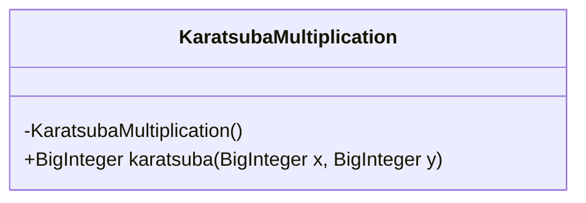
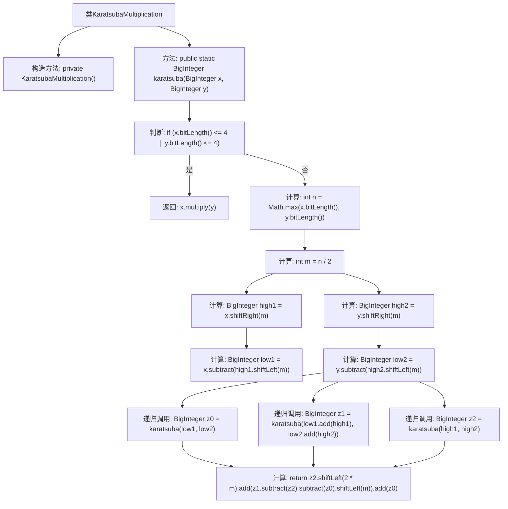

# 基础信息

|      |      |
|------|------|
| 名称 | KaratsubaMultiplication |
| 编码语言 | .java |
| 代码路径 | Java/src/main/java/com/thealgorithms/maths/KaratsubaMultiplication.java |
| 包名 | com.thealgorithms.maths |
| 依赖项 | ['java.math.BigInteger'] |
| 概述说明 | Karatsuba算法通过递归分治实现大数乘法。 |

# 说明

Karatsuba算法是一种用于大数乘法的高效算法，采用递归分治策略计算乘积。其核心思想是将大数分解为较小部分，通过减少乘法次数来提升计算效率。该算法通过将两个大数分别拆分为高位和低位，利用递归计算三个中间结果，最终通过组合这些结果得到乘积。相较于传统乘法，Karatsuba算法显著降低了时间复杂度，适用于处理大规模数值计算。

# 类列表 Class Summary

| 名称   | 类型  | 说明 |
|-------|------|-------------|
| KaratsubaMultiplication | class | Karatsuba算法实现大数乘法，递归分治计算乘积。 |

## 类 KaratsubaMultiplication

|      |      |
|------|------|
| 访问范围 | public final |
| 类型 | class |
| 名称 | KaratsubaMultiplication |
| 说明 | Karatsuba算法实现大数乘法，递归分治计算乘积。 |

### UML类图

**描述：**  
`KaratsubaMultiplication` 类实现了 Karatsuba 算法，用于高效地大整数乘法。该类包含一个私有构造函数以防止实例化，以及一个静态方法 `karatsuba`，该方法递归地将大整数拆分为更小的部分，直到可以直接使用传统方法进行乘法运算。最终，通过 Karatsuba 公式将部分结果组合起来，返回最终的乘积。该算法显著减少了乘法操作的次数，提高了大整数乘法的效率。

### 内部方法调用关系图

这段代码实现了Karatsuba乘法算法，用于高效地计算两个大整数的乘积。代码首先判断输入的整数是否足够小，如果是则直接返回它们的乘积；否则，将整数分成高半部分和低半部分，递归计算三个中间结果，最后根据Karatsuba公式组合这些结果并返回。流程图清晰地展示了算法的各个步骤及其逻辑关系。

### 字段列表 Field List

| 名称  | 类型  | 说明 |
|-------|-------|------|

### 方法列表 Method List

| 名称  | 类型  | 说明 |
|-------|-------|------|
| karatsuba | BigInteger | Karatsuba算法实现大数乘法，递归分割计算并合并结果。 |

