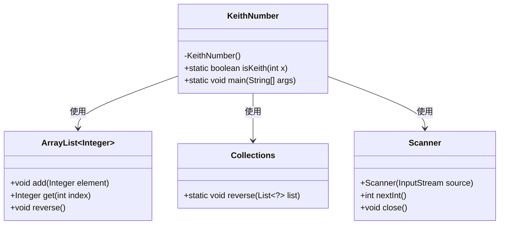
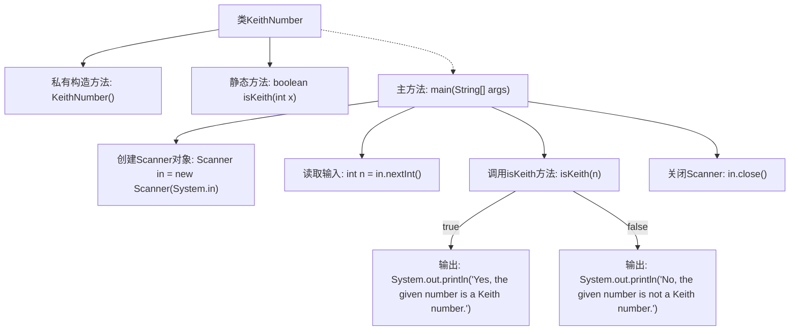

# 基础信息

|      |      |
|------|------|
| 名称 | KeithNumber |
| 编码语言 | .java |
| 代码路径 | Java/src/main/java/com/thealgorithms/maths/KeithNumber.java |
| 包名 | com.thealgorithms.maths |
| 依赖项 | ['java.util.ArrayList', 'java.util.Collections', 'java.util.Scanner'] |
| 概述说明 | Java程序用于判断给定数字是否为Keith数。 |

# 说明

该Java程序用于判断给定的数字是否为Keith数。Keith数是一种特殊的数字序列，其定义基于该数字本身的各位数字生成一个序列，然后检查该数字是否出现在序列中。程序首先提取数字的各位数字，生成初始序列，然后通过不断计算新的序列项，直到序列项等于或超过给定数字。如果在过程中找到与给定数字相等的序列项，则该数字为Keith数，否则不是。程序通过这一逻辑实现了对Keith数的判断。

# 类列表 Class Summary

| 名称   | 类型  | 说明 |
|-------|------|-------------|
| KeithNumber | class | 判断给定数字是否为Keith数的Java程序。 |

## 类 KeithNumber

|      |      |
|------|------|
| 访问范围 | final |
| 类型 | class |
| 名称 | KeithNumber |
| 说明 | 判断给定数字是否为Keith数的Java程序。 |

### UML类图

**描述：**  
`KeithNumber` 类包含一个私有构造函数和一个静态方法 `isKeith`，用于检查给定整数是否为基思数（Keith Number）。该类依赖于 `ArrayList` 来存储数字的各位，使用 `Collections` 来反转列表，并通过 `Scanner` 从用户输入中读取整数。`isKeith` 方法通过计算数字的各位生成一系列数字，并检查是否满足基思数的定义。

### 内部方法调用关系图

这段代码定义了一个`KeithNumber`类，用于判断一个数字是否为Keith数。Keith数是一个特殊的数列，其生成规则类似于斐波那契数列，但基于数字的各位数。代码首先通过`isKeith`方法计算数字的各位数，并生成一个数列，直到数列中的某个数等于或超过输入的数字。如果数列中的某个数等于输入的数字，则该数字是Keith数，否则不是。主方法`main`负责读取用户输入，调用`isKeith`方法，并根据结果输出相应的信息。

### 字段列表 Field List

| 名称  | 类型  | 说明 |
|-------|-------|------|

### 方法列表 Method List

| 名称  | 类型  | 说明 |
|-------|-------|------|
| main | void | Java程序判断输入数字是否为Keith数。 |
| isKeith | boolean | 判断数字是否为Keith数，通过计算其各位数之和并验证是否等于原数。 |

