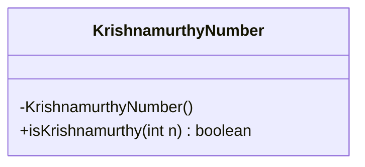
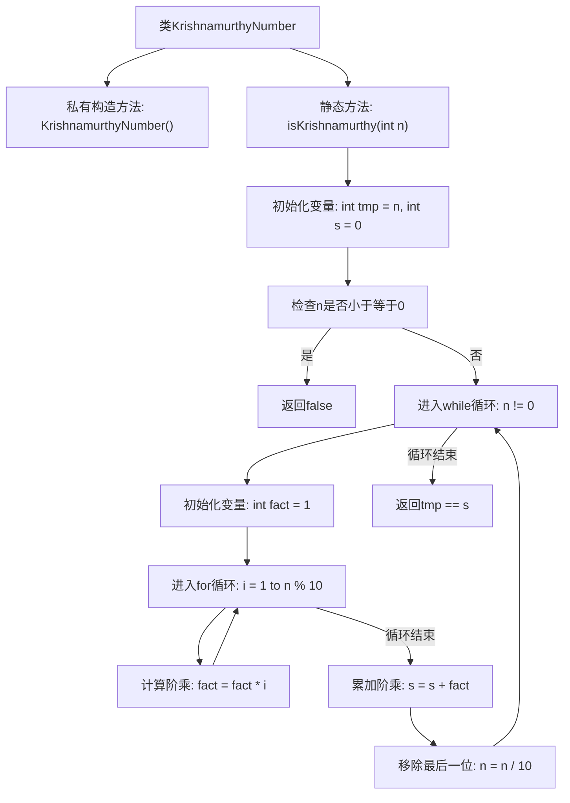

# 基础信息

|      |      |
|------|------|
| 名称 | KrishnamurthyNumber |
| 编码语言 | .java |
| 代码路径 | Java/src/main/java/com/thealgorithms/maths/KrishnamurthyNumber.java |
| 包名 | com.thealgorithms.maths |
| 依赖项 | [] |
| 概述说明 | Krishnamurthy数指各位数字阶乘和等于该数本身的数。 |

# 说明

Krishnamurthy数是指一个数等于其各位数字的阶乘之和。判断一个数是否为Krishnamurthy数，首先需要计算该数每一位数字的阶乘，然后将这些阶乘相加，最后比较阶乘和是否等于原数。如果相等，则该数是Krishnamurthy数，否则不是。

# 类列表 Class Summary

| 名称   | 类型  | 说明 |
|-------|------|-------------|
| KrishnamurthyNumber | class | 判断一个数是否为Krishnamurthy数，即其各位数字的阶乘和等于该数本身。 |

## 类 KrishnamurthyNumber

|      |      |
|------|------|
| 访问范围 | public final |
| 类型 | class |
| 名称 | KrishnamurthyNumber |
| 说明 | 判断一个数是否为Krishnamurthy数，即其各位数字的阶乘和等于该数本身。 |

### UML类图

这段代码定义了一个名为 `KrishnamurthyNumber` 的类，该类包含一个私有构造函数和一个公有静态方法 `isKrishnamurthy`。`isKrishnamurthy` 方法用于检查一个整数是否为 Krishnamurthy 数（也称为强数）。Krishnamurthy 数是指一个数的各位数字的阶乘之和等于该数本身。该方法通过计算输入数的每一位数字的阶乘并求和，最后判断和是否等于原数。如果输入数小于等于0，则直接返回 `false`。

### 内部方法调用关系图

这段代码定义了一个名为 `KrishnamurthyNumber` 的类，其中包含一个静态方法 `isKrishnamurthy`，用于检查一个整数是否是 Krishnamurthy 数。Krishnamurthy 数是指其各位数字的阶乘之和等于该数本身的数。代码首先检查输入是否为正数，然后通过循环计算每位数字的阶乘并累加，最后判断累加结果是否等于原数。流程图展示了从初始化变量到最终判断的完整过程。

### 字段列表 Field List

| 名称  | 类型  | 说明 |
|-------|-------|------|

### 方法列表 Method List

| 名称  | 类型  | 说明 |
|-------|-------|------|
| isKrishnamurthy | boolean | 判断数字是否为克里希纳穆尔提数，即各位数字阶乘和等于原数。 |

