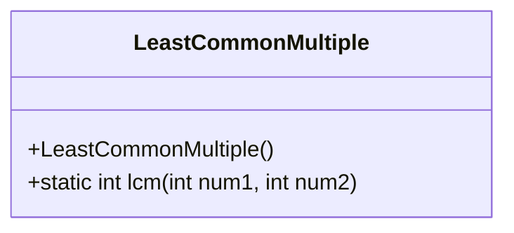
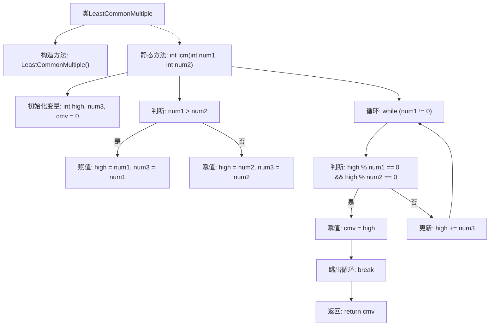

# 基础信息

|      |      |
|------|------|
| 名称 | LeastCommonMultiple |
| 编码语言 | .java |
| 代码路径 | Java/src/main/java/com/thealgorithms/maths/LeastCommonMultiple.java |
| 包名 | com.thealgorithms.maths |
| 依赖项 | [] |
| 概述说明 | 计算两个数的最小公倍数。 |

# 说明

计算两个数的最小公倍数是指找出能够同时被这两个数整除的最小的正整数。最小公倍数在数学和计算机科学中常用于解决涉及多个数的问题，如分数运算、时间同步等。计算方法通常包括分解质因数法或利用最大公约数（GCD）的公式，即两数乘积除以它们的最大公约数。理解最小公倍数的概念对于解决实际问题和优化算法设计具有重要意义。

# 类列表 Class Summary

| 名称   | 类型  | 说明 |
|-------|------|-------------|
| LeastCommonMultiple | class | 计算两个数的最小公倍数。 |

## 类 LeastCommonMultiple

|      |      |
|------|------|
| 访问范围 | public final |
| 类型 | class |
| 名称 | LeastCommonMultiple |
| 说明 | 计算两个数的最小公倍数。 |

### UML类图

**描述：**
`LeastCommonMultiple` 类是一个工具类，用于计算两个整数的最小公倍数（LCM）。该类包含一个私有构造函数，确保无法实例化。`lcm` 方法接收两个整数参数，通过逐步增加较大的数来找到能够同时被两个数整除的最小值，即最小公倍数。该类的设计简洁，专注于单一功能，适合作为工具类使用。

### 内部方法调用关系图

这段代码定义了一个名为`LeastCommonMultiple`的类，其中包含一个静态方法`lcm`，用于计算两个整数的最小公倍数。方法通过比较两个数的大小，确定初始值，并在循环中逐步增加，直到找到同时能被两个数整除的最小值。流程图展示了从初始化变量到最终返回结果的完整过程，清晰地反映了代码的逻辑结构。

### 字段列表 Field List

| 名称  | 类型  | 说明 |
|-------|-------|------|

### 方法列表 Method List

| 名称  | 类型  | 说明 |
|-------|-------|------|
| lcm | int | 计算两个整数的最小公倍数。 |

