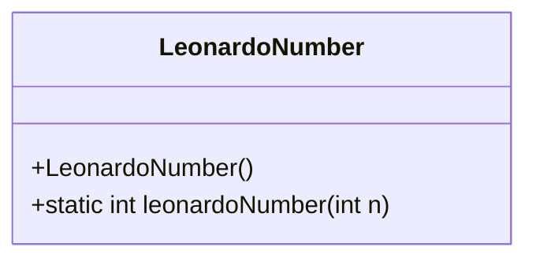
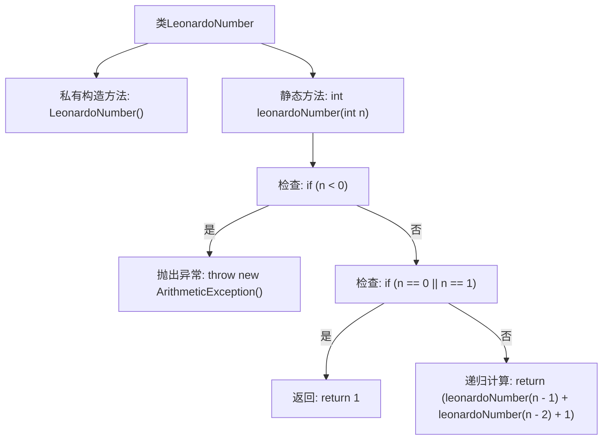

# 基础信息

|      |      |
|------|------|
| 名称 | LeonardoNumber |
| 编码语言 | .java |
| 代码路径 | Java/src/main/java/com/thealgorithms/maths/LeonardoNumber.java |
| 包名 | com.thealgorithms.maths |
| 依赖项 | [] |
| 概述说明 | LeonardoNumber类递归计算第n个Leonardo数列，起始值为1,1。 |

# 说明

LeonardoNumber类用于计算第n个Leonardo数列，采用递归方法实现。数列的起始值为1和1。递归方法通过调用自身来计算数列中的每一个数，确保每个数都是前两个数的和加1。这种实现方式简洁但可能在计算较大数列时效率较低，因为递归调用会导致重复计算。

# 类列表 Class Summary

| 名称   | 类型  | 说明 |
|-------|------|-------------|
| LeonardoNumber | class | LeonardoNumber类计算第n个Leonardo数列，递归实现，起始值为1,1。 |

## 类 LeonardoNumber

|      |      |
|------|------|
| 访问范围 | public final |
| 类型 | class |
| 名称 | LeonardoNumber |
| 说明 | LeonardoNumber类计算第n个Leonardo数列，递归实现，起始值为1,1。 |

### UML类图

类图描述：
`LeonardoNumber` 类是一个不可被继承的最终类，包含一个私有的构造函数，防止外部实例化。该类提供了一个静态方法 `leonardoNumber(int n)`，用于计算第 `n` 个 Leonardo 数。Leonardo 数列的规则是：第 0 和第 1 个数为 1，从第 2 个数开始，每个数等于前两个数之和加 1。方法中包含了参数校验，若 `n` 为负数则抛出 `ArithmeticException` 异常。

### 内部方法调用关系图

这段代码定义了一个名为`LeonardoNumber`的类，其中包含一个私有的构造方法和一个静态方法`leonardoNumber`，用于计算第n个Leonardo数。Leonardo数列的规律是：前两个数为1，从第三个数开始，每个数等于前两个数之和加1。代码通过递归方式实现计算，并在输入为负数时抛出异常。

### 字段列表 Field List

| 名称  | 类型  | 说明 |
|-------|-------|------|

### 方法列表 Method List

| 名称  | 类型  | 说明 |
|-------|-------|------|
| leonardoNumber | int | 计算Leonardo数列的第n项，递归实现，处理异常和边界条件。 |

