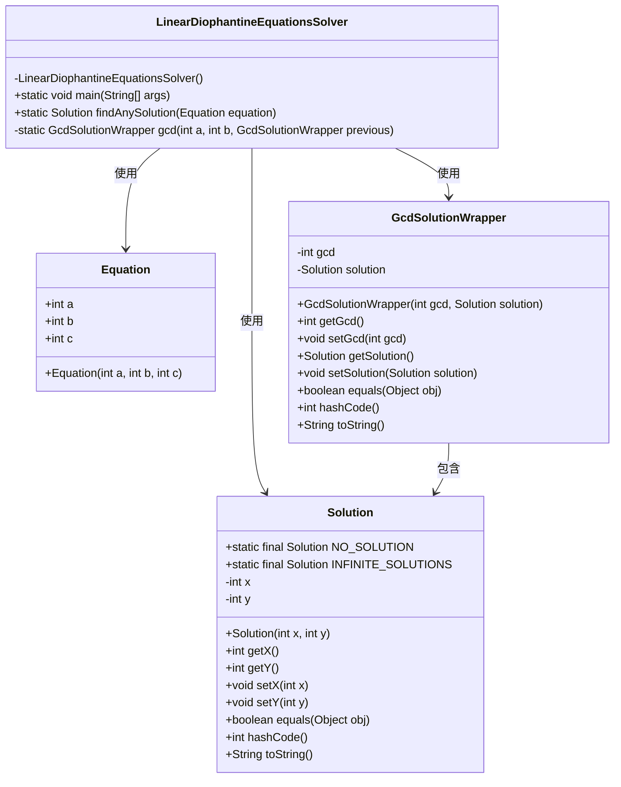
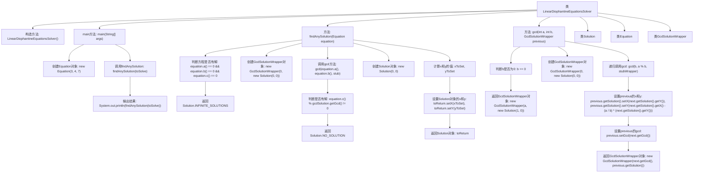

# 基础信息

|      |      |
|------|------|
| 名称 | LinearDiophantineEquationsSolver |
| 编码语言 | .java |
| 代码路径 | Java/src/main/java/com/thealgorithms/maths/LinearDiophantineEquationsSolver.java |
| 包名 | com.thealgorithms.maths |
| 依赖项 | ['java.util.Objects'] |
| 概述说明 | Java实现线性丢番图方程求解，处理无解和无限解情况。 |

# 说明

该内容描述了使用Java编程语言实现线性丢番图方程求解的过程。线性丢番图方程是一种形式为ax + by = c的方程，其中a、b、c为整数，x和y为未知整数。实现中包含了对方程无解和无限解情况的处理。无解的情况通常发生在c不能被a和b的最大公约数整除时，而无限解则发生在a和b都为零且c也为零时。该实现通过计算最大公约数和利用扩展欧几里得算法来找到方程的解，并在无解或无限解时给出相应的提示或处理。

# 类列表 Class Summary

| 名称   | 类型  | 说明 |
|-------|------|-------------|
| LinearDiophantineEquationsSolver | class | Java代码实现线性丢番图方程求解，包含无解和无限解处理。 |

## 类 LinearDiophantineEquationsSolver

|      |      |
|------|------|
| 访问范围 | public final |
| 类型 | class |
| 名称 | LinearDiophantineEquationsSolver |
| 说明 | Java代码实现线性丢番图方程求解，包含无解和无限解处理。 |

### UML类图

这段代码定义了一个用于求解线性Diophantine方程的类`LinearDiophantineEquationsSolver`。它包含一个私有构造函数，防止实例化，并提供了`findAnySolution`方法来寻找方程的解。`Solution`类表示方程的解，`Equation`类表示方程的系数，`GcdSolutionWrapper`类用于在计算最大公约数时包装解和GCD值。代码通过递归计算GCD来求解方程，并根据条件返回相应的解。

### 内部方法调用关系图

这段代码实现了一个线性丢番图方程求解器，包含一个主类`LinearDiophantineEquationsSolver`，以及三个内部类`Solution`、`Equation`和`GcdSolutionWrapper`。代码通过递归调用`gcd`方法计算最大公约数，并根据方程参数判断方程是否有解，最终返回解或无解的结果。流程图展示了从主方法调用到最终返回解的整个过程，涵盖了对象的创建、方法调用和条件判断。

### 字段列表 Field List

| 名称  | 类型  | 说明 |
|-------|-------|------|

### 方法列表 Method List

| 名称  | 类型  | 说明 |
|-------|-------|------|
| gcd | GcdSolutionWrapper | 递归计算最大公约数并更新解决方案。 |
| main | void | Java代码求解方程3x + 4y = 7并输出解。 |
| findAnySolution | Solution | 静态方法findAnySolution根据方程系数判断解的存在性并返回解。 |

