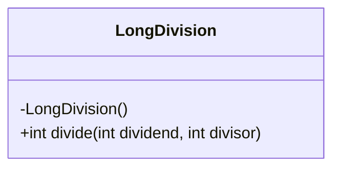
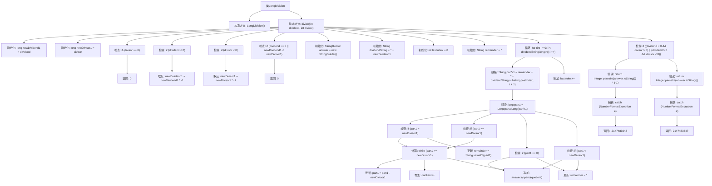

# 基础信息

|      |      |
|------|------|
| 名称 | LongDivision |
| 编码语言 | .java |
| 代码路径 | Java/src/main/java/com/thealgorithms/maths/LongDivision.java |
| 包名 | com.thealgorithms.maths |
| 依赖项 | [] |
| 概述说明 | 实现长除法，处理整数正负及边界情况。 |

# 说明

实现长除法时，需处理整数除法的正负数和边界情况。首先，确定被除数和除数的符号，计算绝对值后进行除法操作。处理负数时，根据符号规则确定结果的符号。边界情况包括除数为零时的异常处理，以及被除数为零时的直接返回零。还需考虑整数溢出的情况，确保计算结果在合理范围内。通过这些步骤，确保长除法在各种情况下都能正确执行。

# 类列表 Class Summary

| 名称   | 类型  | 说明 |
|-------|------|-------------|
| LongDivision | class | 实现长除法，处理整数除法的正负数和边界情况。 |

## 类 LongDivision

|      |      |
|------|------|
| 访问范围 | public final |
| 类型 | class |
| 名称 | LongDivision |
| 说明 | 实现长除法，处理整数除法的正负数和边界情况。 |

### UML类图

这段代码定义了一个名为 `LongDivision` 的类，该类包含一个私有的构造函数和一个公有的静态方法 `divide`。`divide` 方法接受两个整数参数 `dividend` 和 `divisor`，并返回它们的整数除法结果。该方法通过将输入转换为长整型来处理大数除法，并处理了除数为零、被除数为零、负数等情况。最终，方法返回一个整数结果，并在结果超出整数范围时返回 `Integer.MAX_VALUE` 或 `Integer.MIN_VALUE`。

### 内部方法调用关系图

这段代码实现了一个长除法算法，用于处理两个整数的除法操作。代码首先处理了除数为零的情况，并对负数的被除数和除数进行了处理。然后通过循环逐位处理被除数，计算商并更新余数。最后根据被除数和除数的符号决定商的符号，并处理可能的数值溢出情况。整个流程通过多个条件判断和循环实现，确保了算法的正确性和鲁棒性。

### 字段列表 Field List

| 名称  | 类型  | 说明 |
|-------|-------|------|

### 方法列表 Method List

| 名称  | 类型  | 说明 |
|-------|-------|------|
| divide | int | 实现整数除法，处理除零、负数及溢出情况。 |

