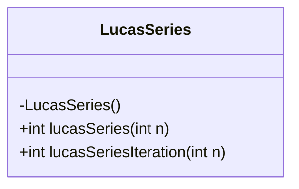
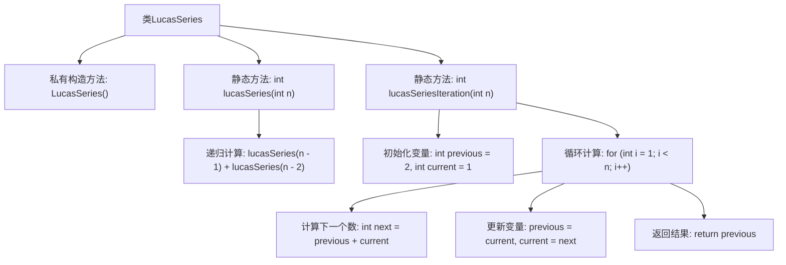

# 基础信息

|      |      |
|------|------|
| 名称 | LucasSeries |
| 编码语言 | .java |
| 代码路径 | Java/src/main/java/com/thealgorithms/maths/LucasSeries.java |
| 包名 | com.thealgorithms.maths |
| 依赖项 | [] |
| 概述说明 | LucasSeries类提供递归和迭代方法计算Lucas数列第n项。 |

# 说明

LucasSeries类提供了两种计算Lucas数列第n项的方法：递归和迭代。递归方法通过函数自身调用来实现计算，适用于理解数列的数学定义。迭代方法则通过循环结构逐步计算，适合处理较大的n值，避免递归带来的栈溢出风险。这两种方法为不同场景下的Lucas数列计算提供了灵活的选择。

# 类列表 Class Summary

| 名称   | 类型  | 说明 |
|-------|------|-------------|
| LucasSeries | class | LucasSeries类提供递归和迭代方法计算Lucas数列的第n项。 |

## 类 LucasSeries

|      |      |
|------|------|
| 访问范围 | public final |
| 类型 | class |
| 名称 | LucasSeries |
| 说明 | LucasSeries类提供递归和迭代方法计算Lucas数列的第n项。 |

### UML类图

类图描述：  
`LucasSeries` 类是一个工具类，提供了两种计算卢卡斯数列的方法。该类包含一个私有构造函数，防止实例化。`lucasSeries` 方法使用递归计算第 n 个卢卡斯数，而 `lucasSeriesIteration` 方法使用迭代实现相同的功能。卢卡斯数列的前两个数字为 2 和 1，后续数字为前两个数字之和。

### 内部方法调用关系图

这段代码定义了一个名为`LucasSeries`的类，其中包含两个静态方法：`lucasSeries`和`lucasSeriesIteration`，分别用于计算Lucas数列的第n项。`lucasSeries`方法通过递归实现，而`lucasSeriesIteration`方法通过迭代实现。递归方法在n为1或2时返回固定值，否则递归调用自身；迭代方法通过循环逐步计算数列的每一项，直到达到第n项。

### 字段列表 Field List

| 名称  | 类型  | 说明 |
|-------|-------|------|

### 方法列表 Method List

| 名称  | 类型  | 说明 |
|-------|-------|------|
| lucasSeriesIteration | int | 静态方法计算卢卡斯数列第n项。 |
| lucasSeries | int | 计算第n项卢卡斯数的递归函数。 |

