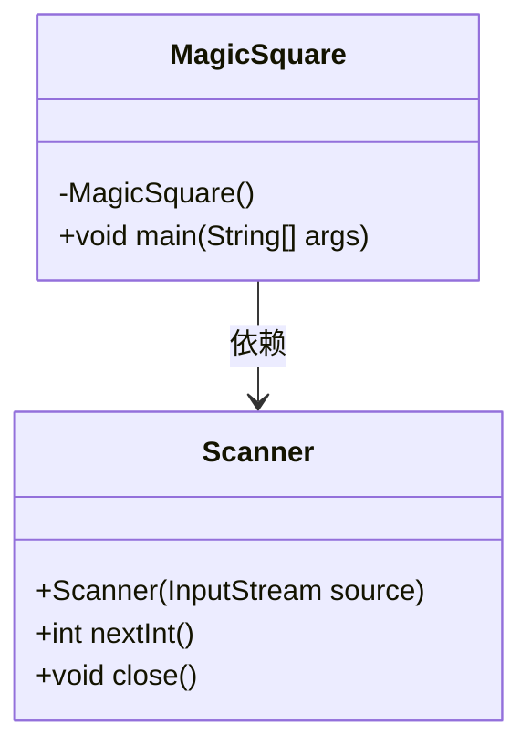
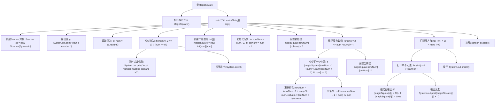

# 基础信息

|      |      |
|------|------|
| 名称 | MagicSquare |
| 编码语言 | .java |
| 代码路径 | Java/src/main/java/com/thealgorithms/maths/MagicSquare.java |
| 包名 | com.thealgorithms.maths |
| 依赖项 | ['java.util.Scanner'] |
| 概述说明 | Java生成奇数阶魔方阵并打印输出。 |

# 说明

该Java程序的主要功能是生成并打印奇数阶的魔方阵。魔方阵是一种特殊的方阵，其中每一行、每一列以及对角线上的数字之和都相等。程序通过特定的算法，确保生成的方阵满足魔方阵的条件。生成的魔方阵将按照标准的矩阵格式打印输出，便于用户查看和验证。整个过程无需用户输入，程序自动完成计算和输出。

# 类列表 Class Summary

| 名称   | 类型  | 说明 |
|-------|------|-------------|
| MagicSquare | class | Java程序生成奇数阶魔方阵并打印。 |

## 类 MagicSquare

|      |      |
|------|------|
| 访问范围 | public final |
| 类型 | class |
| 名称 | MagicSquare |
| 说明 | Java程序生成奇数阶魔方阵并打印。 |

### UML类图

### 描述
这段代码定义了一个名为 `MagicSquare` 的类，该类包含一个私有的构造方法和一个公有的静态 `main` 方法。`main` 方法通过 `Scanner` 类从用户输入中获取一个奇数且大于0的整数，然后生成并打印一个魔方阵。魔方阵的生成遵循特定的规则，确保每行、每列和对角线的和相等。代码通过 `Scanner` 类进行输入操作，并在完成操作后关闭 `Scanner` 实例。

### 内部方法调用关系图

这段代码实现了一个生成奇数阶魔方阵的程序。程序首先通过用户输入获取一个奇数，然后根据该奇数生成一个魔方阵并打印出来。魔方阵的生成规则是从中间行的最后一列开始，按照特定规则填充数字，直到填满整个矩阵。代码还包含了对输入的有效性检查，确保输入的数为正奇数。最后，程序会格式化输出魔方阵，并关闭Scanner对象。

### 字段列表 Field List

| 名称  | 类型  | 说明 |
|-------|-------|------|

### 方法列表 Method List

| 名称  | 类型  | 说明 |
|-------|-------|------|
| main | void | Java程序生成并打印奇数阶幻方。 |

