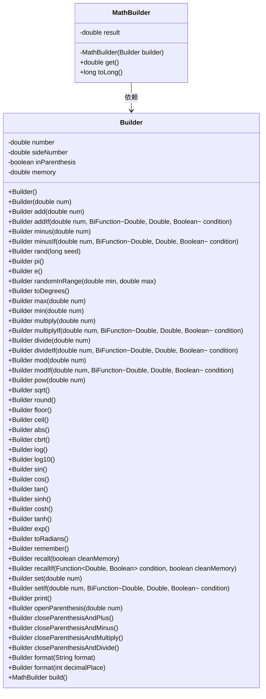

# 基础信息

|      |      |
|------|------|
| 名称 | MathBuilder |
| 编码语言 | .java |
| 代码路径 | Java/src/main/java/com/thealgorithms/maths/MathBuilder.java |
| 包名 | com.thealgorithms.maths |
| 依赖项 | ['java.text.DecimalFormat', 'java.util.Random', 'java.util.function.BiFunction', 'java.util.function.Function'] |
| 概述说明 | MathBuilder类支持多种数学运算和函数。 |

# 说明

MathBuilder类是一个数学操作构建器，支持多种数学运算功能，包括基本的加减乘除操作、条件运算、三角函数计算以及随机数生成。该类旨在提供全面的数学操作支持，方便用户进行复杂的数学运算和处理。

# 类列表 Class Summary

| 名称   | 类型  | 说明 |
|-------|------|-------------|
| MathBuilder | class | MathBuilder类提供数学操作构建器，支持加减乘除、条件运算、三角函数、随机数生成等功能。 |

## 类 MathBuilder

|      |      |
|------|------|
| 访问范围 | public final |
| 类型 | class |
| 名称 | MathBuilder |
| 说明 | MathBuilder类提供数学操作构建器，支持加减乘除、条件运算、三角函数、随机数生成等功能。 |

### UML类图

**描述：**
`MathBuilder` 类是一个用于构建和操作数学表达式的工具类，它通过内部的 `Builder` 类来逐步构建数学表达式。`Builder` 类提供了丰富的数学操作方法，如加法、减法、乘法、除法等，并且支持条件操作、随机数生成、三角函数计算等功能。`MathBuilder` 类通过 `Builder` 类的 `build` 方法生成最终结果，并提供了获取结果和将结果转换为长整型的方法。`Builder` 类还支持括号操作和格式化输出，使得数学表达式的构建更加灵活和强大。

### 内部方法调用关系图

```mermaid
graph TD
    A["类MathBuilder"]
    B["属性: double result"]
    C["构造方法: MathBuilder(Builder builder)"]
    D["方法: double get()"]
    E["方法: long toLong()"]
    F["类Builder"]
    G["属性: double number"]
    H["属性: double sideNumber"]
    I["属性: boolean inParenthesis"]
    J["属性: double memory"]
    K["构造方法: Builder()"]
    L["构造方法: Builder(double num)"]
    M["方法: Builder add(double num)"]
    N["方法: Builder addIf(double num, BiFunction<Double, Double, Boolean> condition)"]
    O["方法: Builder minus(double num)"]
    P["方法: Builder minusIf(double num, BiFunction<Double, Double, Boolean> condition)"]
    Q["方法: Builder rand(long seed)"]
    R["方法: Builder pi()"]
    S["方法: Builder e()"]
    T["方法: Builder randomInRange(double min, double max)"]
    U["方法: Builder toDegrees()"]
    V["方法: Builder max(double num)"]
    W["方法: Builder min(double num)"]
    X["方法: Builder multiply(double num)"]
    Y["方法: Builder multiplyIf(double num, BiFunction<Double, Double, Boolean> condition)"]
    Z["方法: Builder divide(double num)"]
    AA["方法: Builder divideIf(double num, BiFunction<Double, Double, Boolean> condition)"]
    AB["方法: Builder mod(double num)"]
    AC["方法: Builder modIf(double num, BiFunction<Double, Double, Boolean> condition)"]
    AD["方法: Builder pow(double num)"]
    AE["方法: Builder sqrt()"]
    AF["方法: Builder round()"]
    AG["方法: Builder floor()"]
    AH["方法: Builder ceil()"]
    AI["方法: Builder abs()"]
    AJ["方法: Builder cbrt()"]
    AK["方法: Builder log()"]
    AL["方法: Builder log10()"]
    AM["方法: Builder sin()"]
    AN["方法: Builder cos()"]
    AO["方法: Builder tan()"]
    AP["方法: Builder sinh()"]
    AQ["方法: Builder cosh()"]
    AR["方法: Builder tanh()"]
    AS["方法: Builder exp()"]
    AT["方法: Builder toRadians()"]
    AU["方法: Builder remember()"]
    AV["方法: Builder recall(boolean cleanMemory)"]
    AW["方法: Builder recallIf(Function<Double, Boolean> condition, boolean cleanMemory)"]
    AX["方法: Builder set(double num)"]
    AY["方法: Builder setIf(double num, BiFunction<Double, Double, Boolean> condition)"]
    AZ["方法: Builder print()"]
    BA["方法: Builder openParenthesis(double num)"]
    BB["方法: Builder closeParenthesisAndPlus()"]
    BC["方法: Builder closeParenthesisAndMinus()"]
    BD["方法: Builder closeParenthesisAndMultiply()"]
    BE["方法: Builder closeParenthesisAndDivide()"]
    BF["方法: Builder format(String format)"]
    BG["方法: Builder format(int decimalPlace)"]
    BH["方法: MathBuilder build()"]

    A --> B
    A --> C
    A --> D
    A --> E
    A -.-> F
    F --> G
    F --> H
    F --> I
    F --> J
    F --> K
    F --> L
    F --> M
    F --> N
    F --> O
    F --> P
    F --> Q
    F --> R
    F --> S
    F --> T
    F --> U
    F --> V
    F --> W
    F --> X
    F --> Y
    F --> Z
    F --> AA
    F --> AB
    F --> AC
    F --> AD
    F --> AE
    F --> AF
    F --> AG
    F --> AH
    F --> AI
    F --> AJ
    F --> AK
    F --> AL
    F --> AM
    F --> AN
    F --> AO
    F --> AP
    F --> AQ
    F --> AR
    F --> AS
    F --> AT
    F --> AU
    F --> AV
    F --> AW
    F --> AX
    F --> AY
    F --> AZ
    F --> BA
    F --> BB
    F --> BC
    F --> BD
    F --> BE
    F --> BF
    F --> BG
    F --> BH
```

这段代码定义了一个`MathBuilder`类及其内部类`Builder`，用于构建和执行数学操作。`MathBuilder`类包含一个最终结果属性`result`，并通过`Builder`类的方法链式调用进行各种数学计算和操作。`Builder`类提供了丰富的数学操作方法，如加减乘除、幂运算、三角函数等，并且支持条件操作和内存管理。最终，`Builder`类的`build()`方法返回一个`MathBuilder`实例，包含计算后的结果。

### 字段列表 Field List

| 名称  | 类型  | 说明 |
|-------|-------|------|
| result | double | 声明了一个私有的不可变双精度浮点数变量result。 |

### 方法列表 Method List

| 名称  | 类型  | 说明 |
|-------|-------|------|
| get | double | 该方法返回一个双精度浮点数结果。 |
| toLong | long | 将double转为long，处理NaN、无穷大及越界情况，异常返回0。 |

