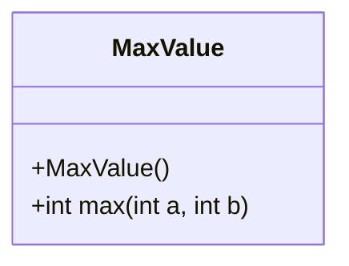
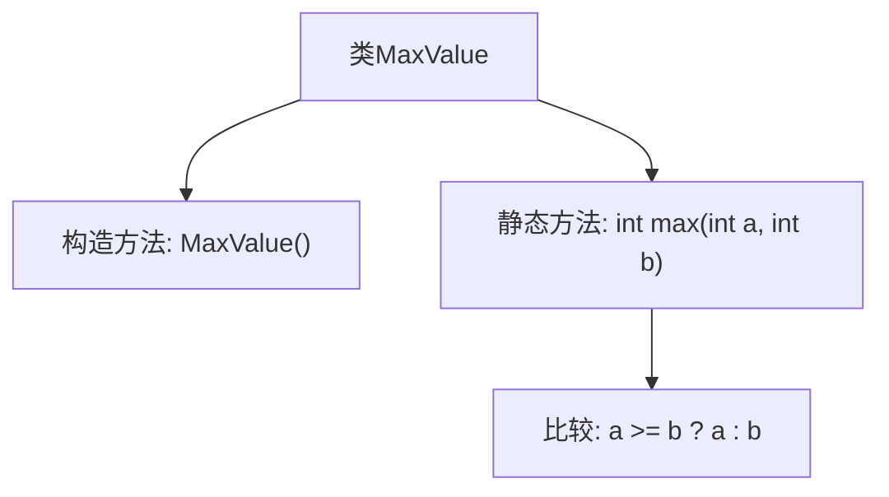

# 基础信息

|      |      |
|------|------|
| 名称 | MaxValue |
| 编码语言 | .java |
| 代码路径 | Java/src/main/java/com/thealgorithms/maths/MaxValue.java |
| 包名 | com.thealgorithms.maths |
| 依赖项 | [] |
| 概述说明 | MaxValue类的max方法返回两个int值中的较大者。 |

# 说明

MaxValue类包含一个静态方法max，该方法用于比较两个int类型的数值，并返回其中较大的一个。该方法不涉及任何复杂的逻辑或计算，仅通过简单的比较操作实现功能。由于其静态性质，可以直接通过类名调用，无需实例化MaxValue类。该方法适用于需要快速获取两个整数中较大值的场景，具有高效和简洁的特点。

# 类列表 Class Summary

| 名称   | 类型  | 说明 |
|-------|------|-------------|
| MaxValue | class | MaxValue类提供静态方法max，返回两个int值中的较大者。 |

## 类 MaxValue

|      |      |
|------|------|
| 访问范围 | public final |
| 类型 | class |
| 名称 | MaxValue |
| 说明 | MaxValue类提供静态方法max，返回两个int值中的较大者。 |

### UML类图

这段代码定义了一个名为 `MaxValue` 的最终类，该类包含一个私有的构造函数和一个公有的静态方法 `max`。`max` 方法接受两个整数参数 `a` 和 `b`，并返回其中较大的一个。由于 `MaxValue` 类是最终类，它不能被继承。该类的主要功能是通过静态方法 `max` 来比较两个整数值，并返回较大的那个值。

### 内部方法调用关系图

这段代码定义了一个名为 `MaxValue` 的不可继承类，包含一个私有的构造方法和一个静态方法 `max`。`max` 方法接收两个整数参数 `a` 和 `b`，并返回其中较大的值。通过三元运算符 `a >= b ? a : b` 进行比较，如果 `a` 大于或等于 `b`，则返回 `a`，否则返回 `b`。该类的设计旨在提供一个简单的工具方法来比较两个整数值。

### 字段列表 Field List

| 名称  | 类型  | 说明 |
|-------|-------|------|

### 方法列表 Method List

| 名称  | 类型  | 说明 |
|-------|-------|------|
| max | int | 静态方法返回两个整数中的较大值。 |

