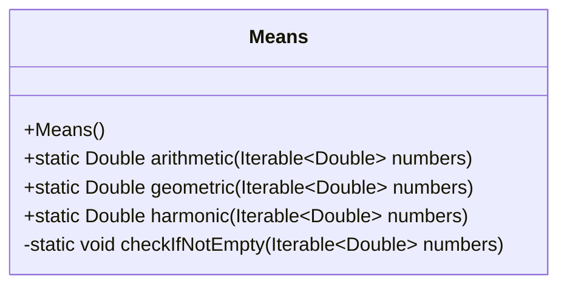
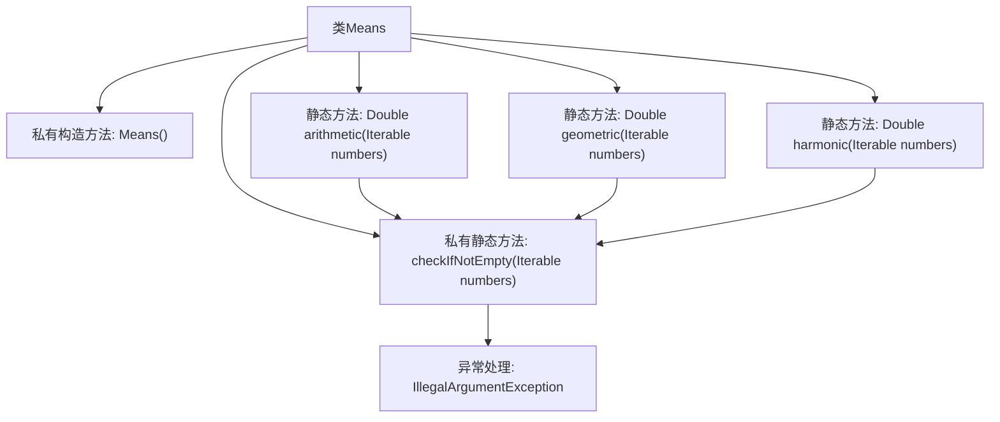

# 基础信息

|      |      |
|------|------|
| 名称 | Means |
| 编码语言 | .java |
| 代码路径 | Java/src/main/java/com/thealgorithms/maths/Means.java |
| 包名 | com.thealgorithms.maths |
| 依赖项 | ['java.util.stream.StreamSupport', 'org.apache.commons.collections4.IterableUtils'] |
| 概述说明 | Means类计算三种均值，输入为空时抛出异常。 |

# 说明

Means类用于计算算术均值、几何均值和调和均值。当输入为空时，该类会抛出异常。该类的主要功能是处理数值数据，确保在输入有效的情况下，能够准确计算三种不同类型的均值。如果输入数据为空，系统会检测到这一情况并抛出异常，以防止无效计算或错误结果。

# 类列表 Class Summary

| 名称   | 类型  | 说明 |
|-------|------|-------------|
| Means | class | Means类计算算术、几何和调和均值，输入为空时抛出异常。 |

## 类 Means

|      |      |
|------|------|
| 访问范围 | public final |
| 类型 | class |
| 名称 | Means |
| 说明 | Means类计算算术、几何和调和均值，输入为空时抛出异常。 |

### UML类图

### 描述
`Means` 类是一个工具类，提供了计算算术平均、几何平均和调和平均的静态方法。所有方法都接受一个 `Iterable<Double>` 类型的输入，并在输入为空时抛出 `IllegalArgumentException`。`checkIfNotEmpty` 方法用于检查输入是否为空。该类通过流操作和数学函数实现了各种平均值的计算，确保了代码的简洁性和高效性。

### 内部方法调用关系图

这段代码定义了一个名为 `Means` 的类，该类包含三个静态方法 `arithmetic`、`geometric` 和 `harmonic`，分别用于计算输入数字的算术平均数、几何平均数和谐和平均数。每个方法首先调用 `checkIfNotEmpty` 方法检查输入是否为空，如果为空则抛出 `IllegalArgumentException` 异常。`checkIfNotEmpty` 方法通过检查迭代器是否有下一个元素来判断输入是否为空。流程图展示了类中各个方法之间的调用关系，以及异常处理的流程。

### 字段列表 Field List

| 名称  | 类型  | 说明 |
|-------|-------|------|

### 方法列表 Method List

| 名称  | 类型  | 说明 |
|-------|-------|------|
| arithmetic | Double | 计算数字集合的算术平均值。 |
| harmonic | Double | 计算一组数的调和平均数。 |
| geometric | Double | 计算可迭代数字集合的几何平均数。 |
| checkIfNotEmpty | void | 检查数字列表是否为空，为空则抛出异常。 |

