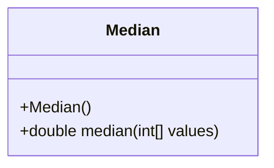
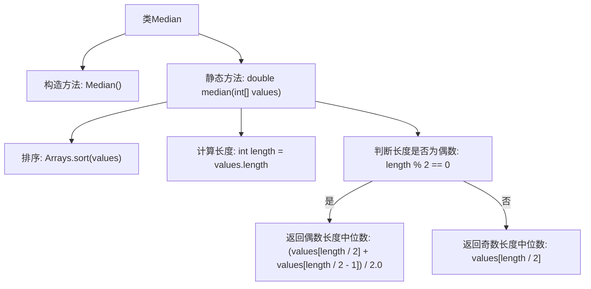

# 基础信息

|      |      |
|------|------|
| 名称 | Median |
| 编码语言 | .java |
| 代码路径 | Java/src/main/java/com/thealgorithms/maths/Median.java |
| 包名 | com.thealgorithms.maths |
| 依赖项 | ['java.util.Arrays'] |
| 概述说明 | 计算排序数组的中位数，偶数取平均值，奇数取中间值。 |

# 说明

计算排序数组的中位数时，首先需要确保数组已经按升序或降序排列。如果数组长度为奇数，则中位数是数组中间的那个元素。如果数组长度为偶数，则中位数是中间两个元素的平均值。这一方法适用于任何已排序的数组，能够快速准确地找到中位数。

# 类列表 Class Summary

| 名称   | 类型  | 说明 |
|-------|------|-------------|
| Median | class | 计算排序数组的中位数，偶数取平均值，奇数取中间值。 |

## 类 Median

|      |      |
|------|------|
| 访问范围 | public final |
| 类型 | class |
| 名称 | Median |
| 说明 | 计算排序数组的中位数，偶数取平均值，奇数取中间值。 |

### UML类图

**描述：**
`Median` 类是一个工具类，用于计算给定整数数组的中位数。该类包含一个私有构造函数，防止外部实例化。`median` 方法接受一个整数数组作为参数，首先对数组进行排序，然后根据数组长度的奇偶性计算中位数。如果数组长度为偶数，则取中间两个数的平均值；如果为奇数，则直接取中间的数。该方法返回一个 `double` 类型的中位数值。

### 内部方法调用关系图

这段代码定义了一个名为 `Median` 的类，其中包含一个静态方法 `median`，用于计算给定整数数组的中位数。首先对数组进行排序，然后根据数组长度的奇偶性计算中位数。如果长度为偶数，则返回中间两个数的平均值；如果长度为奇数，则直接返回中间的数。流程图清晰地展示了这一计算过程。

### 字段列表 Field List

| 名称  | 类型  | 说明 |
|-------|-------|------|

### 方法列表 Method List

| 名称  | 类型  | 说明 |
|-------|-------|------|
| median | double | 计算整数数组的中位数，排序后根据长度奇偶返回中间值或平均值。 |

