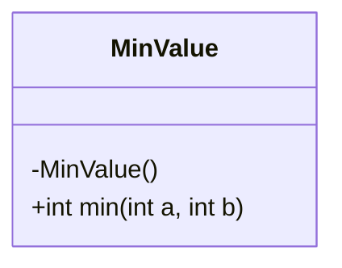
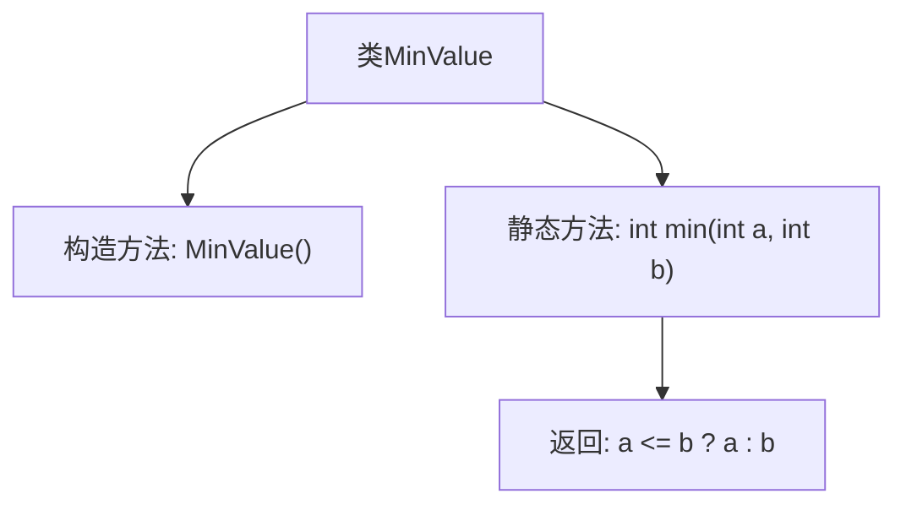

# 基础信息

|      |      |
|------|------|
| 名称 | MinValue |
| 编码语言 | .java |
| 代码路径 | Java/src/main/java/com/thealgorithms/maths/MinValue.java |
| 包名 | com.thealgorithms.maths |
| 依赖项 | [] |
| 概述说明 | MinValue类的静态方法min返回两个整数中的较小值。 |

# 说明

MinValue类包含一个静态方法min，该方法用于比较两个整数并返回其中较小的一个。这个方法的设计旨在提供一种简单而有效的方式来获取两个整数值中的最小值，无需创建类的实例即可直接调用。通过使用静态方法，用户可以方便地在任何需要的地方调用min方法，从而简化代码逻辑并提高代码的可读性和可维护性。

# 类列表 Class Summary

| 名称   | 类型  | 说明 |
|-------|------|-------------|
| MinValue | class | MinValue类提供静态方法min，返回两个整数中较小的一个。 |

## 类 MinValue

|      |      |
|------|------|
| 访问范围 | public final |
| 类型 | class |
| 名称 | MinValue |
| 说明 | MinValue类提供静态方法min，返回两个整数中较小的一个。 |

### UML类图

这段代码定义了一个名为 `MinValue` 的不可继承的类（`final`），该类包含一个私有的构造函数，防止外部实例化。类中定义了一个静态方法 `min(int a, int b)`，用于返回两个整数中较小的一个。该方法通过比较两个参数的大小，返回较小的值。如果两个值相等，则返回该值。这个类的主要作用是提供一个工具方法，用于比较两个整数并返回较小的值。

### 内部方法调用关系图

这段代码定义了一个名为 `MinValue` 的不可继承类，其中包含一个私有的构造方法和一个公共的静态方法 `min`。`min` 方法接受两个整数参数 `a` 和 `b`，并返回其中较小的值。如果 `a` 小于或等于 `b`，则返回 `a`，否则返回 `b`。由于构造方法是私有的，该类不能被实例化，`min` 方法只能通过类名直接调用。

### 字段列表 Field List

| 名称  | 类型  | 说明 |
|-------|-------|------|

### 方法列表 Method List

| 名称  | 类型  | 说明 |
|-------|-------|------|
| min | int | 静态方法返回两个整数中的较小值。 |

