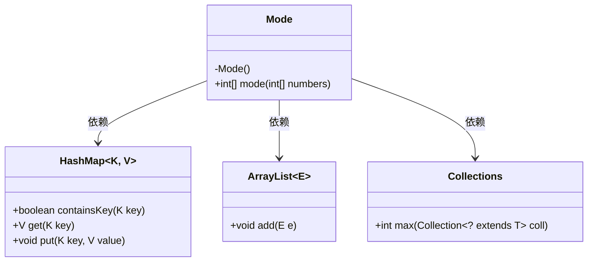
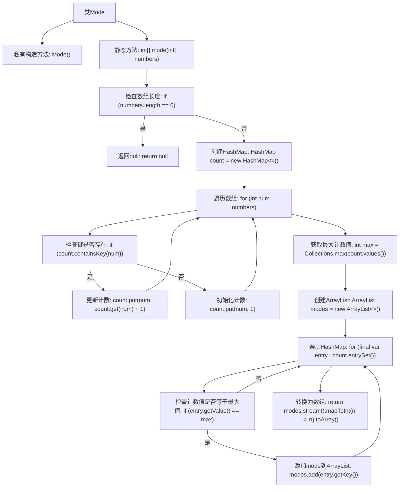

# 基础信息

|      |      |
|------|------|
| 名称 | Mode |
| 编码语言 | .java |
| 代码路径 | Java/src/main/java/com/thealgorithms/maths/Mode.java |
| 包名 | com.thealgorithms.maths |
| 依赖项 | ['java.util.ArrayList', 'java.util.Collections', 'java.util.HashMap'] |
| 概述说明 | 计算数组众数，返回频次最高数。 |

# 说明

该内容描述了一个计算整数数组众数的方法，旨在找出数组中出现次数最多的数。众数是指在数据集中出现频率最高的元素。该方法的实现目标是通过分析数组中的元素频率，确定并返回出现次数最多的那个数。这一过程不涉及具体的代码实现，而是专注于描述其功能目的和核心逻辑。

# 类列表 Class Summary

| 名称   | 类型  | 说明 |
|-------|------|-------------|
| Mode | class | 计算整数数组的众数，返回出现次数最多的数。 |

## 类 Mode

|      |      |
|------|------|
| 访问范围 | public final |
| 类型 | class |
| 名称 | Mode |
| 说明 | 计算整数数组的众数，返回出现次数最多的数。 |

### UML类图

这段代码定义了一个名为 `Mode` 的类，该类包含一个私有构造函数和一个静态方法 `mode`，用于计算整数数组的众数。`mode` 方法首先检查数组是否为空，然后使用 `HashMap` 统计每个数字的出现次数，接着找到最大出现次数，最后将所有出现次数等于最大值的数字收集到 `ArrayList` 中，并将其转换为数组返回。代码依赖了 `HashMap`、`ArrayList` 和 `Collections` 类来完成这些操作。

### 内部方法调用关系图

这段代码定义了一个名为`Mode`的类，其中包含一个静态方法`mode`，用于计算整数数组的众数。首先检查数组是否为空，如果为空则返回`null`。接着使用`HashMap`统计每个数字的出现次数，然后找到最大计数值，并将所有出现次数等于最大值的数字添加到`ArrayList`中，最后将其转换为数组返回。

### 字段列表 Field List

| 名称  | 类型  | 说明 |
|-------|-------|------|

### 方法列表 Method List

| 名称  | 类型  | 说明 |
|-------|-------|------|
| mode | int[] | 计算数组中出现频率最高的元素并返回。 |

