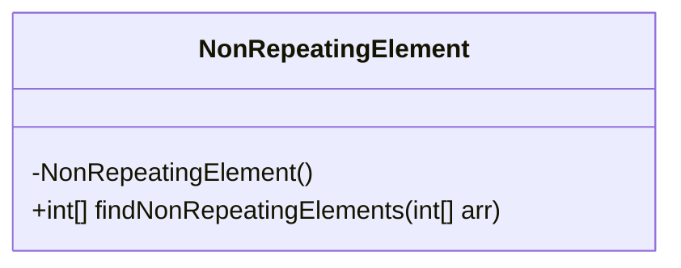
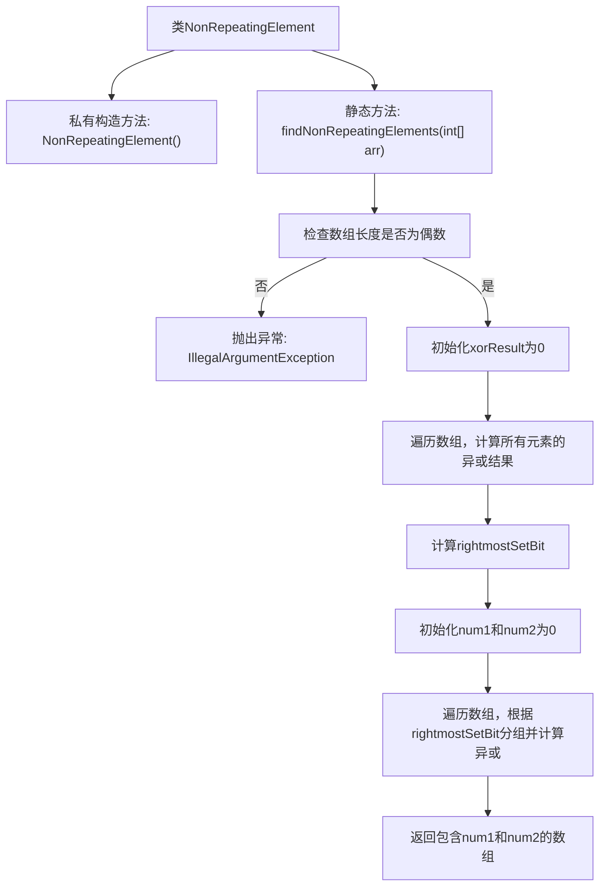

# 基础信息

|      |      |
|------|------|
| 名称 | NonRepeatingElement |
| 编码语言 | .java |
| 代码路径 | Java/src/main/java/com/thealgorithms/maths/NonRepeatingElement.java |
| 包名 | com.thealgorithms.maths |
| 依赖项 | [] |
| 概述说明 | 类NonRepeatingElement的方法findNonRepeatingElements用于查找数组中两个不重复元素。 |

# 说明

类NonRepeatingElement包含一个名为findNonRepeatingElements的方法，该方法用于在数组中查找两个不重复的元素。该方法的主要功能是识别并返回数组中唯一出现的两个元素，确保这些元素在数组中没有重复出现。通过这一方法，用户可以有效地从数组中提取出唯一的元素，从而进行进一步的处理或分析。

# 类列表 Class Summary

| 名称   | 类型  | 说明 |
|-------|------|-------------|
| NonRepeatingElement | class | 类NonRepeatingElement提供方法findNonRepeatingElements，用于查找数组中两个不重复元素。 |

## 类 NonRepeatingElement

|      |      |
|------|------|
| 访问范围 | public final |
| 类型 | class |
| 名称 | NonRepeatingElement |
| 说明 | 类NonRepeatingElement提供方法findNonRepeatingElements，用于查找数组中两个不重复元素。 |

### UML类图

**类图描述：**

`NonRepeatingElement` 是一个不可被继承的类，包含一个私有构造函数以防止实例化。该类提供了一个公有静态方法 `findNonRepeatingElements`，用于在数组中查找两个不重复的元素。该方法接收一个整数数组作为输入，并返回一个包含这两个不重复元素的数组。如果输入数组的长度为奇数，方法将抛出 `IllegalArgumentException` 异常。

### 内部方法调用关系图

**描述：**  
该代码定义了一个名为`NonRepeatingElement`的类，包含一个私有构造方法和一个静态方法`findNonRepeatingElements`。该方法用于在数组中查找两个不重复的元素。首先检查数组长度是否为偶数，若为奇数则抛出异常。然后通过异或操作计算所有元素的异或结果，找到最右置位，并根据该位将数组分为两组，分别计算异或结果，最终返回两个不重复的元素。

### 字段列表 Field List

| 名称  | 类型  | 说明 |
|-------|-------|------|

### 方法列表 Method List

| 名称  | 类型  | 说明 |
|-------|-------|------|
| findNonRepeatingElements | int[] | 通过异或运算找出数组中两个不重复的元素。 |

