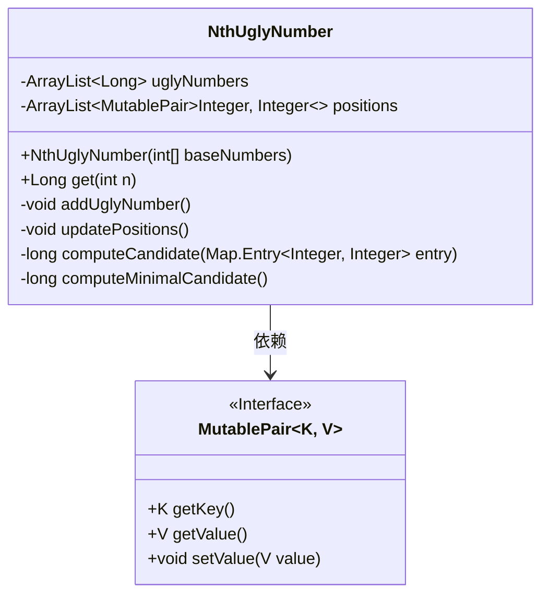
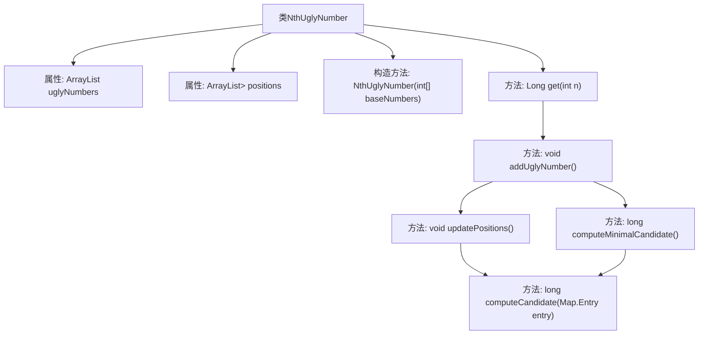

# 基础信息

|      |      |
|------|------|
| 名称 | NthUglyNumber |
| 编码语言 | .java |
| 代码路径 | Java/src/main/java/com/thealgorithms/maths/NthUglyNumber.java |
| 包名 | com.thealgorithms.maths |
| 依赖项 | ['java.util.Collections.singletonList', 'java.util.ArrayList', 'java.util.Map', 'org.apache.commons.lang3.tuple.MutablePair'] |
| 概述说明 | NthUglyNumber类计算第n个丑数，支持初始化、获取及更新操作。 |

# 说明

NthUglyNumber类是一个用于计算第n个丑数的工具类，其核心功能基于给定的基数进行操作。该类支持初始化、获取和更新操作，使用户能够灵活地生成和管理丑数序列。通过初始化设置基数，用户可以获取指定位置的丑数，并可根据需要更新基数以重新计算序列。该类设计简洁高效，适用于需要频繁计算丑数的场景。

# 类列表 Class Summary

| 名称   | 类型  | 说明 |
|-------|------|-------------|
| NthUglyNumber | class | NthUglyNumber类用于计算基于给定基数的第n个丑数，支持初始化、获取及更新操作。 |

## 类 NthUglyNumber

|      |      |
|------|------|
| 访问范围 | public |
| 类型 | class |
| 名称 | NthUglyNumber |
| 说明 | NthUglyNumber类用于计算基于给定基数的第n个丑数，支持初始化、获取及更新操作。 |

### UML类图

### 描述：
`NthUglyNumber` 类用于计算第n个丑数，丑数是指仅能被给定基数整除的数。类中包含两个私有成员：`uglyNumbers` 用于存储已计算的丑数，`positions` 用于记录每个基数的当前位置。类提供了构造函数 `NthUglyNumber` 初始化基数，并通过 `get` 方法获取第n个丑数。内部方法 `addUglyNumber` 和 `updatePositions` 用于动态添加新的丑数并更新位置信息。`MutablePair` 接口用于表示键值对，`NthUglyNumber` 依赖此接口来管理基数及其位置。

### 内部方法调用关系图

这段代码定义了一个名为`NthUglyNumber`的类，用于计算并存储丑数。丑数是指只包含给定基数的质因数的正整数。类中包含了两个主要属性：`uglyNumbers`用于存储已计算的丑数，`positions`用于跟踪每个基数在丑数生成过程中的位置。构造方法`NthUglyNumber`初始化对象并验证基数数组非空。方法`get`用于获取第n个丑数，若未计算到该位置，则调用`addUglyNumber`方法生成新的丑数。`addUglyNumber`方法通过`computeMinimalCandidate`找到最小候选丑数，并调用`updatePositions`更新位置信息。`computeCandidate`方法用于计算候选丑数，`computeMinimalCandidate`方法则用于找到最小的候选丑数。

### 字段列表 Field List

| 名称  | 类型  | 说明 |
|-------|-------|------|
| uglyNumbers = new ArrayList<>(singletonList(1L)) | ArrayList<Long> | 私有ArrayList存储长整型丑数，初始值为1。 |
| positions = new ArrayList<>() | ArrayList<MutablePair<Integer, Integer>> | 定义了一个存储整数对的可变数组列表。 |

### 方法列表 Method List

| 名称  | 类型  | 说明 |
|-------|-------|------|
| addUglyNumber | void | 私有方法添加丑数并更新位置。 |
| computeCandidate | long | 计算候选值：键乘以丑数列表中的值。 |
| get | Long | 获取第n个丑数，若n为负则抛出异常，不足时动态添加。 |
| updatePositions | void | 更新位置信息，若候选值等于最后一个丑数则递增位置值。 |
| computeMinimalCandidate | long | 计算最小候选值，遍历所有位置并返回最小值。 |

