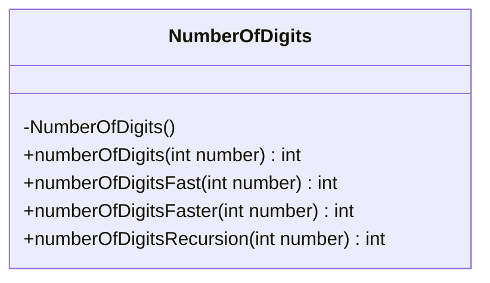
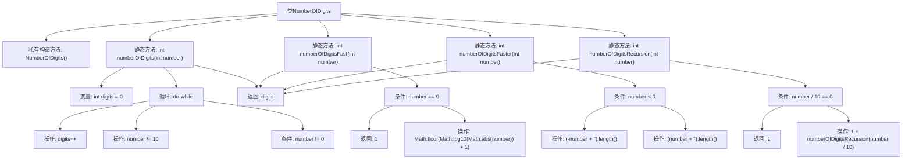

# 基础信息

|      |      |
|------|------|
| 名称 | NumberOfDigits |
| 编码语言 | .java |
| 代码路径 | Java/src/main/java/com/thealgorithms/maths/NumberOfDigits.java |
| 包名 | com.thealgorithms.maths |
| 依赖项 | [] |
| 概述说明 | NumberOfDigits类提供四种方法计算整数位数。 |

# 说明

NumberOfDigits类提供了四种不同的方法来计算整数的位数。这些方法包括循环法、快速法、更快速法和递归法。每种方法都有其独特的实现方式，旨在满足不同场景下的需求，提供灵活且高效的计算位数解决方案。

# 类列表 Class Summary

| 名称   | 类型  | 说明 |
|-------|------|-------------|
| NumberOfDigits | class | NumberOfDigits类提供四种方法计算整数位数：循环、快速、更快速和递归。 |

## 类 NumberOfDigits

|      |      |
|------|------|
| 访问范围 | public final |
| 类型 | class |
| 名称 | NumberOfDigits |
| 说明 | NumberOfDigits类提供四种方法计算整数位数：循环、快速、更快速和递归。 |

### UML类图

这段代码定义了一个名为 `NumberOfDigits` 的类，该类包含四个静态方法，用于计算一个整数的位数。`numberOfDigits` 方法通过循环逐位计算位数；`numberOfDigitsFast` 方法使用数学对数快速计算位数；`numberOfDigitsFaster` 方法通过将数字转换为字符串并计算其长度来获取位数；`numberOfDigitsRecursion` 方法则通过递归来计算位数。所有方法都返回整数值，表示输入数字的位数。

### 内部方法调用关系图

这段代码定义了一个名为`NumberOfDigits`的类，包含四个静态方法，分别用于计算一个整数的位数。`numberOfDigits`方法通过循环逐位去除数字来计算位数；`numberOfDigitsFast`方法利用对数运算快速计算位数；`numberOfDigitsFaster`方法通过将数字转换为字符串并获取其长度来计算位数；`numberOfDigitsRecursion`方法通过递归方式计算位数。每个方法都返回输入整数的位数。

### 字段列表 Field List

| 名称  | 类型  | 说明 |
|-------|-------|------|

### 方法列表 Method List

| 名称  | 类型  | 说明 |
|-------|-------|------|
| numberOfDigitsFaster | int | 该方法快速计算整数的位数，处理负数时取绝对值。 |
| numberOfDigitsRecursion | int | 递归计算整数位数，若除10为0返回1，否则加1继续递归。 |
| numberOfDigits | int | 静态方法计算整数位数，循环除以10直到0。 |
| numberOfDigitsFast | int | 快速计算整数位数的方法，使用对数函数实现。 |

