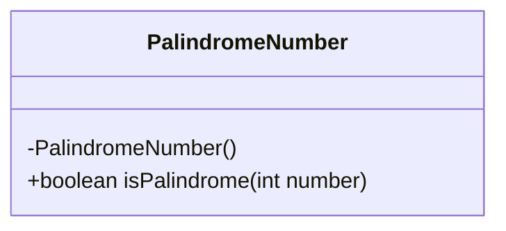
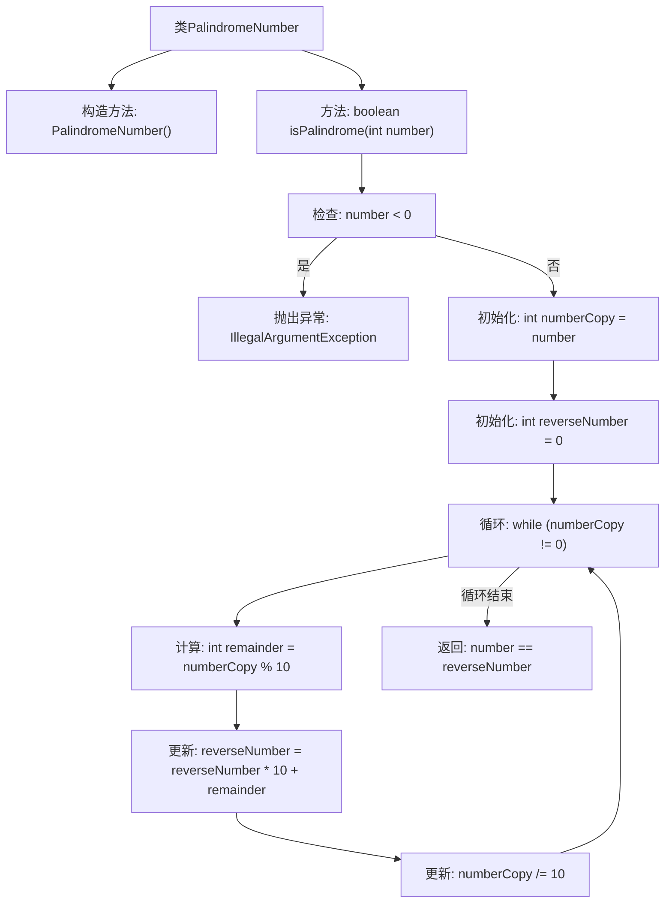

# 基础信息

|      |      |
|------|------|
| 名称 | PalindromeNumber |
| 编码语言 | .java |
| 代码路径 | Java/src/main/java/com/thealgorithms/maths/PalindromeNumber.java |
| 包名 | com.thealgorithms.maths |
| 依赖项 | [] |
| 概述说明 | 判断整数是否为回文数，负数则抛出异常。 |

# 说明

该内容描述了一个判断整数是否为回文数的任务。回文数是指正读和反读都相同的数字。任务要求对输入的整数进行判断，如果整数是负数，则抛出异常。判断过程需要确保数字的前后对称性，即从前往后和从后往前读取的数字序列相同。该任务的核心在于处理整数的数字序列，确保其对称性，并对负数进行异常处理。

# 类列表 Class Summary

| 名称   | 类型  | 说明 |
|-------|------|-------------|
| PalindromeNumber | class | 判断整数是否为回文数，负数抛出异常。 |

## 类 PalindromeNumber

|      |      |
|------|------|
| 访问范围 | public final |
| 类型 | class |
| 名称 | PalindromeNumber |
| 说明 | 判断整数是否为回文数，负数抛出异常。 |

### UML类图

类图描述：`PalindromeNumber` 类是一个工具类，用于检查一个整数是否为回文数。该类包含一个私有构造函数，防止外部实例化，以及一个静态方法 `isPalindrome`，该方法接受一个整数参数并返回一个布尔值，表示该整数是否为回文数。方法内部通过反转数字并进行比较来判断是否为回文数，若输入参数为负数，则抛出 `IllegalArgumentException` 异常。

### 内部方法调用关系图

**描述：**  
这段代码定义了一个名为`PalindromeNumber`的类，其中包含一个静态方法`isPalindrome`，用于判断一个整数是否为回文数。流程从检查输入是否为负数开始，如果是负数则抛出异常；否则，通过循环将数字反转，最后比较原始数字与反转后的数字是否相等，以确定是否为回文数。

### 字段列表 Field List

| 名称  | 类型  | 说明 |
|-------|-------|------|

### 方法列表 Method List

| 名称  | 类型  | 说明 |
|-------|-------|------|
| isPalindrome | boolean | 该方法判断整数是否为回文数，负数会抛出异常。 |

