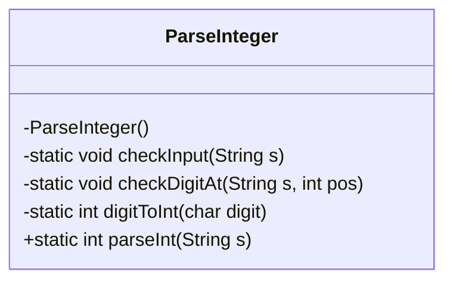
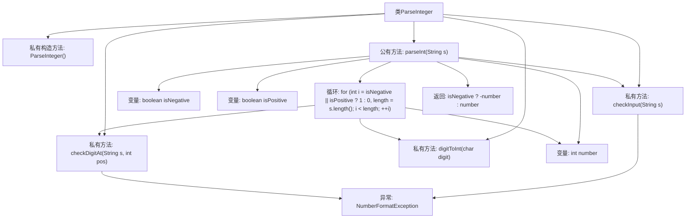

# 基础信息

|      |      |
|------|------|
| 名称 | ParseInteger |
| 编码语言 | .java |
| 代码路径 | Java/src/main/java/com/thealgorithms/maths/ParseInteger.java |
| 包名 | com.thealgorithms.maths |
| 依赖项 | [] |
| 概述说明 | ParseInteger类实现字符串转整数，含输入检查、字符验证和转换逻辑。 |

# 说明

ParseInteger类用于将字符串转换为整数，其实现过程包括三个主要步骤。首先，进行输入检查，确保输入字符串的有效性和合法性。其次，进行字符验证，确认字符串中的每个字符是否符合整数格式要求。最后，执行转换逻辑，将验证通过的字符串逐字符转换为整数。整个过程注重异常处理和边界条件的考虑，以确保转换的准确性和鲁棒性。

# 类列表 Class Summary

| 名称   | 类型  | 说明 |
|-------|------|-------------|
| ParseInteger | class | ParseInteger类实现字符串转整数，包含输入检查、字符验证和转换逻辑。 |

## 类 ParseInteger

|      |      |
|------|------|
| 访问范围 | public final |
| 类型 | class |
| 名称 | ParseInteger |
| 说明 | ParseInteger类实现字符串转整数，包含输入检查、字符验证和转换逻辑。 |

### UML类图

这段代码定义了一个名为 `ParseInteger` 的类，该类用于将字符串解析为整数。`ParseInteger` 类包含四个私有静态方法：`checkInput` 用于检查输入字符串是否为空或为 null；`checkDigitAt` 用于检查字符串中指定位置的字符是否为数字；`digitToInt` 用于将字符转换为对应的整数值；`parseInt` 是公有静态方法，负责解析字符串并返回对应的整数值。该类通过严格的输入检查和字符验证，确保字符串能够正确解析为整数，并在遇到非法输入时抛出 `NumberFormatException` 异常。

### 内部方法调用关系图

这段代码定义了一个名为 `ParseInteger` 的类，用于将字符串解析为整数。类中包含多个私有方法用于输入验证和字符转换，以及一个公有方法 `parseInt` 用于执行实际的解析操作。流程图展示了类中各个方法的调用关系，从输入验证到字符处理和最终结果的返回。代码通过异常处理确保输入字符串的格式正确，并支持正负数的解析。

### 字段列表 Field List

| 名称  | 类型  | 说明 |
|-------|-------|------|

### 方法列表 Method List

| 名称  | 类型  | 说明 |
|-------|-------|------|
| checkInput | void | 检查输入字符串是否为空或null，否则抛出异常。 |
| parseInt | int | 解析字符串为整数，处理正负号，逐位转换并返回结果。 |
| digitToInt | int | 该方法将字符数字转换为对应的整数值。 |
| checkDigitAt | void | 检查字符串指定位置是否为数字，否则抛出格式异常。 |

