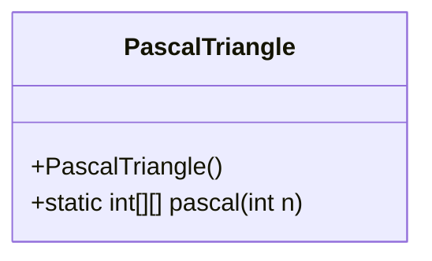
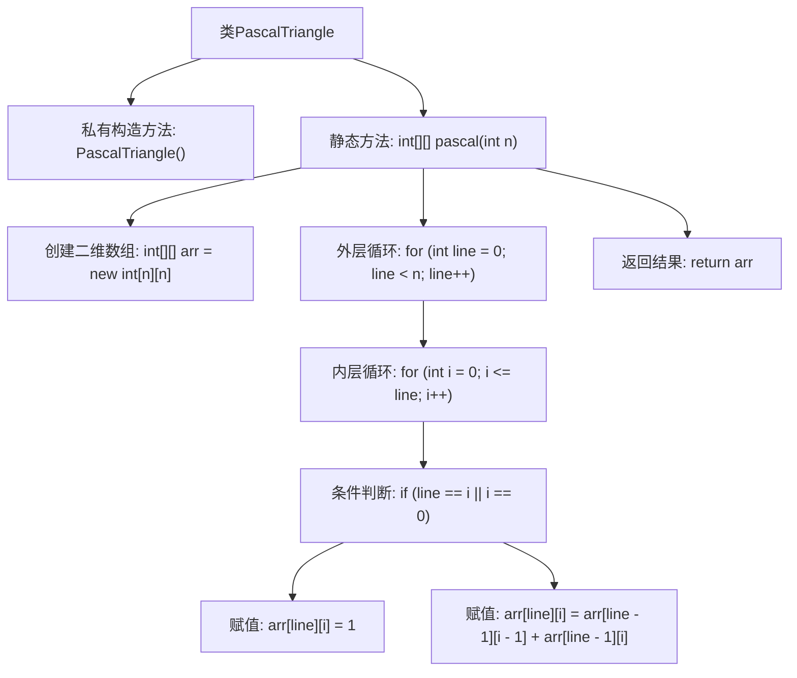

# 基础信息

|      |      |
|------|------|
| 名称 | PascalTriangle |
| 编码语言 | .java |
| 代码路径 | Java/src/main/java/com/thealgorithms/maths/PascalTriangle.java |
| 包名 | com.thealgorithms.maths |
| 依赖项 | [] |
| 概述说明 | 帕斯卡三角类生成指定行数的帕斯卡三角数组。 |

# 说明

帕斯卡三角类用于生成指定行数的帕斯卡三角数组。帕斯卡三角是一种数学结构，每一行的数字由上一行的相邻数字相加得到，首尾均为1。该类通过接收一个整数参数n，表示需要生成的行数，返回一个二维数组，其中每个子数组代表帕斯卡三角的一行。生成过程通过迭代或递归实现，确保每一行的数字准确无误。该方法适用于需要帕斯卡三角数据的数学计算或图形展示场景。

# 类列表 Class Summary

| 名称   | 类型  | 说明 |
|-------|------|-------------|
| PascalTriangle | class | 帕斯卡三角类，生成n行帕斯卡三角数组。 |

## 类 PascalTriangle

|      |      |
|------|------|
| 访问范围 | public final |
| 类型 | class |
| 名称 | PascalTriangle |
| 说明 | 帕斯卡三角类，生成n行帕斯卡三角数组。 |

### UML类图

### 描述
`PascalTriangle` 类是一个用于生成帕斯卡三角形的工具类。该类包含一个私有构造函数，确保无法实例化该类。`pascal` 方法是一个静态方法，接受一个整数 `n` 作为参数，返回一个二维数组，表示前 `n` 行的帕斯卡三角形。该方法通过双重循环计算每个元素的值，确保每行的第一个和最后一个元素为1，其余元素为上一行相邻两个元素的和。帕斯卡三角形在数学中广泛应用于组合数学、概率论和代数等领域。

### 内部方法调用关系图

**描述：**  
该代码实现了一个生成帕斯卡三角形的静态方法`pascal(int n)`。帕斯卡三角形是一个二维数组，其中每个元素的值是其上方两个元素的和。代码通过双重循环遍历每一行和每一列，根据条件判断是否为边界元素，然后进行赋值操作。最终返回生成的二维数组。

### 字段列表 Field List

| 名称  | 类型  | 说明 |
|-------|-------|------|

### 方法列表 Method List

| 名称  | 类型  | 说明 |
|-------|-------|------|
| pascal | int[][] | 生成n行帕斯卡三角形的二维数组。 |

