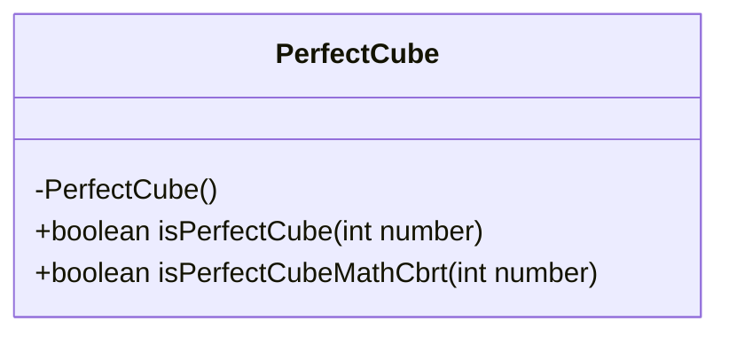
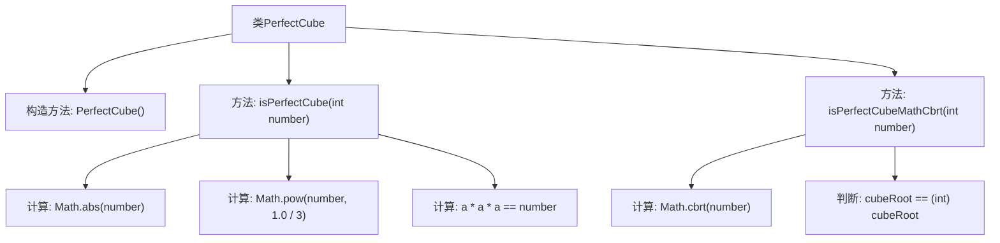

# 基础信息

|      |      |
|------|------|
| 名称 | PerfectCube |
| 编码语言 | .java |
| 代码路径 | Java/src/main/java/com/thealgorithms/maths/PerfectCube.java |
| 包名 | com.thealgorithms.maths |
| 依赖项 | [] |
| 概述说明 | PerfectCube类通过Math.pow和Math.cbrt函数检查数字是否为完全立方数。 |

# 说明

PerfectCube类提供了两种方法来检查一个数字是否为完全立方数。第一种方法使用Math.pow函数，通过计算数字的立方根并将其立方后与原始数字进行比较。第二种方法使用Math.cbrt函数，直接计算数字的立方根，并将结果取整后再次立方，与原始数字进行比较。这两种方法都能有效判断一个数字是否为完全立方数。

# 类列表 Class Summary

| 名称   | 类型  | 说明 |
|-------|------|-------------|
| PerfectCube | class | PerfectCube类提供两种方法检查数字是否为完全立方数，分别使用Math.pow和Math.cbrt函数。 |

## 类 PerfectCube

|      |      |
|------|------|
| 访问范围 | public final |
| 类型 | class |
| 名称 | PerfectCube |
| 说明 | PerfectCube类提供两种方法检查数字是否为完全立方数，分别使用Math.pow和Math.cbrt函数。 |

### UML类图

**描述：**  
`PerfectCube` 类是一个工具类，用于判断一个整数是否为完全立方数。该类提供了两个静态方法：`isPerfectCube` 和 `isPerfectCubeMathCbrt`。`isPerfectCube` 方法通过计算立方根并验证其是否为整数来判断，而 `isPerfectCubeMathCbrt` 方法则直接使用 `Math.cbrt` 函数来计算立方根并进行验证。由于该类是工具类，因此构造函数被私有化，防止实例化。

### 内部方法调用关系图

这段代码定义了一个名为 `PerfectCube` 的类，其中包含两个静态方法 `isPerfectCube` 和 `isPerfectCubeMathCbrt`，用于判断一个整数是否为完全立方数。`isPerfectCube` 方法通过计算立方根并验证其是否为整数来判断，而 `isPerfectCubeMathCbrt` 方法则直接使用 `Math.cbrt` 函数来计算立方根并进行验证。流程图展示了类及其方法的调用关系，以及每个方法内部的计算步骤。

### 字段列表 Field List

| 名称  | 类型  | 说明 |
|-------|-------|------|

### 方法列表 Method List

| 名称  | 类型  | 说明 |
|-------|-------|------|
| isPerfectCube | boolean | 该方法判断整数是否为完全立方数，先取绝对值，再计算立方根并验证。 |
| isPerfectCubeMathCbrt | boolean | 判断整数是否为完全立方数，使用Math.cbrt计算立方根并检查是否为整数。 |

