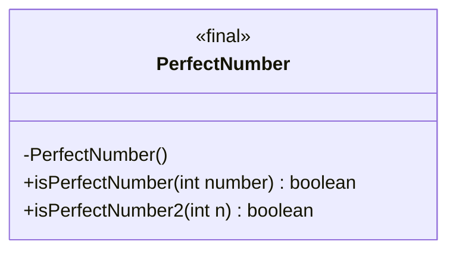
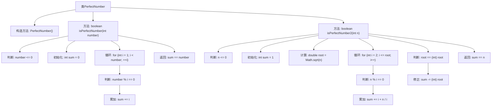

# 基础信息

|      |      |
|------|------|
| 名称 | PerfectNumber |
| 编码语言 | .java |
| 代码路径 | Java/src/main/java/com/thealgorithms/maths/PerfectNumber.java |
| 包名 | com.thealgorithms.maths |
| 依赖项 | [] |
| 概述说明 | 判断数字是否为完美数，需计算其所有正因子之和。 |

# 说明

该描述涉及判断一个数字是否为完美数的方法。完美数是指一个数字等于其所有正因子（不包括其本身）的和。通过计算该数字的所有正因子的和，并将其与原始数字进行比较，可以确定该数字是否为完美数。这一过程包括找出所有正因子、计算它们的和，并进行最终的比较判断。

# 类列表 Class Summary

| 名称   | 类型  | 说明 |
|-------|------|-------------|
| PerfectNumber | class | 检查给定数字是否为完美数，通过计算其所有正因子的和。 |

## 类 PerfectNumber

|      |      |
|------|------|
| 访问范围 | public final |
| 类型 | class |
| 名称 | PerfectNumber |
| 说明 | 检查给定数字是否为完美数，通过计算其所有正因子的和。 |

### UML类图

这段代码定义了一个名为 `PerfectNumber` 的类，该类包含两个静态方法 `isPerfectNumber` 和 `isPerfectNumber2`，用于判断一个整数是否为完美数。完美数是指等于其所有正因数之和的数（不包括自身）。`isPerfectNumber` 方法通过遍历所有小于该数的整数来求和，而 `isPerfectNumber2` 方法则通过优化算法，只遍历到该数的平方根，从而减少计算量。该类被声明为 `final`，表示不能被继承，并且构造函数被私有化，防止实例化。

### 内部方法调用关系图

这段代码定义了一个`PerfectNumber`类，其中包含两个静态方法`isPerfectNumber`和`isPerfectNumber2`，用于判断一个整数是否为完全数。`isPerfectNumber`方法通过遍历所有小于该数的正整数并累加其真因数来判断，而`isPerfectNumber2`方法则通过优化算法，只遍历到该数的平方根，并利用数学性质减少计算量。两个方法都返回布尔值，表示该数是否为完全数。

### 字段列表 Field List

| 名称  | 类型  | 说明 |
|-------|-------|------|

### 方法列表 Method List

| 名称  | 类型  | 说明 |
|-------|-------|------|
| isPerfectNumber | boolean | 判断一个数是否为完美数，即其所有正除数之和等于自身。 |
| isPerfectNumber2 | boolean | 该方法判断整数是否为完全数，通过计算因数之和并与原数比较。 |

