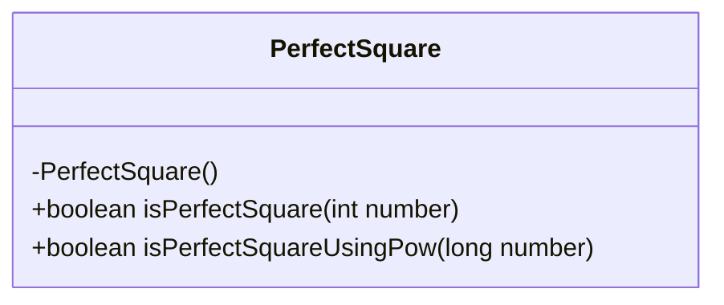
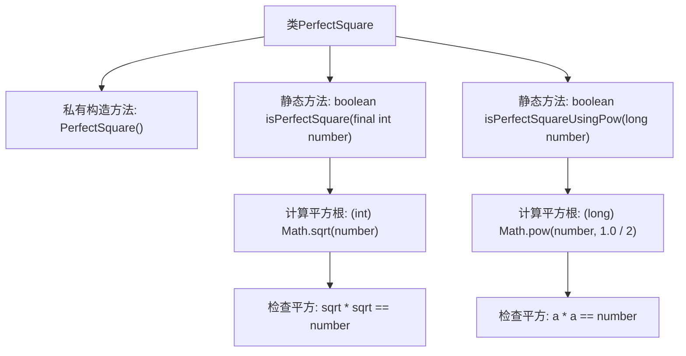

# 基础信息

|      |      |
|------|------|
| 名称 | PerfectSquare |
| 编码语言 | .java |
| 代码路径 | Java/src/main/java/com/thealgorithms/maths/PerfectSquare.java |
| 包名 | com.thealgorithms.maths |
| 依赖项 | [] |
| 概述说明 | PerfectSquare类提供两种方法验证数字是否为完全平方数。 |

# 说明

PerfectSquare类提供了两种方法用于检查给定数字是否为完全平方数。这两种方法旨在通过不同的逻辑或算法来确定一个数字是否可以被表示为某个整数的平方。通过使用该类，用户可以方便地验证数字的完全平方属性，从而在需要时进行进一步的处理或分析。

# 类列表 Class Summary

| 名称   | 类型  | 说明 |
|-------|------|-------------|
| PerfectSquare | class | PerfectSquare类提供两种方法检查数字是否为完全平方数。 |

## 类 PerfectSquare

|      |      |
|------|------|
| 访问范围 | public final |
| 类型 | class |
| 名称 | PerfectSquare |
| 说明 | PerfectSquare类提供两种方法检查数字是否为完全平方数。 |

### UML类图

这段代码定义了一个名为 `PerfectSquare` 的类，该类包含两个静态方法：`isPerfectSquare` 和 `isPerfectSquareUsingPow`，用于判断一个数是否为完全平方数。`isPerfectSquare` 方法通过计算整数的平方根并进行平方运算来验证，而 `isPerfectSquareUsingPow` 方法则使用 `Math.pow` 函数进行类似的计算。该类是 `final` 的，并且构造函数是私有的，表明该类不可被继承且不可实例化。

### 内部方法调用关系图

这段代码定义了一个名为 `PerfectSquare` 的类，其中包含两个静态方法 `isPerfectSquare` 和 `isPerfectSquareUsingPow`，用于判断一个数是否为完全平方数。`isPerfectSquare` 方法通过计算整数的平方根并检查其平方是否等于原数来实现；`isPerfectSquareUsingPow` 方法则使用 `Math.pow` 函数来计算平方根并进行同样的检查。两个方法都返回布尔值，表示输入的数是否为完全平方数。

### 字段列表 Field List

| 名称  | 类型  | 说明 |
|-------|-------|------|

### 方法列表 Method List

| 名称  | 类型  | 说明 |
|-------|-------|------|
| isPerfectSquare | boolean | 该方法判断整数是否为完全平方数。 |
| isPerfectSquareUsingPow | boolean | 该方法通过计算平方根并验证其平方是否等于原数来判断是否为完全平方数。 |

