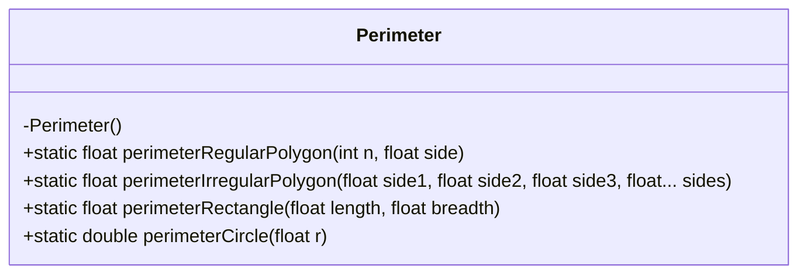
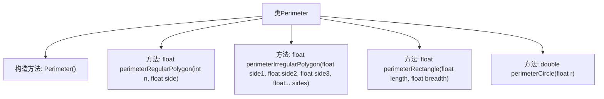

# 基础信息

|      |      |
|------|------|
| 名称 | Perimeter |
| 编码语言 | .java |
| 代码路径 | Java/src/main/java/com/thealgorithms/maths/Perimeter.java |
| 包名 | com.thealgorithms.maths |
| 依赖项 | [] |
| 概述说明 | Perimeter类支持计算正多边形、不规则多边形、矩形和圆的周长。 |

# 说明

Perimeter类是一个用于计算多种几何图形周长的工具类。它支持计算正多边形、不规则多边形、矩形和圆的周长。通过提供不同的方法，用户可以轻松获取这些几何图形的周长值，适用于各种需要周长计算的场景。

# 类列表 Class Summary

| 名称   | 类型  | 说明 |
|-------|------|-------------|
| Perimeter | class | Perimeter类提供计算正多边形、不规则多边形、矩形和圆周长的方法。 |

## 类 Perimeter

|      |      |
|------|------|
| 访问范围 | public final |
| 类型 | class |
| 名称 | Perimeter |
| 说明 | Perimeter类提供计算正多边形、不规则多边形、矩形和圆周长的方法。 |

### UML类图

这段代码定义了一个名为 `Perimeter` 的类，该类包含四个静态方法，分别用于计算不同几何形状的周长。`perimeterRegularPolygon` 方法用于计算正多边形的周长，`perimeterIrregularPolygon` 方法用于计算不规则多边形的周长，`perimeterRectangle` 方法用于计算矩形的周长，`perimeterCircle` 方法用于计算圆的周长。该类是 `final` 的，且构造函数是私有的，意味着该类不能被继承，也不能被实例化。这些方法都是静态的，可以直接通过类名调用。

### 内部方法调用关系图

这段代码定义了一个名为`Perimeter`的类，该类包含四个静态方法，分别用于计算规则多边形、不规则多边形、矩形和圆的周长。`perimeterRegularPolygon`方法通过边数和边长计算规则多边形的周长；`perimeterIrregularPolygon`方法通过多个边长计算不规则多边形的周长；`perimeterRectangle`方法通过长和宽计算矩形的周长；`perimeterCircle`方法通过半径计算圆的周长。所有方法均为静态方法，无需实例化类即可调用。

### 字段列表 Field List

| 名称  | 类型  | 说明 |
|-------|-------|------|

### 方法列表 Method List

| 名称  | 类型  | 说明 |
|-------|-------|------|
| perimeterCircle | double | 计算圆周长的方法，参数为半径r。 |
| perimeterRegularPolygon | float | 计算正多边形周长的静态方法，输入边数和边长，返回周长。 |
| perimeterRectangle | float | 计算矩形周长的静态方法，返回长宽之和的两倍。 |
| perimeterIrregularPolygon | float | 计算不规则多边形周长的静态方法，累加所有边长。 |

