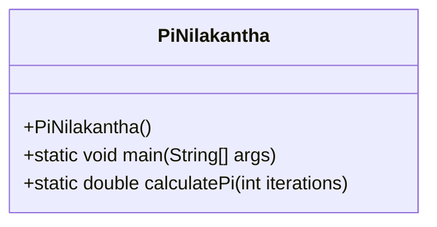
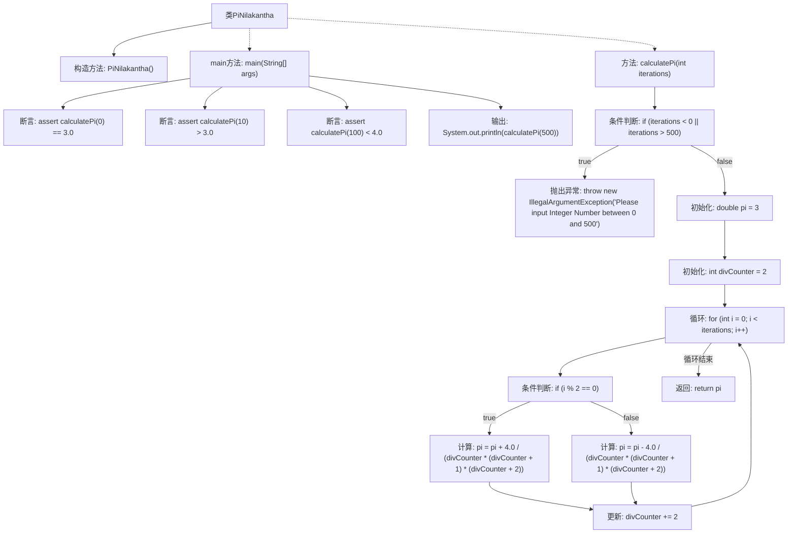

# 基础信息

|      |      |
|------|------|
| 名称 | PiNilakantha |
| 编码语言 | .java |
| 代码路径 | Java/src/main/java/com/thealgorithms/maths/PiNilakantha.java |
| 包名 | com.thealgorithms.maths |
| 依赖项 | [] |
| 概述说明 | PiNilakantha类用无限级数计算Pi，迭代次数0到500。 |

# 说明

PiNilakantha类采用无限级数方法来计算圆周率Pi，该方法的迭代次数范围设定为0到500。通过这一系列的迭代计算，PiNilakantha类能够逐步逼近Pi的精确值，展示了无限级数在数学计算中的有效性和实用性。

# 类列表 Class Summary

| 名称   | 类型  | 说明 |
|-------|------|-------------|
| PiNilakantha | class | PiNilakantha类通过无限级数计算Pi，迭代次数范围为0到500。 |

## 类 PiNilakantha

|      |      |
|------|------|
| 访问范围 | public final |
| 类型 | class |
| 名称 | PiNilakantha |
| 说明 | PiNilakantha类通过无限级数计算Pi，迭代次数范围为0到500。 |

### UML类图

**描述：**  
`PiNilakantha` 类是一个工具类，用于计算π的值，使用Nilakantha的无限级数算法。该类包含一个私有的构造函数，防止实例化，以及两个静态方法：`main` 和 `calculatePi`。`main` 方法用于测试和输出π的计算结果，`calculatePi` 方法根据给定的迭代次数计算π的值，并确保迭代次数在0到500之间。该类的设计简洁，专注于单一功能，适合用于数学计算场景。

### 内部方法调用关系图

这段代码实现了一个计算π值的类`PiNilakantha`，使用Nilakantha的无穷级数算法。`main`方法通过断言验证`calculatePi`方法的正确性，并输出计算后的π值。`calculatePi`方法根据输入的迭代次数计算π值，迭代次数必须在0到500之间，否则抛出异常。通过循环和条件判断，逐步计算π值并返回结果。

### 字段列表 Field List

| 名称  | 类型  | 说明 |
|-------|-------|------|

### 方法列表 Method List

| 名称  | 类型  | 说明 |
|-------|-------|------|
| main | void | Java代码测试calculatePi方法，验证不同输入下的PI值并输出结果。 |
| calculatePi | double | 计算圆周率的函数，迭代次数需在0到500之间。 |

