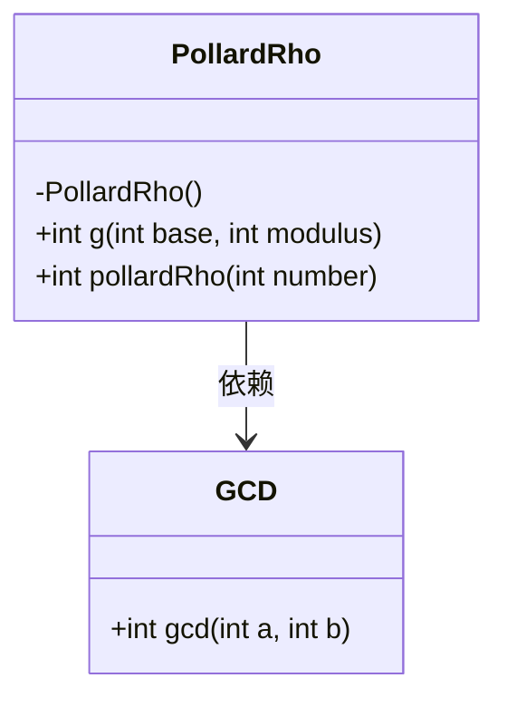
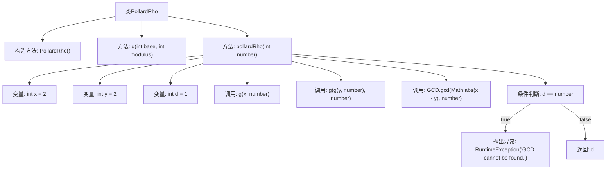

# 基础信息

|      |      |
|------|------|
| 名称 | PollardRho |
| 编码语言 | .java |
| 代码路径 | Java/src/main/java/com/thealgorithms/maths/PollardRho.java |
| 包名 | com.thealgorithms.maths |
| 依赖项 | [] |
| 概述说明 | PollardRho类包含g计算多项式模数和pollardRho寻找非平凡因子两个方法。 |

# 说明

PollardRho类包含两个主要方法：g方法和pollardRho方法。g方法用于计算多项式的模数，而pollardRho方法则用于寻找整数的非平凡因子。这两个方法共同协作，通过计算和因子分解来实现其功能。

# 类列表 Class Summary

| 名称   | 类型  | 说明 |
|-------|------|-------------|
| PollardRho | class | PollardRho类包含两个方法：g计算多项式模数，pollardRho寻找整数的非平凡因子。 |

## 类 PollardRho

|      |      |
|------|------|
| 访问范围 | public final |
| 类型 | class |
| 名称 | PollardRho |
| 说明 | PollardRho类包含两个方法：g计算多项式模数，pollardRho寻找整数的非平凡因子。 |

### UML类图

这段代码定义了一个名为 `PollardRho` 的类，该类包含两个静态方法：`g` 和 `pollardRho`。`g` 方法用于计算一个多项式模 `n` 的值，而 `pollardRho` 方法用于寻找给定整数的非平凡因子。`pollardRho` 方法依赖于 `GCD` 类中的 `gcd` 方法来计算最大公约数。`PollardRho` 类的构造函数是私有的，意味着该类不能被实例化。整体设计用于实现 Pollard's Rho 算法，用于因数分解。

### 内部方法调用关系图

这段代码实现了一个名为 `PollardRho` 的类，用于计算给定整数的非平凡因子。类中包含两个主要方法：`g` 和 `pollardRho`。`g` 方法计算一个多项式模运算的结果，而 `pollardRho` 方法使用 Pollard's Rho 算法来寻找给定整数的非平凡因子。流程图中详细展示了类结构、方法调用以及算法的主要步骤，包括变量初始化、函数调用、条件判断和异常处理。

### 字段列表 Field List

| 名称  | 类型  | 说明 |
|-------|-------|------|

### 方法列表 Method List

| 名称  | 类型  | 说明 |
|-------|-------|------|
| g | int | 函数g计算(base平方减1)对modulus取模的结果。 |
| pollardRho | int | Pollard's Rho算法实现，用于查找整数的非平凡因子。 |

