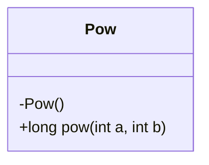
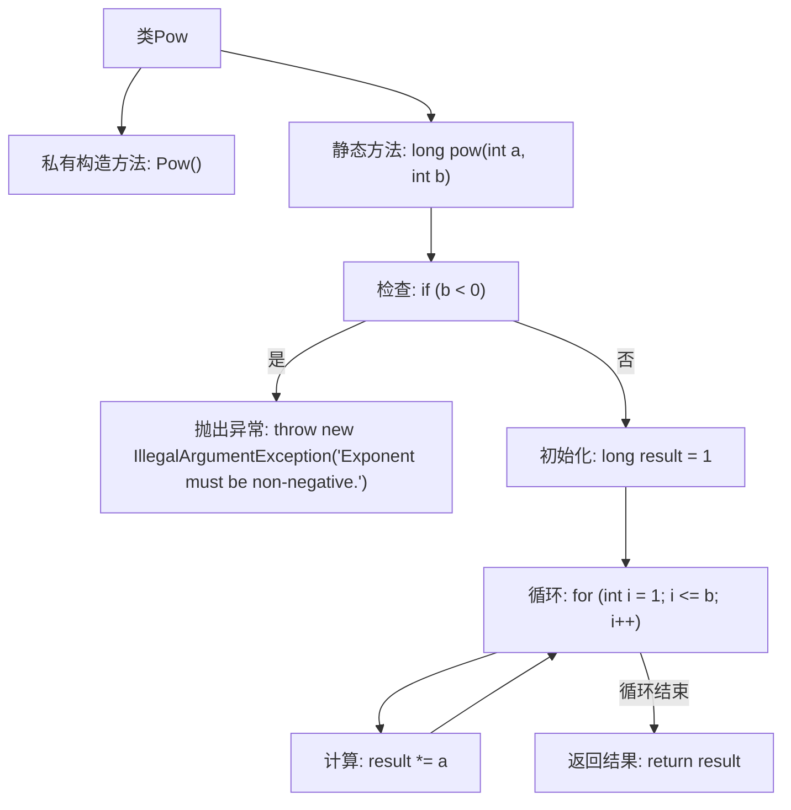

# 基础信息

|      |      |
|------|------|
| 名称 | Pow |
| 编码语言 | .java |
| 代码路径 | Java/src/main/java/com/thealgorithms/maths/Pow.java |
| 包名 | com.thealgorithms.maths |
| 依赖项 | [] |
| 概述说明 | Pow类计算a的b次方，b为非负整数，否则抛异常。 |

# 说明

Pow类用于计算a的b次方，其中b必须为非负整数。如果b为负数或其他非整数值，将抛出异常以确保计算的合法性和准确性。该设计保证了输入参数的约束条件，避免了无效或不合法的计算结果。

# 类列表 Class Summary

| 名称   | 类型  | 说明 |
|-------|------|-------------|
| Pow | class | Pow类计算a的b次方，b必须为非负整数，否则抛出异常。 |

## 类 Pow

|      |      |
|------|------|
| 访问范围 | public final |
| 类型 | class |
| 名称 | Pow |
| 说明 | Pow类计算a的b次方，b必须为非负整数，否则抛出异常。 |

### UML类图

这段代码定义了一个名为 `Pow` 的不可继承类，包含一个私有构造函数和一个静态公有方法 `pow`。`pow` 方法用于计算一个非负整数的幂次方，接受两个参数：基数 `a` 和指数 `b`。如果指数 `b` 为负数，方法会抛出 `IllegalArgumentException`。方法通过循环迭代计算幂次方，并返回结果。该类设计为工具类，用于提供幂次方计算功能，且不允许实例化。

### 内部方法调用关系图

这段代码定义了一个名为 `Pow` 的类，其中包含一个静态方法 `pow`，用于计算一个非负整数的幂次方。方法首先检查指数是否为负数，如果是则抛出 `IllegalArgumentException` 异常。接着，通过循环将基数乘以自身，直到达到指定的幂次，最后返回计算结果。流程图清晰地展示了方法的执行流程和异常处理逻辑。

### 字段列表 Field List

| 名称  | 类型  | 说明 |
|-------|-------|------|

### 方法列表 Method List

| 名称  | 类型  | 说明 |
|-------|-------|------|
| pow | long | 计算a的b次方，b必须为非负整数。 |

