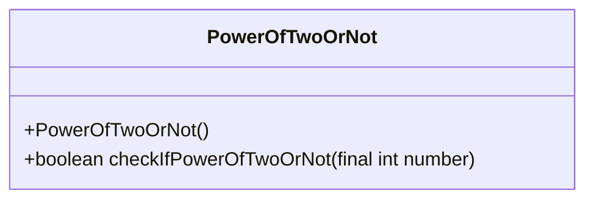
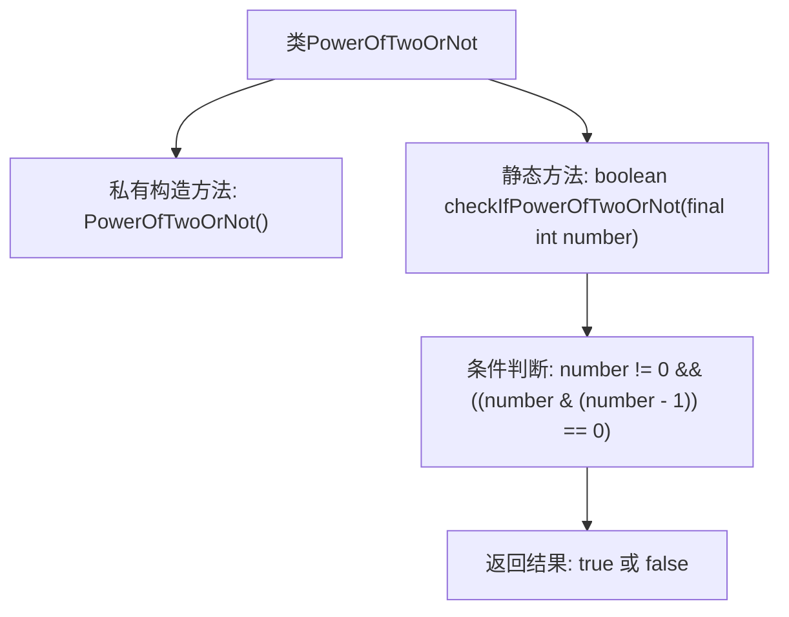

# 基础信息

|      |      |
|------|------|
| 名称 | PowerOfTwoOrNot |
| 编码语言 | .java |
| 代码路径 | Java/src/main/java/com/thealgorithms/maths/PowerOfTwoOrNot.java |
| 包名 | com.thealgorithms.maths |
| 依赖项 | [] |
| 概述说明 | 判断数字是否为2的幂。 |

# 说明

判断给定数字是否为2的幂，可以通过检查该数字是否只有一个二进制位为1来实现。具体方法是，如果该数字大于0，并且该数字与它的减1结果进行按位与运算后等于0，则该数字是2的幂。这种方法利用了2的幂在二进制表示中的特性，即只有最高位为1，其余位均为0。例如，数字8的二进制表示为1000，8减1为7，其二进制表示为0111，1000与0111按位与运算结果为0，因此8是2的幂。

# 类列表 Class Summary

| 名称   | 类型  | 说明 |
|-------|------|-------------|
| PowerOfTwoOrNot | class | 判断给定数字是否为2的幂。 |

## 类 PowerOfTwoOrNot

|      |      |
|------|------|
| 访问范围 | public final |
| 类型 | class |
| 名称 | PowerOfTwoOrNot |
| 说明 | 判断给定数字是否为2的幂。 |

### UML类图

这段代码定义了一个名为 `PowerOfTwoOrNot` 的类，该类包含一个私有的构造函数和一个公有的静态方法 `checkIfPowerOfTwoOrNot`。该方法用于检查给定的整数是否是2的幂次方。通过使用位运算 `number & (number - 1)`，该方法能够高效地判断一个数是否为2的幂次方。如果 `number` 不为0且 `number & (number - 1)` 等于0，则返回 `true`，否则返回 `false`。该类被设计为不可继承的，并且构造函数是私有的，防止外部实例化。

### 内部方法调用关系图

这段代码定义了一个名为 `PowerOfTwoOrNot` 的类，该类包含一个私有构造方法和一个静态方法 `checkIfPowerOfTwoOrNot`。该方法用于检查给定的整数是否是2的幂。通过判断 `number != 0` 且 `number & (number - 1)` 等于0，来确定该数是否为2的幂。如果是，则返回 `true`，否则返回 `false`。

### 字段列表 Field List

| 名称  | 类型  | 说明 |
|-------|-------|------|

### 方法列表 Method List

| 名称  | 类型  | 说明 |
|-------|-------|------|
| checkIfPowerOfTwoOrNot | boolean | 该方法检查整数是否为2的幂次方。 |

