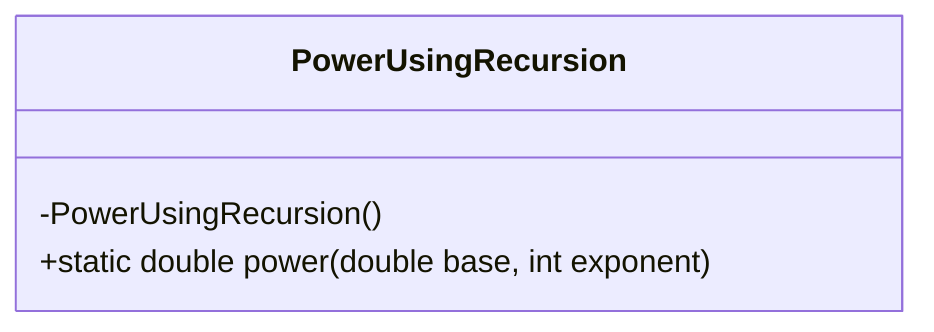
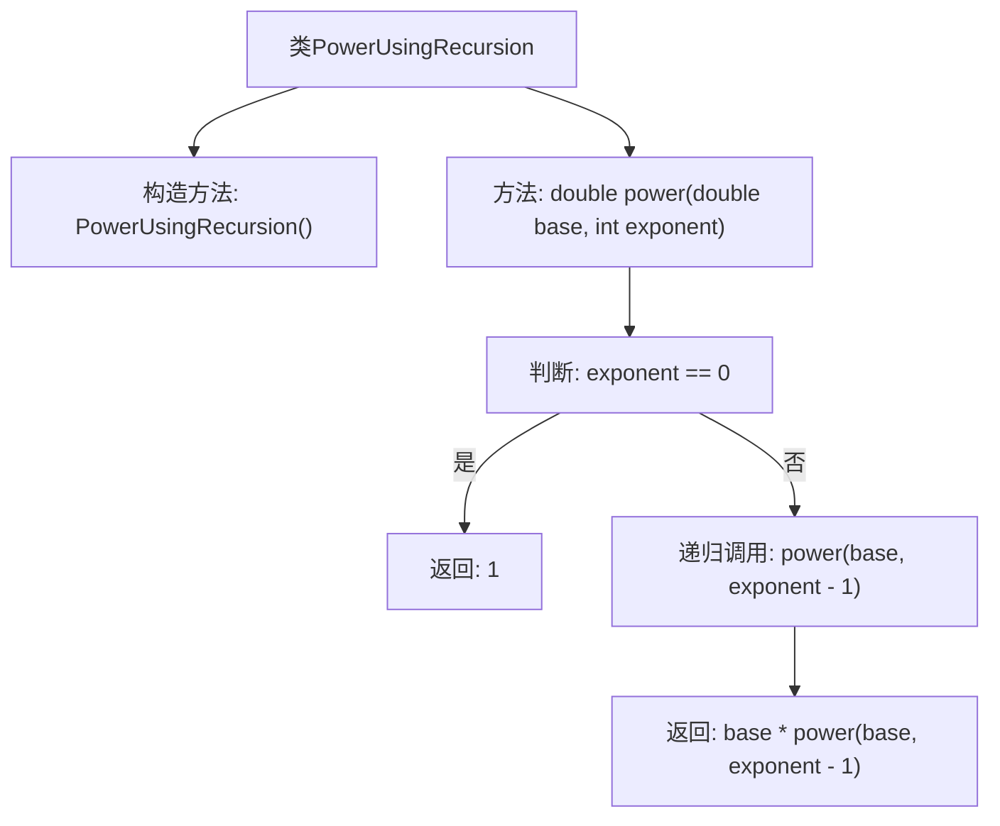

# 基础信息

|      |      |
|------|------|
| 名称 | PowerUsingRecursion |
| 编码语言 | .java |
| 代码路径 | Java/src/main/java/com/thealgorithms/maths/PowerUsingRecursion.java |
| 包名 | com.thealgorithms.maths |
| 依赖项 | [] |
| 概述说明 | 递归方法实现任意底数的整数次幂运算。 |

# 说明

递归实现幂运算是一种通过函数自身调用来计算任意底数的整数指数幂的方法。该方法首先判断指数的值，若指数为零，则返回1；若指数为负数，则返回底数的倒数与正指数幂的乘积；若指数为正数，则通过递归调用函数逐步减少指数值，最终返回底数与递归结果的乘积。该方法简洁高效，适用于各种整数指数的幂运算场景。

# 类列表 Class Summary

| 名称   | 类型  | 说明 |
|-------|------|-------------|
| PowerUsingRecursion | class | 递归实现幂运算，支持任意底数和整数指数。 |

## 类 PowerUsingRecursion

|      |      |
|------|------|
| 访问范围 | public final |
| 类型 | class |
| 名称 | PowerUsingRecursion |
| 说明 | 递归实现幂运算，支持任意底数和整数指数。 |

### UML类图

该代码定义了一个名为 `PowerUsingRecursion` 的类，该类包含一个私有构造函数和一个静态方法 `power`。`power` 方法通过递归计算一个数的幂。当指数为0时，返回1作为基准情况；否则，递归调用自身并将指数减1，直到达到基准情况。类图展示了类的结构和方法的访问权限。

### 内部方法调用关系图

这段代码定义了一个名为 `PowerUsingRecursion` 的类，其中包含一个私有的构造方法和一个静态的 `power` 方法。`power` 方法通过递归的方式计算一个数的幂。当指数为0时，返回1作为基本情况；否则，递归调用 `power` 方法并将结果与基数相乘。流程图清晰地展示了方法的执行流程，包括基本情况和递归情况的处理路径。

### 字段列表 Field List

| 名称  | 类型  | 说明 |
|-------|-------|------|

### 方法列表 Method List

| 名称  | 类型  | 说明 |
|-------|-------|------|
| power | double | 递归方法计算幂，指数为0时返回1，否则递归乘基数。 |

