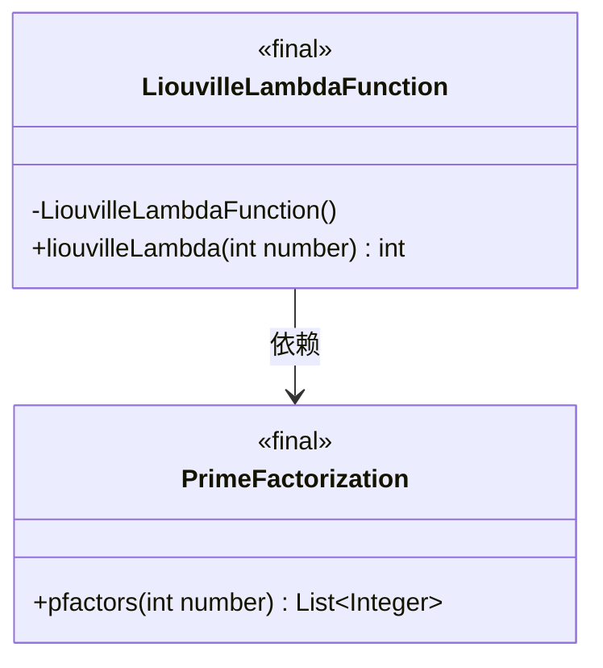
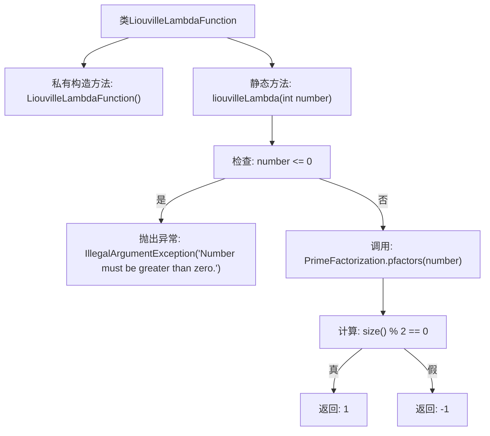

# 基础信息

|      |      |
|------|------|
| 名称 | LiouvilleLambdaFunction |
| 编码语言 | .java |
| 代码路径 | Java/src/main/java/com/thealgorithms/maths/Prime/LiouvilleLambdaFunction.java |
| 包名 | com.thealgorithms.maths.Prime |
| 依赖项 | [] |
| 概述说明 | LiouvilleLambdaFunction类计算数的Liouville函数值，偶素因子返回1，奇素因子返回-1，负数抛出异常。 |

# 说明

LiouvilleLambdaFunction类用于计算给定数的Liouville函数值。该函数根据数的素因子性质返回1或-1：如果数的素因子个数为偶数，则返回1；如果为奇数，则返回-1。若输入为负数，类将抛出异常，确保仅处理非负整数。

# 类列表 Class Summary

| 名称   | 类型  | 说明 |
|-------|------|-------------|
| LiouvilleLambdaFunction | class | LiouvilleLambdaFunction类计算给定数的Liouville函数值，偶素因子数返回1，奇素因子数返回-1，负数抛出异常。 |

## 类 LiouvilleLambdaFunction

|      |      |
|------|------|
| 访问范围 | public final |
| 类型 | class |
| 名称 | LiouvilleLambdaFunction |
| 说明 | LiouvilleLambdaFunction类计算给定数的Liouville函数值，偶素因子数返回1，奇素因子数返回-1，负数抛出异常。 |

### UML类图

这段代码定义了一个名为 `LiouvilleLambdaFunction` 的最终类，其中包含一个静态方法 `liouvilleLambda`，用于计算给定整数的 Liouville λ 函数值。该方法依赖于 `PrimeFactorization` 类的 `pfactors` 方法来获取整数的质因数列表，并根据质因数的数量的奇偶性返回 1 或 -1。如果输入的整数小于或等于零，方法会抛出 `IllegalArgumentException` 异常。类图展示了 `LiouvilleLambdaFunction` 与 `PrimeFactorization` 之间的依赖关系。

### 内部方法调用关系图

这段代码定义了一个名为 `LiouvilleLambdaFunction` 的类，其中包含一个静态方法 `liouvilleLambda`，用于计算给定整数的 Liouville λ 函数值。方法首先检查输入是否为正数，若为负数或零则抛出异常。接着，它通过调用 `PrimeFactorization.pfactors` 方法获取该数的质因数列表，并根据质因数的数量是奇数还是偶数返回 1 或 -1。流程图展示了方法的执行流程，包括异常处理和返回值计算。

### 字段列表 Field List

| 名称  | 类型  | 说明 |
|-------|-------|------|

### 方法列表 Method List

| 名称  | 类型  | 说明 |
|-------|-------|------|
| liouvilleLambda | int | 计算整数素数因子个数，偶数返回1，奇数返回-1，小于等于0抛出异常。 |

