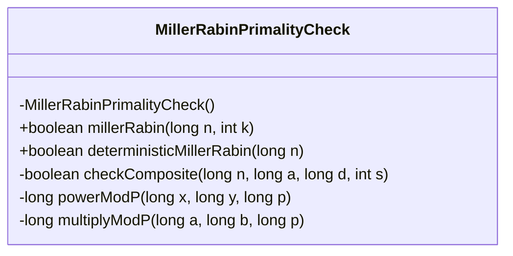
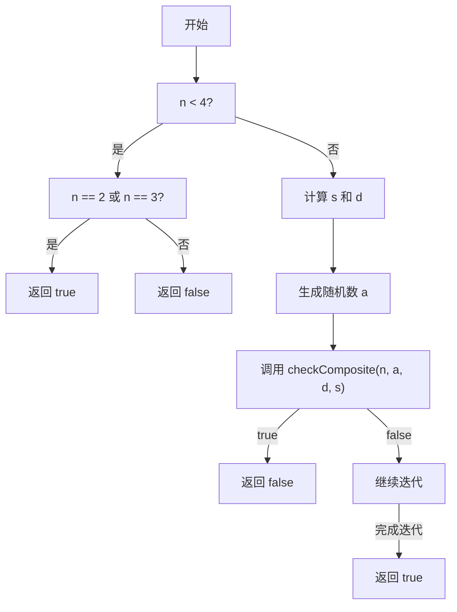
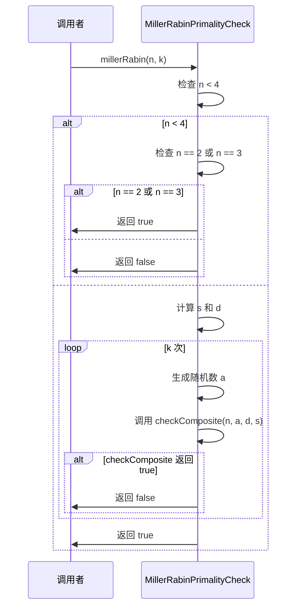
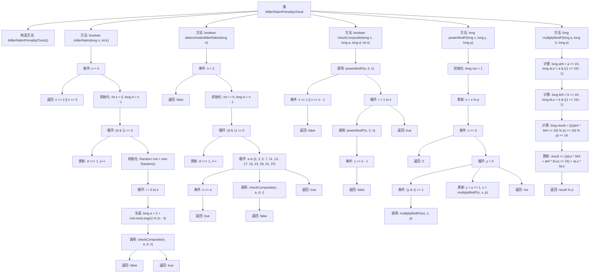

# 基础信息

|      |      |
|------|------|
| 名称 | MillerRabinPrimalityCheck |
| 编码语言 | .java |
| 代码路径 | Java/src/main/java/com/thealgorithms/maths/Prime/MillerRabinPrimalityCheck.java |
| 包名 | com.thealgorithms.maths.Prime |
| 依赖项 | ['java.util.Random'] |
| 概述说明 | MillerRabin算法用于素性检测，支持概率和确定性版本。 |

# 说明

MillerRabin算法用于素性检测，提供概率和确定性两种版本。概率版本通过多次迭代提高检测准确性，允许用户指定错误概率。确定性版本在特定范围内确保100%准确性，适用于需要绝对可靠性的场景。两种版本均基于数学理论，适用于大数检测，广泛应用于密码学等领域。

# 类列表 Class Summary

| 名称   | 类型  | 说明 |
|-------|------|-------------|
| MillerRabinPrimalityCheck | class | MillerRabin算法实现素性检测，包含概率和确定性版本。 |

## 类 MillerRabinPrimalityCheck

|      |      |
|------|------|
| 访问范围 | public final |
| 类型 | class |
| 名称 | MillerRabinPrimalityCheck |
| 说明 | MillerRabin算法实现素性检测，包含概率和确定性版本。 |

### UML类图

**描述**：`MillerRabinPrimalityCheck` 类实现了 Miller-Rabin 素性测试算法，用于判断一个数是否为素数。该算法分为概率性测试和确定性测试两种。概率性测试通过多次迭代来提高结果的准确性，而确定性测试则使用固定的素数基来确保结果的确定性。类中的私有方法 `checkComposite`、`powerModP` 和 `multiplyModP` 用于辅助计算和验证。

### 内部方法调用关系图

这段代码实现了Miller-Rabin素性测试算法，包括概率性和确定性两种版本。概率性版本通过多次随机测试判断一个数是否为素数，而确定性版本则通过固定的一组基数进行测试。代码中还包含了用于辅助计算的模幂运算和模乘运算方法。整个流程通过逐步分解和验证，确保算法的正确性和效率。

### 字段列表 Field List

| 名称  | 类型  | 说明 |
|-------|-------|------|

### 方法列表 Method List

| 名称  | 类型  | 说明 |
|-------|-------|------|
| millerRabin | boolean | 米勒-拉宾素数测试，判断n是否为素数，通过k次随机测试提高准确性。 |
| powerModP | long | 计算x的y次方模p，通过逐次平方和乘法优化性能。 |
| checkComposite | boolean | 检查合数方法：通过幂模运算验证n是否为合数。 |
| multiplyModP | long | 该方法通过分解和重组长整型数实现模乘运算。 |
| deterministicMillerRabin | boolean | 确定性的Miller-Rabin算法，用于判断整数n是否为素数。 |

