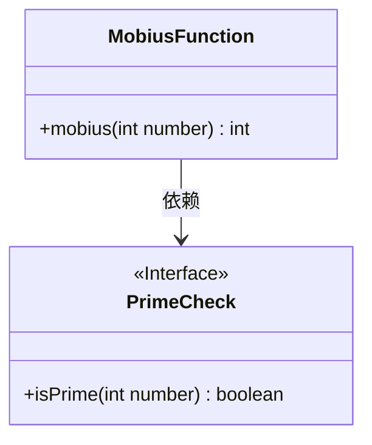
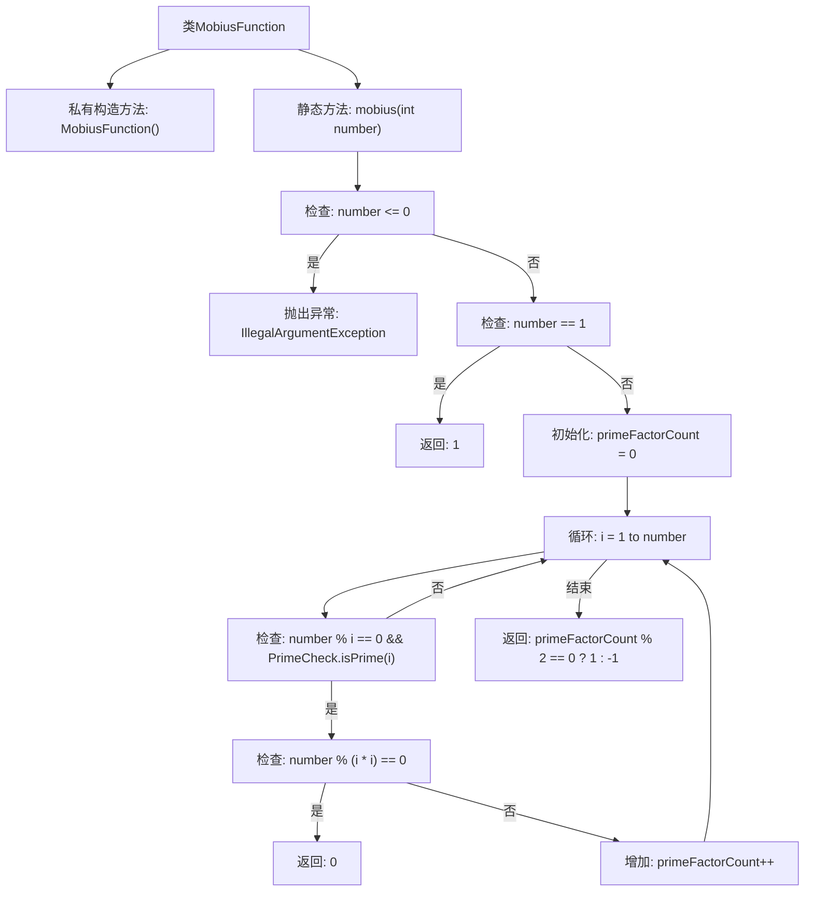

# 基础信息

|      |      |
|------|------|
| 名称 | MobiusFunction |
| 编码语言 | .java |
| 代码路径 | Java/src/main/java/com/thealgorithms/maths/Prime/MobiusFunction.java |
| 包名 | com.thealgorithms.maths.Prime |
| 依赖项 | [] |
| 概述说明 | MobiusFunction类计算数的Mobius函数值，返回1、0或-1，依据质因数个数及重复情况。 |

# 说明

MobiusFunction类用于计算给定数的Mobius函数值，结果返回1、0或-1。具体计算基于该数的质因数个数及其重复情况。如果数包含平方因子，则返回0；如果质因数个数为偶数且无平方因子，返回1；如果质因数个数为奇数且无平方因子，返回-1。

# 类列表 Class Summary

| 名称   | 类型  | 说明 |
|-------|------|-------------|
| MobiusFunction | class | MobiusFunction类计算给定数的Mobius函数值，返回1、0或-1，基于质因数个数及重复情况。 |

## 类 MobiusFunction

|      |      |
|------|------|
| 访问范围 | public final |
| 类型 | class |
| 名称 | MobiusFunction |
| 说明 | MobiusFunction类计算给定数的Mobius函数值，返回1、0或-1，基于质因数个数及重复情况。 |

### UML类图

**描述：**  
`MobiusFunction` 类包含一个静态方法 `mobius`，用于计算给定整数的莫比乌斯函数值。该方法依赖于 `PrimeCheck` 接口中的 `isPrime` 方法来判断一个数是否为质数。`mobius` 方法根据输入数的质因数情况返回 1、0 或 -1，分别表示质因数个数为偶数、存在重复质因数或质因数个数为奇数。`PrimeCheck` 接口定义了 `isPrime` 方法，具体实现未在代码中给出。

### 内部方法调用关系图

这段代码实现了Mobius函数，用于计算给定整数的Mobius值。代码首先检查输入是否合法，若小于等于0则抛出异常。若输入为1，则直接返回1。接着，代码通过循环查找输入数的所有质因数，并检查是否存在重复的质因数。若存在重复质因数，则返回0；否则，根据质因数的数量是奇数还是偶数，返回-1或1。

### 字段列表 Field List

| 名称  | 类型  | 说明 |
|-------|-------|------|

### 方法列表 Method List

| 名称  | 类型  | 说明 |
|-------|-------|------|
| mobius | int | 计算给定数的莫比乌斯函数值，处理异常和质因数。 |

