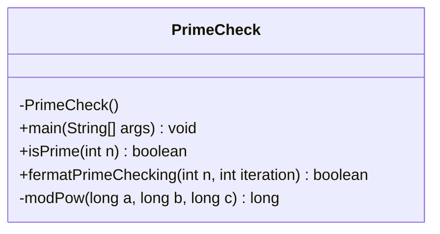
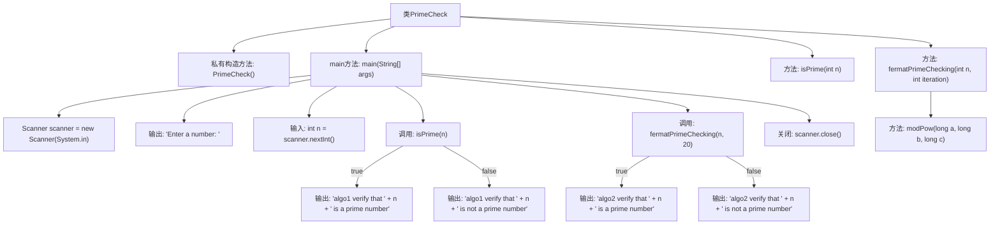

# 基础信息

|      |      |
|------|------|
| 名称 | PrimeCheck |
| 编码语言 | .java |
| 代码路径 | Java/src/main/java/com/thealgorithms/maths/Prime/PrimeCheck.java |
| 包名 | com.thealgorithms.maths.Prime |
| 依赖项 | ['java.util.Scanner'] |
| 概述说明 | Java程序验证质数，采用常规检查和费马测试两种算法。 |

# 说明

该Java程序用于验证数字是否为质数，采用了两种不同的算法进行判断。第一种是常规检查方法，通过遍历从2到该数字平方根的所有整数，检查是否存在能整除该数字的因子，若存在则不是质数。第二种是费马测试，基于费马小定理，通过随机选择几个基数进行幂运算，若结果不符合定理，则该数字可能不是质数，但该方法存在一定的误判概率。两种算法结合使用，可以提高质数判断的准确性和效率。

# 类列表 Class Summary

| 名称   | 类型  | 说明 |
|-------|------|-------------|
| PrimeCheck | class | Java程序验证数字是否为质数，使用两种算法：常规检查和费马测试。 |

## 类 PrimeCheck

|      |      |
|------|------|
| 访问范围 | public final |
| 类型 | class |
| 名称 | PrimeCheck |
| 说明 | Java程序验证数字是否为质数，使用两种算法：常规检查和费马测试。 |

### UML类图

**描述：**  
`PrimeCheck` 是一个工具类，提供了两种方法来验证一个数是否为质数。`isPrime` 方法通过传统的试除法进行验证，而 `fermatPrimeChecking` 方法则基于费马小定理进行概率性验证。`modPow` 是一个私有方法，用于计算模幂运算。该类通过 `main` 方法接收用户输入，并调用这两种方法进行验证，输出结果。由于 `PrimeCheck` 是 `final` 类且构造函数私有化，因此无法被继承或实例化，确保了工具类的安全性和不可变性。

### 内部方法调用关系图

这段代码实现了一个用于检查数字是否为质数的程序。它包含两个主要的质数检查算法：`isPrime`和`fermatPrimeChecking`。`isPrime`方法通过遍历数字的平方根来检查是否为质数，而`fermatPrimeChecking`方法则基于费马小定理进行多次迭代验证。程序首先通过用户输入获取一个数字，然后分别使用这两种算法进行验证，并输出结果。

### 字段列表 Field List

| 名称  | 类型  | 说明 |
|-------|-------|------|

### 方法列表 Method List

| 名称  | 类型  | 说明 |
|-------|-------|------|
| main | void | Java程序通过两种算法验证输入数字是否为质数。 |
| modPow | long | 计算a的b次方模c的Java方法。 |
| isPrime | boolean | 判断整数是否为质数的静态方法，通过优化循环减少计算量。 |
| fermatPrimeChecking | boolean | 费马素性检验方法，通过随机数测试判断n是否为素数。 |

