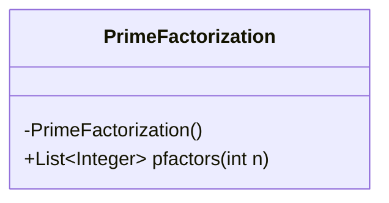
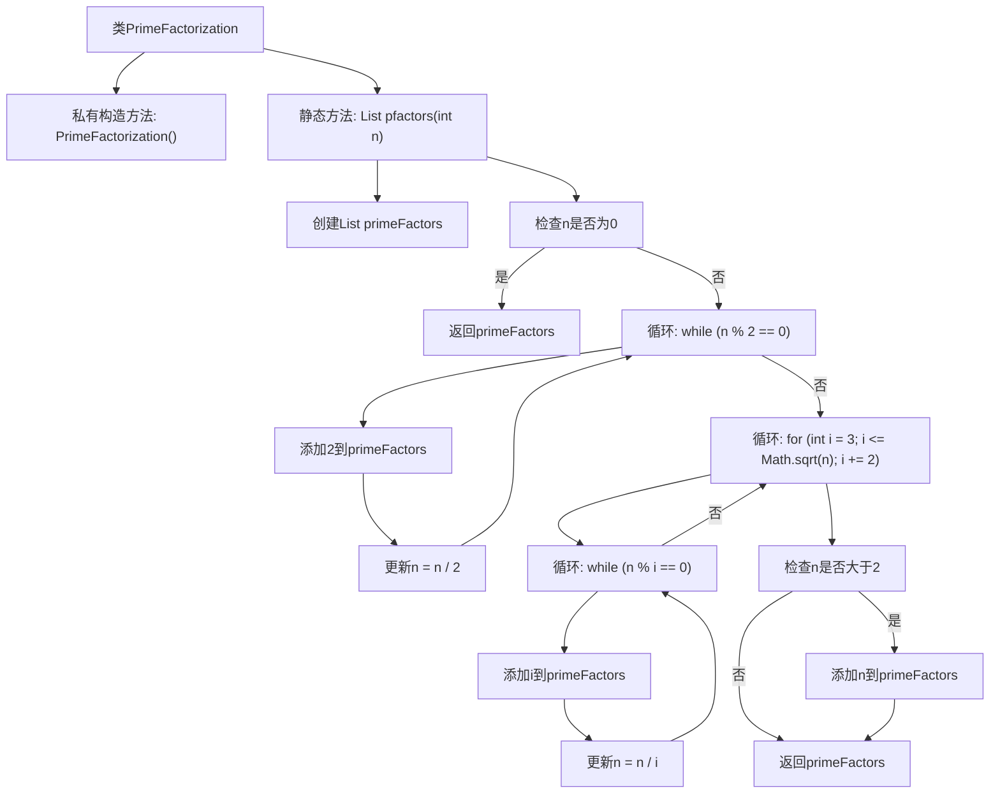

# 基础信息

|      |      |
|------|------|
| 名称 | PrimeFactorization |
| 编码语言 | .java |
| 代码路径 | Java/src/main/java/com/thealgorithms/maths/Prime/PrimeFactorization.java |
| 包名 | com.thealgorithms.maths.Prime |
| 依赖项 | ['java.util.ArrayList', 'java.util.List'] |
| 概述说明 | PrimeFactorization类用于整数质因数分解，返回质因数列表。 |

# 说明

PrimeFactorization类用于实现整数的质因数分解功能。该类接收一个整数作为输入，通过内部算法将其分解为质因数的乘积，并返回一个包含所有质因数的列表。质因数列表按照从小到大的顺序排列，确保结果的准确性和一致性。该类的实现旨在高效地处理整数分解问题，适用于需要质因数分解的各种应用场景。

# 类列表 Class Summary

| 名称   | 类型  | 说明 |
|-------|------|-------------|
| PrimeFactorization | class | PrimeFactorization类实现整数质因数分解，返回质因数列表。 |

## 类 PrimeFactorization

|      |      |
|------|------|
| 访问范围 | public final |
| 类型 | class |
| 名称 | PrimeFactorization |
| 说明 | PrimeFactorization类实现整数质因数分解，返回质因数列表。 |

### UML类图

**描述：**  
`PrimeFactorization` 类是一个工具类，用于计算给定整数的质因数分解。该类包含一个私有构造函数，确保无法实例化。`pfactors` 方法接收一个整数 `n`，返回其所有质因数的列表。该方法首先处理偶数因子，然后通过循环处理奇数因子，最后检查剩余的数是否为质数。通过逐步分解，确保所有质因数都被正确找到并返回。

### 内部方法调用关系图

这段代码实现了一个名为`PrimeFactorization`的类，其中包含一个静态方法`pfactors`，用于计算给定整数`n`的质因数分解。方法首先处理`n`为0的情况，然后通过循环去除所有2的因数，接着遍历奇数去除其他质因数，最后如果`n`仍然大于2，则将其添加到质因数列表中。流程图展示了方法的主要步骤和逻辑流程。

### 字段列表 Field List

| 名称  | 类型  | 说明 |
|-------|-------|------|

### 方法列表 Method List

| 名称  | 类型  | 说明 |
|-------|-------|------|
| pfactors | List<Integer> | 该方法返回整数n的所有质因数，先处理2，再处理奇数，最后处理剩余质数。 |

