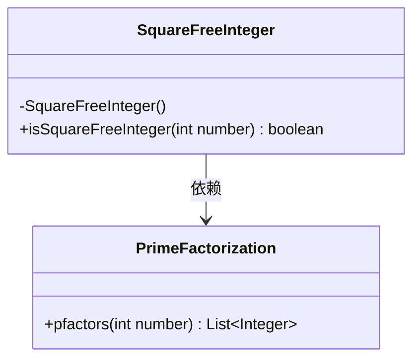
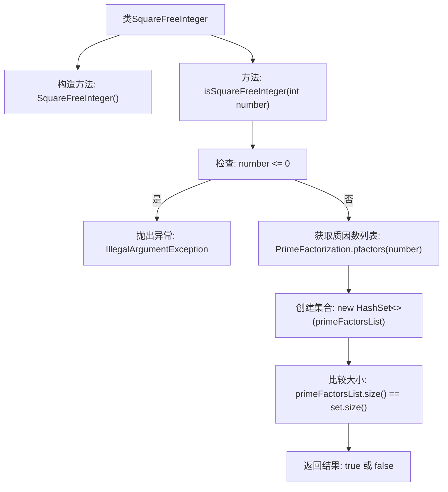

# 基础信息

|      |      |
|------|------|
| 名称 | SquareFreeInteger |
| 编码语言 | .java |
| 代码路径 | Java/src/main/java/com/thealgorithms/maths/Prime/SquareFreeInteger.java |
| 包名 | com.thealgorithms.maths.Prime |
| 依赖项 | ['java.util.HashSet', 'java.util.List'] |
| 概述说明 | SquareFreeInteger类通过比较质因数列表和集合大小判断整数是否为无平方数。 |

# 说明

SquareFreeInteger类用于检查一个整数是否为无平方数。其核心逻辑是通过比较该整数的质因数列表和集合的大小来实现判断。如果质因数列表的大小与集合的大小相同，说明该整数没有重复的质因数，即为无平方数；否则，该整数包含重复的质因数，不是无平方数。

# 类列表 Class Summary

| 名称   | 类型  | 说明 |
|-------|------|-------------|
| SquareFreeInteger | class | SquareFreeInteger类检查整数是否为无平方数，通过比较质因数列表和集合的大小来判断。 |

## 类 SquareFreeInteger

|      |      |
|------|------|
| 访问范围 | public final |
| 类型 | class |
| 名称 | SquareFreeInteger |
| 说明 | SquareFreeInteger类检查整数是否为无平方数，通过比较质因数列表和集合的大小来判断。 |

### UML类图

**描述：**  
`SquareFreeInteger` 是一个工具类，用于判断一个整数是否为无平方因子的数。它依赖于 `PrimeFactorization` 类来获取整数的质因数列表。通过比较质因数列表和其对应的集合的大小，`isSquareFreeInteger` 方法可以确定该整数是否具有重复的质因数，从而判断其是否为无平方因子的数。如果输入的整数为负数或零，该方法会抛出 `IllegalArgumentException` 异常。

### 内部方法调用关系图

这段代码定义了一个名为 `SquareFreeInteger` 的类，其中包含一个静态方法 `isSquareFreeInteger`，用于判断一个整数是否为“无平方因子数”。该方法首先检查输入的整数是否小于或等于零，如果是则抛出 `IllegalArgumentException` 异常。接着，它通过调用 `PrimeFactorization.pfactors` 方法获取该整数的质因数列表，并将其转换为一个集合。如果列表和集合的大小相等，则说明该整数是无平方因子数，返回 `true`；否则返回 `false`。

### 字段列表 Field List

| 名称  | 类型  | 说明 |
|-------|-------|------|

### 方法列表 Method List

| 名称  | 类型  | 说明 |
|-------|-------|------|
| isSquareFreeInteger | boolean | 方法判断整数是否无平方因子，通过质因数列表与集合大小比较实现。 |

