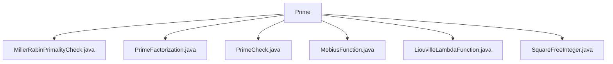

# 基础信息

|      |      |
|------|------|
| 名称 | Prime |
| 编码语言 | .java |
| 代码路径 | Java/src/main/java/com/thealgorithms/maths/Prime |
| 包名 | Java.src.main.java.com.thealgorithms.maths.Prime |
| 概述说明 | MillerRabin算法提供概率和确定性素性检测，质因数分解类高效分解整数，质数验证结合常规和费马测试，Mobius和Liouville函数计算特定值，SquareFreeInteger检查无平方数。 |

# 说明

## 概述
该代码模块主要围绕素数相关的数学算法展开，提供了多种与素数检测、质因数分解、Mobius函数、Liouville函数以及无平方数判断相关的功能。这些功能基于数学理论，适用于大数检测和密码学等领域。模块中的每个类都专注于解决特定的数学问题，并提供了高效的算法实现，以确保在各类应用场景中的准确性和性能。

## 主要业务场景
1. **素数检测**：
   - **MillerRabin算法**：提供概率和确定性两种版本，适用于需要高效且准确的素数检测场景，尤其是在大数检测和密码学中。
   - **常规检查与费马测试**：结合使用两种算法，提高质数判断的准确性和效率，适用于需要快速验证质数的场景。

2. **质因数分解**：
   - **PrimeFactorization类**：实现整数的质因数分解，适用于需要将整数分解为质因数乘积的应用场景，如密码学、数论研究等。

3. **Mobius函数计算**：
   - **MobiusFunction类**：计算给定数的Mobius函数值，适用于数论中需要分析数的质因数性质的应用场景。

4. **Liouville函数计算**：
   - **LiouvilleLambdaFunction类**：计算给定数的Liouville函数值，适用于数论中需要分析数的素因子性质的应用场景。

5. **无平方数判断**：
   - **SquareFreeInteger类**：检查一个整数是否为无平方数，适用于需要判断整数是否包含重复质因数的应用场景，如数论研究和算法设计。

这些功能模块共同构成了一个强大的素数相关算法库，能够满足多种数学计算和密码学应用的需求。

### 包内部结构视图

该流程图展示了`Prime`文件夹下的所有文件及其层级关系。`Prime`作为根节点，直接包含多个与质数相关的算法文件，如`MillerRabinPrimalityCheck.java`、`PrimeFactorization.java`等。每个文件都与`Prime`文件夹直接关联，没有进一步的子目录结构。

# 文件列表 File List

| 名称   | 类型  | 说明 |
|-------|------|-------------|
| [SquareFreeInteger.java](SquareFreeInteger.md) | file | SquareFreeInteger类通过比较质因数列表和集合大小判断整数是否为无平方数。 |
| [PrimeFactorization.java](PrimeFactorization.md) | file | PrimeFactorization类用于整数质因数分解，返回质因数列表。 |
| [LiouvilleLambdaFunction.java](LiouvilleLambdaFunction.md) | file | LiouvilleLambdaFunction类计算数的Liouville函数值，偶素因子返回1，奇素因子返回-1，负数抛出异常。 |
| [MobiusFunction.java](MobiusFunction.md) | file | MobiusFunction类计算数的Mobius函数值，返回1、0或-1，依据质因数个数及重复情况。 |
| [PrimeCheck.java](PrimeCheck.md) | file | Java程序验证质数，采用常规检查和费马测试两种算法。 |
| [MillerRabinPrimalityCheck.java](MillerRabinPrimalityCheck.md) | file | MillerRabin算法用于素性检测，支持概率和确定性版本。 |

