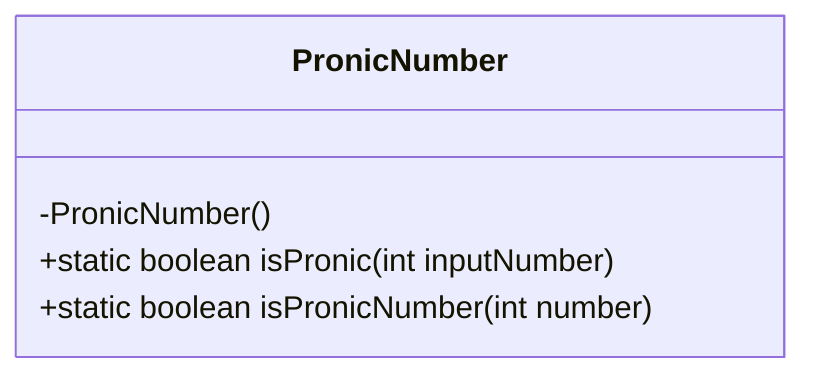
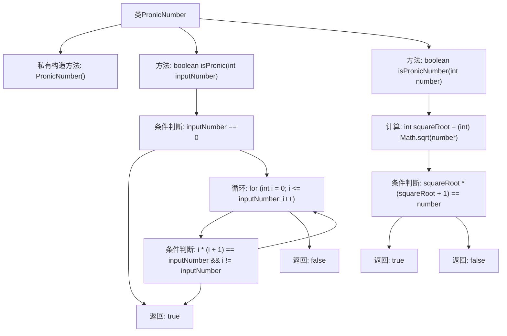

# 基础信息

|      |      |
|------|------|
| 名称 | PronicNumber |
| 编码语言 | .java |
| 代码路径 | Java/src/main/java/com/thealgorithms/maths/PronicNumber.java |
| 包名 | com.thealgorithms.maths |
| 依赖项 | [] |
| 概述说明 | PronicNumber类提供遍历和平方根优化两种方法判断Pronic数。 |

# 说明

PronicNumber类提供了两种方法来判断一个整数是否为Pronic数。第一种方法通过遍历实现，即逐个检查整数是否满足Pronic数的定义。第二种方法通过平方根优化实现，利用数学性质减少计算量，提高判断效率。这两种方法各有优劣，遍历方法简单直观，适合小范围判断；平方根优化方法则在大范围判断时更具优势，能够显著提升性能。

# 类列表 Class Summary

| 名称   | 类型  | 说明 |
|-------|------|-------------|
| PronicNumber | class | PronicNumber类提供两种方法判断整数是否为Pronic数，分别通过遍历和平方根优化实现。 |

## 类 PronicNumber

|      |      |
|------|------|
| 访问范围 | public final |
| 类型 | class |
| 名称 | PronicNumber |
| 说明 | PronicNumber类提供两种方法判断整数是否为Pronic数，分别通过遍历和平方根优化实现。 |

### UML类图

**描述：**  
`PronicNumber` 类是一个工具类，用于判断一个整数是否为Pronic数（即两个连续整数的乘积）。该类包含两个静态方法：`isPronic` 和 `isPronicNumber`。`isPronic` 方法通过遍历从0到输入数的范围，检查是否存在两个连续整数乘积等于输入数。`isPronicNumber` 方法则通过计算输入数的平方根，并检查平方根与其加1的乘积是否等于输入数。这两个方法都返回布尔值，表示输入数是否为Pronic数。

### 内部方法调用关系图

这段代码定义了一个名为 `PronicNumber` 的类，其中包含两个静态方法 `isPronic` 和 `isPronicNumber`，用于判断一个整数是否为普洛尼克数（Pronic Number）。`isPronic` 方法通过遍历从0到输入数的范围，检查是否存在两个连续整数的乘积等于输入数。`isPronicNumber` 方法则通过计算输入数的平方根，并检查该平方根与其加1的乘积是否等于输入数。流程图展示了这两个方法的执行流程和条件判断。

### 字段列表 Field List

| 名称  | 类型  | 说明 |
|-------|-------|------|

### 方法列表 Method List

| 名称  | 类型  | 说明 |
|-------|-------|------|
| isPronic | boolean | 该方法判断输入数字是否为Pronic数，即是否等于两个连续整数的乘积。 |
| isPronicNumber | boolean | 判断一个数是否为Pronic数，即是否等于两个连续整数的乘积。 |

