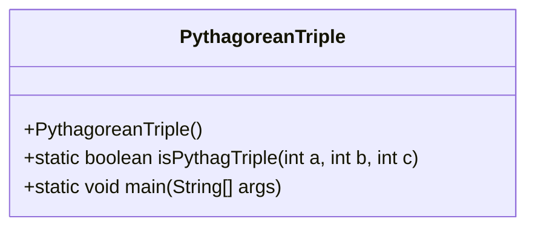
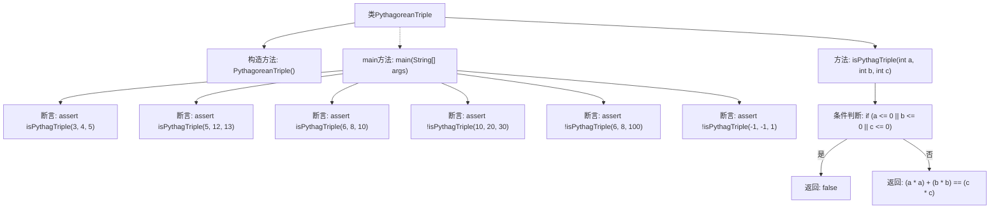

# 基础信息

|      |      |
|------|------|
| 名称 | PythagoreanTriple |
| 编码语言 | .java |
| 代码路径 | Java/src/main/java/com/thealgorithms/maths/PythagoreanTriple.java |
| 包名 | com.thealgorithms.maths |
| 依赖项 | [] |
| 概述说明 | Java类验证三个数字是否满足勾股定理。 |

# 说明

该Java类的主要功能是验证三个给定的数字是否构成勾股数。勾股数是指满足勾股定理的三个正整数，即a² + b² = c²，其中c为斜边。该类通过接收三个整数作为输入，首先检查它们是否为正整数，然后计算它们的平方和，判断是否满足勾股定理的条件。如果满足，则返回true，表示这三个数是勾股数；否则返回false。该类的设计简洁高效，能够准确地验证输入的三个数是否符合勾股数的定义。

# 类列表 Class Summary

| 名称   | 类型  | 说明 |
|-------|------|-------------|
| PythagoreanTriple | class | Java类验证三数是否为勾股数。 |

## 类 PythagoreanTriple

|      |      |
|------|------|
| 访问范围 | public final |
| 类型 | class |
| 名称 | PythagoreanTriple |
| 说明 | Java类验证三数是否为勾股数。 |

### UML类图

### 描述
`PythagoreanTriple` 是一个不可继承的类，用于判断三个整数是否构成勾股三元组。该类包含一个私有构造函数，确保无法实例化。`isPythagTriple` 方法用于验证输入的三个整数是否满足勾股定理，即 `a² + b² = c²`。`main` 方法通过断言测试了多个输入组合的正确性，确保方法的准确性。

### 内部方法调用关系图

这段代码定义了一个名为 `PythagoreanTriple` 的类，其中包含一个私有构造方法和一个 `main` 方法。`main` 方法通过断言验证了几组整数是否为毕达哥拉斯三元组。`isPythagTriple` 方法用于判断三个整数是否满足毕达哥拉斯定理，即 `a² + b² = c²`。如果输入的任意一个数小于等于零，则直接返回 `false`，否则返回计算结果。

### 字段列表 Field List

| 名称  | 类型  | 说明 |
|-------|-------|------|

### 方法列表 Method List

| 名称  | 类型  | 说明 |
|-------|-------|------|
| main | void | 验证勾股数，包括正确和错误示例。 |
| isPythagTriple | boolean | 判断三个正整数是否为毕达哥拉斯三元组。 |

