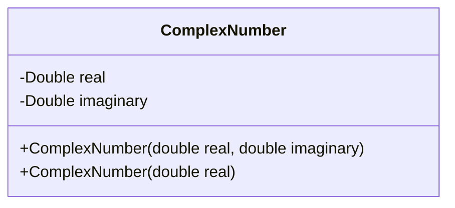
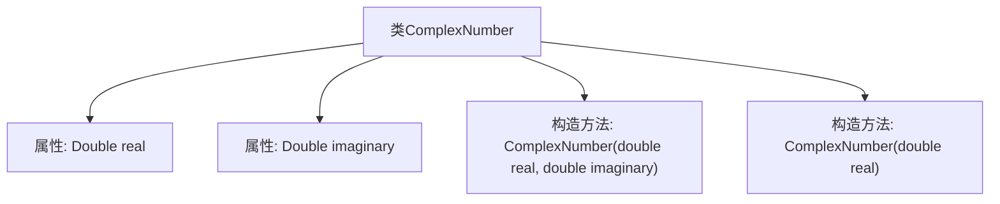
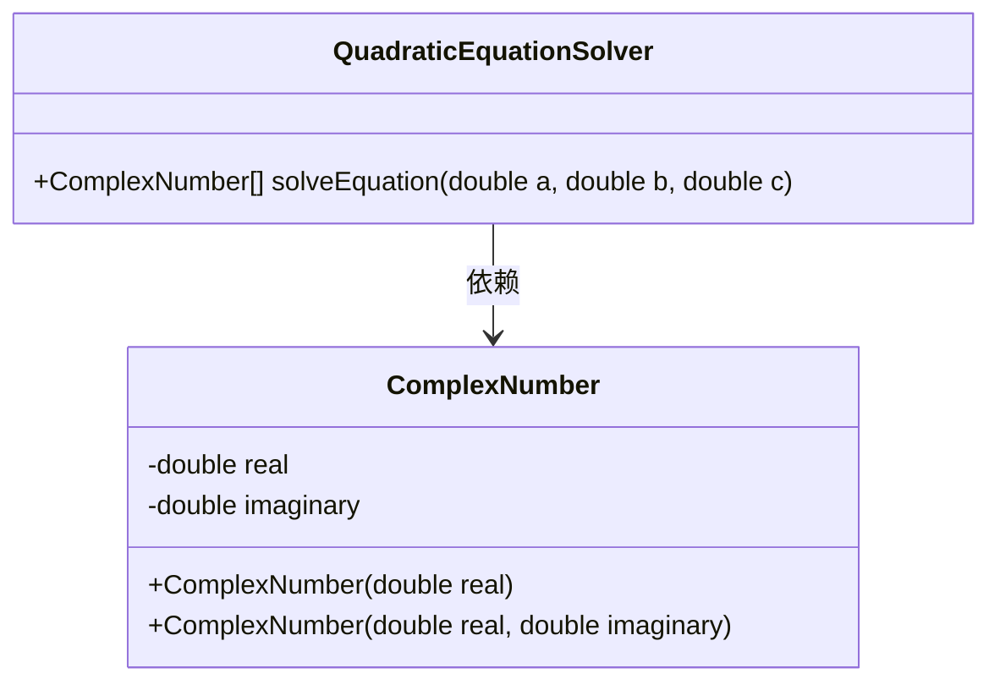
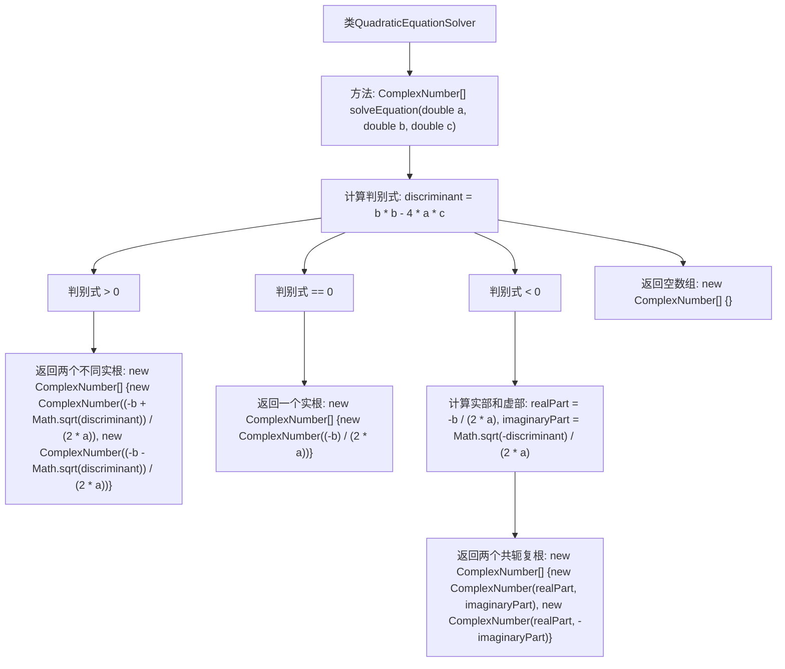

# 基础信息

|      |      |
|------|------|
| 名称 | QuadraticEquationSolver |
| 编码语言 | .java |
| 代码路径 | Java/src/main/java/com/thealgorithms/maths/QuadraticEquationSolver.java |
| 包名 | com.thealgorithms.maths |
| 依赖项 | [] |
| 概述说明 | 定义复数类，支持构造和二次方程根求解。 |

# 说明

定义了一个复数类，该类包含实部和虚部两个属性，支持通过双参数（实部和虚部）和单参数（仅实部）进行构造。此外，该类还提供了求解二次方程根的功能，返回的结果为复数类型，确保能够处理所有可能的根情况，包括实根和虚根。

# 类列表 Class Summary

| 名称   | 类型  | 说明 |
|-------|------|-------------|
| ComplexNumber | class | 定义复数类，包含实部和虚部，支持双参数和单参数构造。 |
| QuadraticEquationSolver | class | 求解二次方程的根，返回复数类型结果。 |

## 类 ComplexNumber

|      |      |
|------|------|
| 访问范围 | None |
| 类型 | class |
| 名称 | ComplexNumber |
| 说明 | 定义复数类，包含实部和虚部，支持双参数和单参数构造。 |

### UML类图

这段代码定义了一个名为 `ComplexNumber` 的类，用于表示复数。复数由实部和虚部组成，类中有两个私有成员变量 `real` 和 `imaginary`，分别表示复数的实部和虚部。类提供了两个构造函数，一个用于初始化实部和虚部，另一个仅初始化实部，虚部默认为 `null`。该类可以用于处理复数的基本操作，但代码中未展示具体的方法实现。

### 内部方法调用关系图

这段代码定义了一个名为 `ComplexNumber` 的类，用于表示复数。类中包含两个属性：`real` 和 `imaginary`，分别表示复数的实部和虚部。类提供了两个构造方法：一个接受实部和虚部作为参数，另一个仅接受实部，虚部默认为 `null`。通过这两个构造方法，可以灵活地创建复数对象，适用于不同的使用场景。

### 字段列表 Field List

| 名称  | 类型  | 说明 |
|-------|-------|------|
| real | Double | 定义双精度浮点变量real。 |
| imaginary | Double | 声明双精度虚数变量。 |

### 方法列表 Method List

| 名称  | 类型  | 说明 |
|-------|-------|------|

## 类 QuadraticEquationSolver

|      |      |
|------|------|
| 访问范围 | public |
| 类型 | class |
| 名称 | QuadraticEquationSolver |
| 说明 | 求解二次方程的根，返回复数类型结果。 |

### UML类图

这段代码定义了一个 `QuadraticEquationSolver` 类，用于求解二次方程的根。该类包含一个 `solveEquation` 方法，接受三个参数 `a`、`b` 和 `c`，分别代表二次方程的系数。该方法根据判别式的值返回不同类型的根，根的类型为 `ComplexNumber`，表示复数。`ComplexNumber` 类用于存储复数的实部和虚部，并提供了两个构造函数来初始化复数对象。`QuadraticEquationSolver` 类依赖于 `ComplexNumber` 类来表示方程的根。

### 内部方法调用关系图

这段代码实现了一个二次方程求解器，根据判别式的值（大于零、等于零或小于零）返回不同的根。如果判别式大于零，返回两个不同的实根；如果等于零，返回一个实根；如果小于零，返回两个共轭复根；否则返回空数组。代码通过条件判断和数学计算，确保在不同情况下都能正确求解二次方程的根。

### 字段列表 Field List

| 名称  | 类型  | 说明 |
|-------|-------|------|

### 方法列表 Method List

| 名称  | 类型  | 说明 |
|-------|-------|------|
| solveEquation | ComplexNumber[] | 解二次方程，返回复数根，判别式决定根类型。 |

