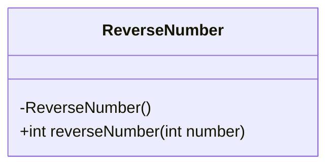
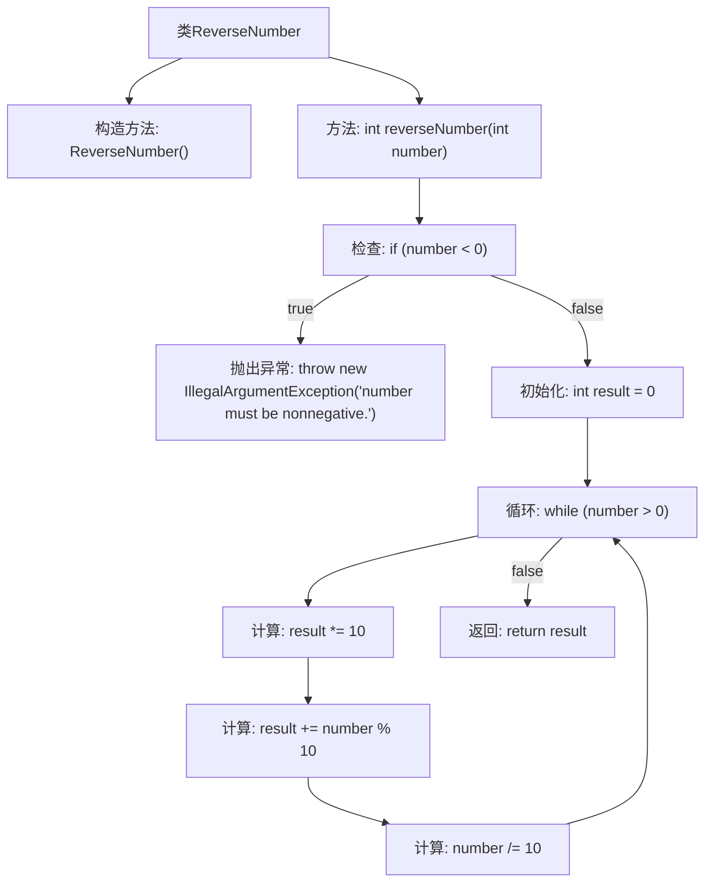

# 基础信息

|      |      |
|------|------|
| 名称 | ReverseNumber |
| 编码语言 | .java |
| 代码路径 | Java/src/main/java/com/thealgorithms/maths/ReverseNumber.java |
| 包名 | com.thealgorithms.maths |
| 依赖项 | [] |
| 概述说明 | ReverseNumber类提供静态方法reverseNumber，用于反转非负整数的数字顺序。 |

# 说明

ReverseNumber类包含一个名为reverseNumber的静态方法，该方法专门用于反转非负整数的数字顺序。该方法通过重新排列数字的位置，将输入的非负整数的数字顺序进行反转，从而生成一个新的整数。这个功能在处理需要数字逆序的场景中非常有用，例如在某些数学运算或数据处理任务中。通过使用静态方法，可以确保该功能在类的实例化过程中无需创建对象即可直接调用，提高了代码的效率和简洁性。

# 类列表 Class Summary

| 名称   | 类型  | 说明 |
|-------|------|-------------|
| ReverseNumber | class | ReverseNumber类包含静态方法reverseNumber，用于反转非负整数的数字顺序。 |

## 类 ReverseNumber

|      |      |
|------|------|
| 访问范围 | public final |
| 类型 | class |
| 名称 | ReverseNumber |
| 说明 | ReverseNumber类包含静态方法reverseNumber，用于反转非负整数的数字顺序。 |

### UML类图

这段代码定义了一个名为 `ReverseNumber` 的最终类，该类包含一个私有的构造方法，防止外部实例化。类中提供了一个静态公有方法 `reverseNumber`，用于反转输入的非负整数。如果输入为负数，方法会抛出 `IllegalArgumentException` 异常。该方法通过循环取余和整除操作，逐步构建反转后的数字并返回。类图简洁地展示了类的结构和方法的访问权限。

### 内部方法调用关系图

这段代码定义了一个名为 `ReverseNumber` 的类，其中包含一个静态方法 `reverseNumber`，用于反转输入的非负整数。首先，方法会检查输入是否为负数，如果是则抛出 `IllegalArgumentException` 异常。如果输入合法，方法通过循环将数字的每一位反转，最终返回反转后的结果。流程图展示了从输入检查到最终返回结果的完整流程。

### 字段列表 Field List

| 名称  | 类型  | 说明 |
|-------|-------|------|

### 方法列表 Method List

| 名称  | 类型  | 说明 |
|-------|-------|------|
| reverseNumber | int | 反转非负整数，返回结果。 |

