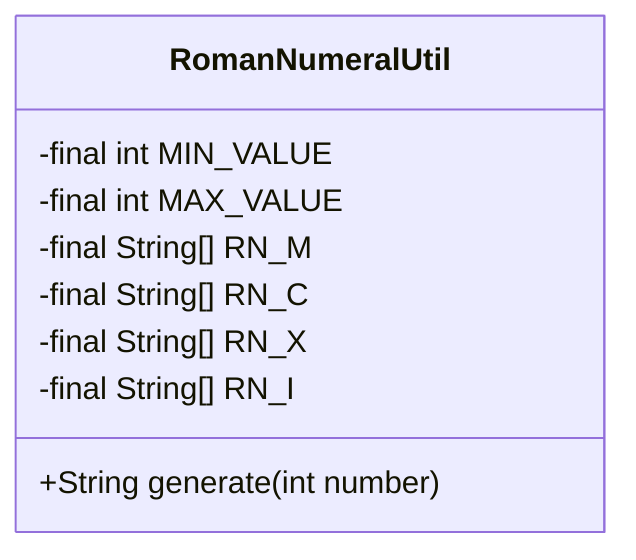
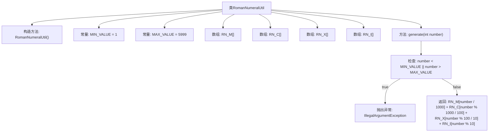

# 基础信息

|      |      |
|------|------|
| 名称 | RomanNumeralUtil |
| 编码语言 | .java |
| 代码路径 | Java/src/main/java/com/thealgorithms/maths/RomanNumeralUtil.java |
| 包名 | com.thealgorithms.maths |
| 依赖项 | [] |
| 概述说明 | 罗马数字工具类，支持1到5999的数字转换。 |

# 说明

罗马数字工具类是一个专门用于数字转换的工具，支持将阿拉伯数字转换为罗马数字，且转换范围限定在1到5999之间。该工具类设计用于处理这一特定范围内的数字转换任务，确保转换的准确性和高效性。通过该工具，用户可以轻松地将常见的阿拉伯数字转换为对应的罗马数字表示，适用于需要罗马数字表示的各种场景。

# 类列表 Class Summary

| 名称   | 类型  | 说明 |
|-------|------|-------------|
| RomanNumeralUtil | class | 罗马数字工具类，支持1到5999的数字转换。 |

## 类 RomanNumeralUtil

|      |      |
|------|------|
| 访问范围 | public final |
| 类型 | class |
| 名称 | RomanNumeralUtil |
| 说明 | 罗马数字工具类，支持1到5999的数字转换。 |

### UML类图

### 描述：
`RomanNumeralUtil` 是一个工具类，用于将整数转换为罗马数字。它包含四个静态数组 `RN_M`、`RN_C`、`RN_X` 和 `RN_I`，分别表示千位、百位、十位和个位的罗马数字符号。`generate` 方法接受一个整数参数，并返回对应的罗马数字字符串。如果输入的整数不在有效范围内（1到5999），则会抛出 `IllegalArgumentException` 异常。该类是 `final` 的，且构造函数是私有的，确保无法实例化。

### 内部方法调用关系图

这段代码定义了一个名为`RomanNumeralUtil`的工具类，用于将整数转换为罗马数字。类中包含四个数组`RN_M`、`RN_C`、`RN_X`和`RN_I`，分别表示千位、百位、十位和个位的罗马数字符号。`generate`方法接收一个整数参数，首先检查该参数是否在有效范围内（1到5999），如果不在范围内则抛出异常，否则通过组合数组中的罗马数字符号生成最终的罗马数字字符串。

### 字段列表 Field List

| 名称  | 类型  | 说明 |
|-------|-------|------|
| MIN_VALUE = 1 | int | 定义常量MIN_VALUE，值为1。 |
| RN_I = {        "",        "I",        "II",        "III",        "IV",        "V",        "VI",        "VII",        "VIII",        "IX",    } | String[] | 定义罗马数字1到9的字符串数组。 |
| MAX_VALUE = 5999 | int | 定义常量MAX_VALUE，值为5999。 |
| RN_M = {        "",        "M",        "MM",        "MMM",        "MMMM",        "MMMMM",    } | String[] | 定义了一个包含罗马数字"M"及其重复形式的字符串数组。 |
| RN_C = {        "",        "C",        "CC",        "CCC",        "CD",        "D",        "DC",        "DCC",        "DCCC",        "CM",    } | String[] | 定义罗马数字百位字符数组RN_C，包含空字符串至CM。 |
| RN_X = {        "",        "X",        "XX",        "XXX",        "XL",        "L",        "LX",        "LXX",        "LXXX",        "XC",    } | String[] | 定义一个私有静态字符串数组RN_X，包含罗马数字表示。 |

### 方法列表 Method List

| 名称  | 类型  | 说明 |
|-------|-------|------|
| generate | String | 方法生成罗马数字，若数字超出范围则抛出异常。 |

