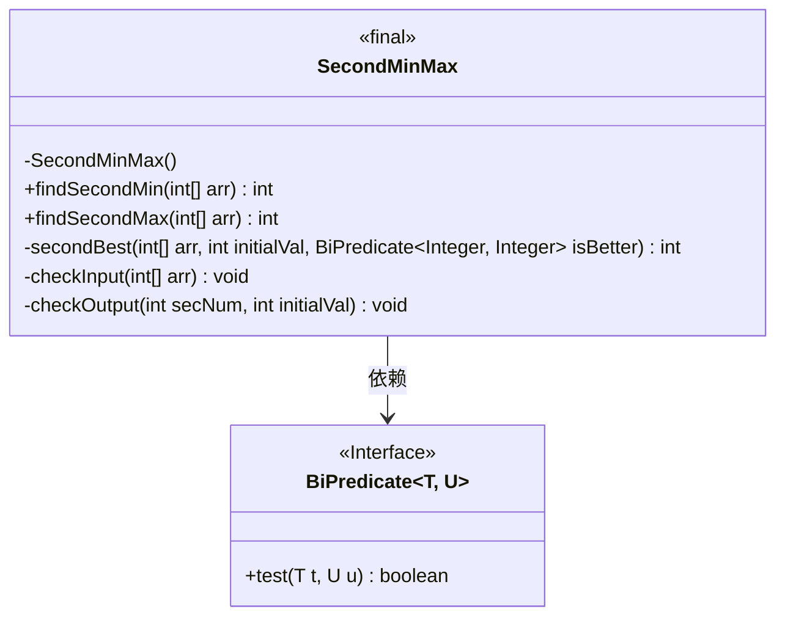
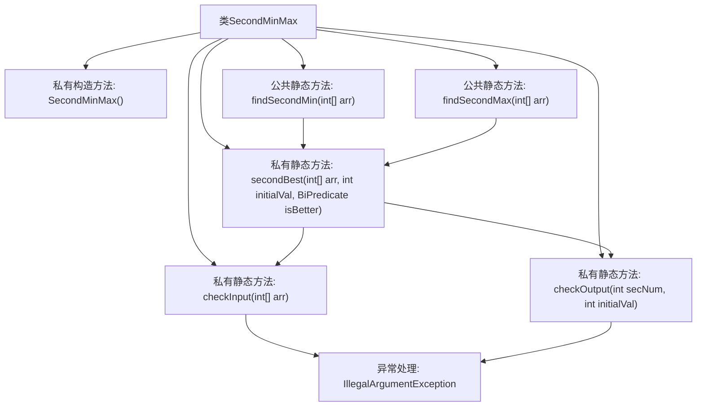

# 基础信息

|      |      |
|------|------|
| 名称 | SecondMinMax |
| 编码语言 | .java |
| 代码路径 | Java/src/main/java/com/thealgorithms/maths/SecondMinMax.java |
| 包名 | com.thealgorithms.maths |
| 依赖项 | ['java.util.function.BiPredicate'] |
| 概述说明 | SecondMinMax类用于查找数组中第二小或第二大值，数组长度需≥2且元素不全相同。 |

# 说明

SecondMinMax类用于在数组中查找第二小或第二大的值。该类要求输入的数组长度必须大于或等于2，并且数组中的元素不能全部相同，以确保能够找到有效的第二小或第二大值。

# 类列表 Class Summary

| 名称   | 类型  | 说明 |
|-------|------|-------------|
| SecondMinMax | class | SecondMinMax类用于查找数组中第二最小或最大值，输入数组长度需大于等于2且元素不全部相同。 |

## 类 SecondMinMax

|      |      |
|------|------|
| 访问范围 | public final |
| 类型 | class |
| 名称 | SecondMinMax |
| 说明 | SecondMinMax类用于查找数组中第二最小或最大值，输入数组长度需大于等于2且元素不全部相同。 |

### UML类图

### 描述
`SecondMinMax` 是一个工具类，用于在数组中查找第二小或第二大的值。它包含两个公共方法 `findSecondMin` 和 `findSecondMax`，分别用于查找第二小和第二大的值。类中定义了私有方法 `secondBest` 来执行实际的查找逻辑，并使用 `BiPredicate` 接口来比较元素。此外，类中还包含两个私有方法 `checkInput` 和 `checkOutput`，分别用于验证输入数组的有效性和输出结果的正确性。如果输入数组长度小于2或所有元素相同，将抛出 `IllegalArgumentException`。

### 内部方法调用关系图

这段代码定义了一个工具类 `SecondMinMax`，用于在数组中查找第二小或第二大的值。它通过 `secondBest` 方法实现核心逻辑，使用 `BiPredicate` 来判断元素的大小关系。`checkInput` 和 `checkOutput` 方法分别用于验证输入数组的有效性和输出结果的合法性。`findSecondMin` 和 `findSecondMax` 方法分别调用 `secondBest` 来查找第二小和第二大的值。如果输入数组长度小于2或所有元素相同，会抛出 `IllegalArgumentException` 异常。

### 字段列表 Field List

| 名称  | 类型  | 说明 |
|-------|-------|------|

### 方法列表 Method List

| 名称  | 类型  | 说明 |
|-------|-------|------|
| findSecondMin | int | 查找数组中第二小值的静态方法。 |
| secondBest | int | 方法查找数组中第二优值，使用初始值和比较条件。 |
| checkInput | void | 检查输入数组长度，不足两个元素时抛出异常。 |
| findSecondMax | int | 静态方法findSecondMax返回数组中第二大的整数。 |
| checkOutput | void | 检查secNum与initialVal是否相等，若相等则抛出异常提示数组需至少包含两个不同元素。 |

