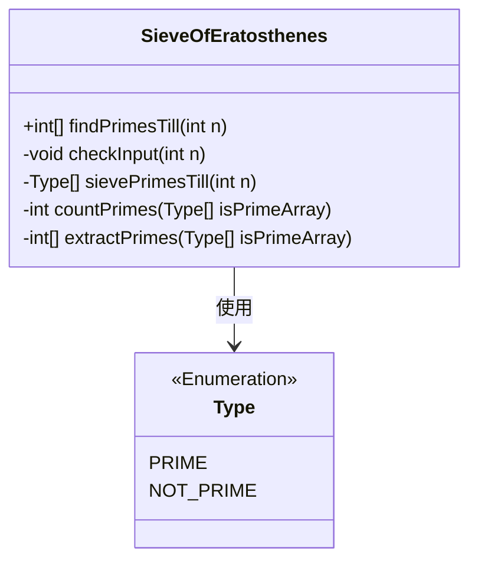
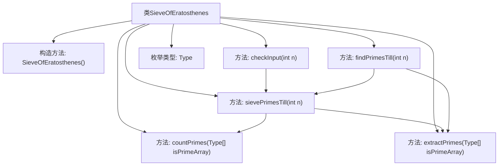
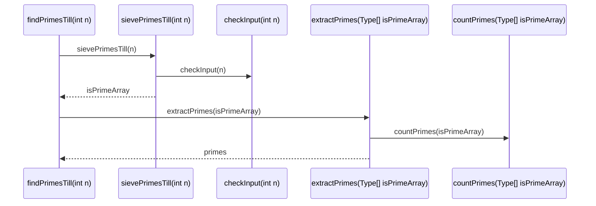

# 基础信息

|      |      |
|------|------|
| 名称 | SieveOfEratosthenes |
| 编码语言 | .java |
| 代码路径 | Java/src/main/java/com/thealgorithms/maths/SieveOfEratosthenes.java |
| 包名 | com.thealgorithms.maths |
| 依赖项 | ['java.util.Arrays'] |
| 概述说明 | 埃拉托斯特尼筛法用于找出小于等于n的所有素数。 |

# 说明

埃拉托斯特尼筛法是一种用于查找小于等于给定整数n的所有素数的经典算法。该方法通过逐步排除合数来确定素数。首先，创建一个从2到n的连续整数列表。然后，从最小的素数2开始，标记其所有倍数为合数。接着，找到下一个未被标记的数，重复上述步骤，直到处理完所有小于等于n的数。最终，未被标记的数即为素数。该算法高效且易于理解，适用于大规模素数查找。

# 类列表 Class Summary

| 名称   | 类型  | 说明 |
|-------|------|-------------|
| SieveOfEratosthenes | class | 埃拉托斯特尼筛法实现，查找并返回小于等于n的所有素数。 |

## 类 SieveOfEratosthenes

|      |      |
|------|------|
| 访问范围 | public final |
| 类型 | class |
| 名称 | SieveOfEratosthenes |
| 说明 | 埃拉托斯特尼筛法实现，查找并返回小于等于n的所有素数。 |

### UML类图

这段代码实现了一个经典的算法——埃拉托斯特尼筛法，用于找出小于或等于给定整数 `n` 的所有素数。`SieveOfEratosthenes` 类包含了多个私有方法来执行筛法的各个步骤，包括输入验证、筛法执行、素数计数和素数提取。`Type` 枚举用于标记数字是否为素数。最终，`findPrimesTill` 方法将所有这些步骤整合在一起，返回一个包含所有素数的数组。

### 内部方法调用关系图

这段代码实现了埃拉托斯特尼筛法，用于查找小于或等于给定上限的所有素数。代码首先通过`checkInput`方法验证输入的有效性，然后使用`sievePrimesTill`方法生成素数标记数组，接着通过`countPrimes`方法统计素数数量，最后通过`extractPrimes`方法提取素数并返回结果。整个流程通过`findPrimesTill`方法统一调用，确保代码的模块化和可维护性。

### 字段列表 Field List

| 名称  | 类型  | 说明 |
|-------|-------|------|

### 方法列表 Method List

| 名称  | 类型  | 说明 |
|-------|-------|------|
| checkInput | void | 检查输入是否为正数，否则抛出异常。 |
| countPrimes | int | 方法统计数组中素数类型元素的个数。 |
| findPrimesTill | int[] | 该方法通过筛选法找出小于等于n的所有素数并返回。 |
| sievePrimesTill | Type[] | 筛法求素数，标记非素数，返回素数数组。 |
| extractPrimes | int[] | 从数组中提取素数并返回新数组。 |

