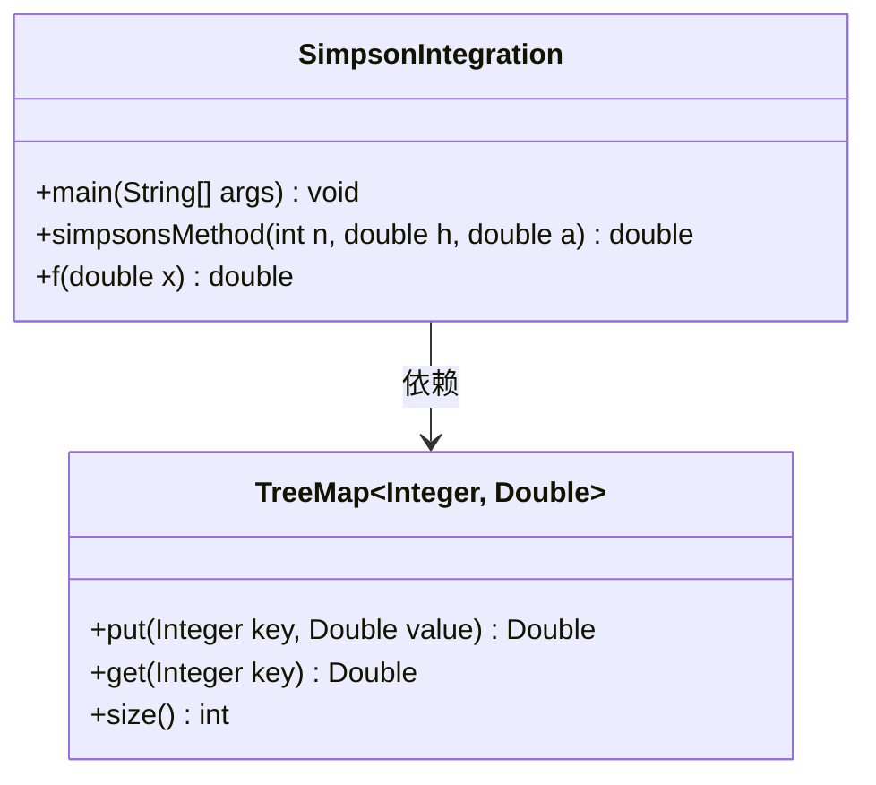
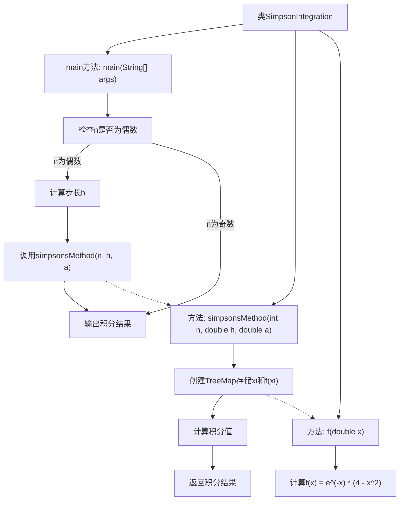

# 基础信息

|      |      |
|------|------|
| 名称 | SimpsonIntegration |
| 编码语言 | .java |
| 代码路径 | Java/src/main/java/com/thealgorithms/maths/SimpsonIntegration.java |
| 包名 | com.thealgorithms.maths |
| 依赖项 | ['java.util.TreeMap'] |
| 概述说明 | 辛普森法计算定积分，适用于偶数区间，通过公式评估积分值。 |

# 说明

辛普森法是一种用于计算定积分的数值方法，特别适用于偶数区间。该方法通过使用二次多项式近似被积函数，并利用公式评估积分值。其核心思想是将积分区间分割成若干个子区间，每个子区间内采用二次插值函数进行近似，最终将所有子区间的积分结果求和，得到整个区间的定积分近似值。这种方法在保证计算精度的同时，具有较高的效率和稳定性。

# 类列表 Class Summary

| 名称   | 类型  | 说明 |
|-------|------|-------------|
| SimpsonIntegration | class | 使用辛普森法计算定积分，适用于偶数区间，通过公式评估积分值。 |

## 类 SimpsonIntegration

|      |      |
|------|------|
| 访问范围 | public |
| 类型 | class |
| 名称 | SimpsonIntegration |
| 说明 | 使用辛普森法计算定积分，适用于偶数区间，通过公式评估积分值。 |

### UML类图

**描述：**  
`SimpsonIntegration` 类实现了复合辛普森规则来计算定积分。它包含一个 `main` 方法用于启动计算，`simpsonsMethod` 方法用于执行辛普森规则的具体计算，以及 `f` 方法用于定义被积函数。`TreeMap` 类用于存储插值点的键值对，`SimpsonIntegration` 类依赖于 `TreeMap` 来存储和检索这些数据。整体设计简洁，专注于数值积分的计算。

### 内部方法调用关系图

**流程图描述：**
该流程图描述了`SimpsonIntegration`类的执行流程。首先，`main`方法检查区间数`n`是否为偶数，若为偶数则计算步长`h`并调用`simpsonsMethod`方法进行积分计算，最后输出结果。`simpsonsMethod`方法通过创建`TreeMap`存储插值点`xi`和对应的函数值`f(xi)`，然后根据Simpson规则计算积分值并返回。`f`方法用于计算函数值`f(x) = e^(-x) * (4 - x^2)`。

### 字段列表 Field List

| 名称  | 类型  | 说明 |
|-------|-------|------|

### 方法列表 Method List

| 名称  | 类型  | 说明 |
|-------|-------|------|
| f | double | 函数f(x)返回e的-x次方乘以(4减x的平方)。 |
| simpsonsMethod | double | 使用辛普森法计算积分，生成点表并应用公式，最终返回结果。 |
| main | void | 使用Simpson积分法计算定积分，确保n为偶数，输出积分结果。 |

