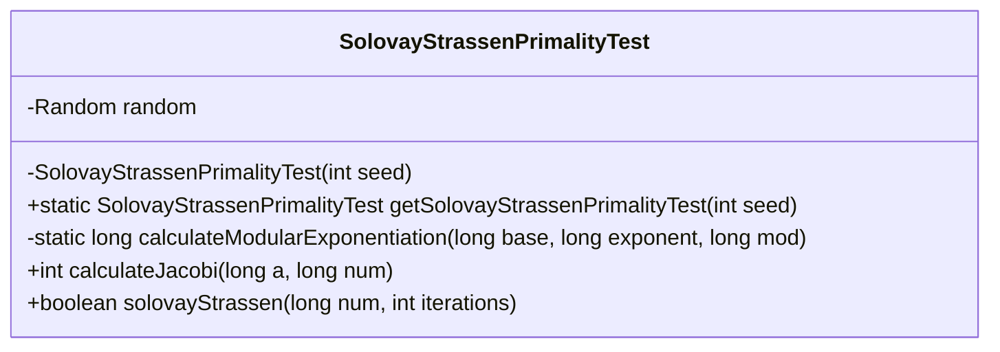
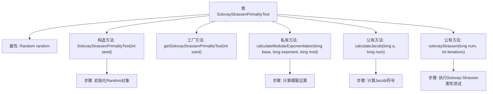

# 基础信息

|      |      |
|------|------|
| 名称 | SolovayStrassenPrimalityTest |
| 编码语言 | .java |
| 代码路径 | Java/src/main/java/com/thealgorithms/maths/SolovayStrassenPrimalityTest.java |
| 包名 | com.thealgorithms.maths |
| 依赖项 | ['java.util.Random'] |
| 概述说明 | SolovayStrassen类实现素性测试，含模幂和雅可比符号计算，多次迭代提高准确性。 |

# 说明

SolovayStrassenPrimalityTest类实现了素性测试功能，主要包含模幂计算和雅可比符号计算两个核心部分。通过多次迭代测试，该方法能够显著提高判断一个数是否为素数的准确性。模幂计算用于处理大数幂运算，而雅可比符号计算则用于评估数论中的特定性质。这种组合方法确保了测试的可靠性和高效性，适用于需要高精度素性判断的场景。

# 类列表 Class Summary

| 名称   | 类型  | 说明 |
|-------|------|-------------|
| SolovayStrassenPrimalityTest | class | SolovayStrassenPrimalityTest类实现素性测试，包含模幂计算和雅可比符号计算，通过多次迭代提高准确性。 |

## 类 SolovayStrassenPrimalityTest

|      |      |
|------|------|
| 访问范围 | final |
| 类型 | class |
| 名称 | SolovayStrassenPrimalityTest |
| 说明 | SolovayStrassenPrimalityTest类实现素性测试，包含模幂计算和雅可比符号计算，通过多次迭代提高准确性。 |

### UML类图

这段代码定义了一个名为 `SolovayStrassenPrimalityTest` 的类，用于实现 Solovay-Strassen 素性测试算法。该类包含一个私有的 `Random` 对象用于生成随机数，并通过工厂方法 `getSolovayStrassenPrimalityTest` 创建实例。主要方法包括 `calculateModularExponentiation` 用于计算模幂运算，`calculateJacobi` 用于计算雅可比符号，以及 `solovayStrassen` 用于执行素性测试。该类的设计旨在通过随机数和数学计算来判断一个数是否为素数。

### 内部方法调用关系图

这段代码实现了Solovay-Strassen素性测试算法，用于判断一个数是否为素数。类中包含了一个随机数生成器、模幂运算方法、Jacobi符号计算方法以及素性测试方法。代码通过工厂方法创建实例，并在素性测试中结合Jacobi符号和模幂运算来验证数的素性。流程图展示了类的结构及其方法的调用关系。

### 字段列表 Field List

| 名称  | 类型  | 说明 |
|-------|-------|------|
| random | Random | 声明一个私有的不可变的Random类实例。 |

### 方法列表 Method List

| 名称  | 类型  | 说明 |
|-------|-------|------|
| calculateModularExponentiation | long | 计算模幂，通过平方和乘法优化，返回结果模数。 |
| getSolovayStrassenPrimalityTest | SolovayStrassenPrimalityTest | 获取SolovayStrassen素性测试实例，需提供随机种子。 |
| calculateJacobi | int | 计算雅可比符号，处理特殊情况并调整符号值。 |
| solovayStrassen | boolean | Solovay-Strassen算法用于判断大数是否为素数，通过随机数生成和Jacobi符号计算验证。 |

