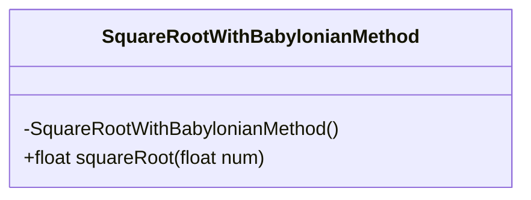
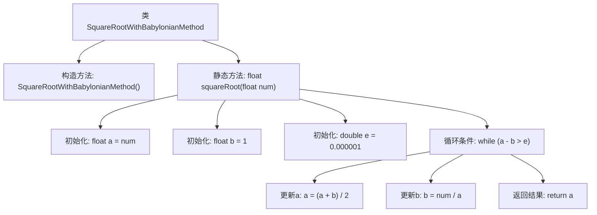

# 基础信息

|      |      |
|------|------|
| 名称 | SquareRootWithBabylonianMethod |
| 编码语言 | .java |
| 代码路径 | Java/src/main/java/com/thealgorithms/maths/SquareRootWithBabylonianMethod.java |
| 包名 | com.thealgorithms.maths |
| 依赖项 | [] |
| 概述说明 | Java类实现巴比伦方法计算平方根。 |

# 说明

这是一个使用巴比伦方法计算平方根的Java类。巴比伦方法，也称为牛顿迭代法，是一种通过迭代逼近来计算平方根的算法。该Java类实现了这一算法，通过不断迭代改进猜测值，直到达到预定的精度要求。类中可能包含初始化、迭代计算和精度判断等方法，确保最终结果准确。这种方法在数值计算中广泛使用，适用于需要高精度平方根计算的场景。

# 类列表 Class Summary

| 名称   | 类型  | 说明 |
|-------|------|-------------|
| SquareRootWithBabylonianMethod | class | 使用巴比伦方法计算平方根的Java类。 |

## 类 SquareRootWithBabylonianMethod

|      |      |
|------|------|
| 访问范围 | public final |
| 类型 | class |
| 名称 | SquareRootWithBabylonianMethod |
| 说明 | 使用巴比伦方法计算平方根的Java类。 |

### UML类图

这段代码定义了一个名为 `SquareRootWithBabylonianMethod` 的类，该类包含一个私有的构造函数和一个公有的静态方法 `squareRoot`。`squareRoot` 方法使用巴比伦方法（也称为牛顿迭代法）来计算给定浮点数的平方根。该方法通过不断迭代逼近平方根，直到满足精度要求。由于构造函数是私有的，该类不能被实例化，只能通过静态方法 `squareRoot` 来使用其功能。

### 内部方法调用关系图

这段代码定义了一个名为 `SquareRootWithBabylonianMethod` 的类，该类包含一个私有构造方法和一个静态方法 `squareRoot`。`squareRoot` 方法使用巴比伦法（也称为牛顿迭代法）计算给定浮点数的平方根。通过初始化两个变量 `a` 和 `b`，并在循环中不断更新它们的值，直到满足精度要求，最终返回计算得到的平方根值。

### 字段列表 Field List

| 名称  | 类型  | 说明 |
|-------|-------|------|

### 方法列表 Method List

| 名称  | 类型  | 说明 |
|-------|-------|------|
| squareRoot | float | 该方法通过二分法计算浮点数的平方根，精度为0.000001。 |

