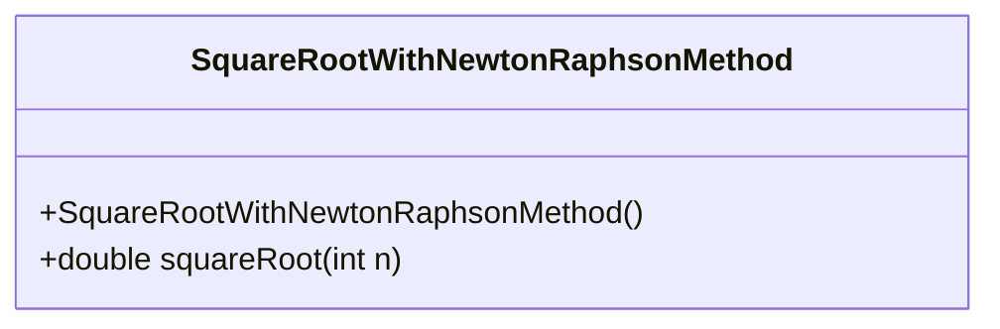
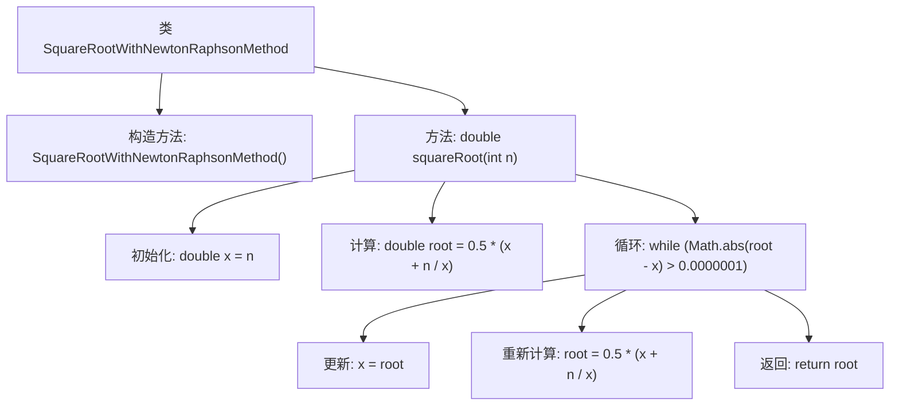

# 基础信息

|      |      |
|------|------|
| 名称 | SquareRootWithNewtonRaphsonMethod |
| 编码语言 | .java |
| 代码路径 | Java/src/main/java/com/thealgorithms/maths/SquareRootWithNewtonRaphsonMethod.java |
| 包名 | com.thealgorithms.maths |
| 依赖项 | [] |
| 概述说明 | 使用牛顿迭代法计算整数平方根，精度达0.0000001。 |

# 说明

该方法使用牛顿迭代法来计算整数的平方根，其精度要求为0.0000001。牛顿迭代法是一种通过逐步逼近来求解方程根的方法，适用于计算平方根等数学问题。在此过程中，算法会不断更新猜测值，直到结果与真实值的误差小于设定的精度阈值。该方法通过迭代优化，能够高效且准确地得到整数的平方根，满足高精度的计算需求。

# 类列表 Class Summary

| 名称   | 类型  | 说明 |
|-------|------|-------------|
| SquareRootWithNewtonRaphsonMethod | class | 使用牛顿迭代法计算整数平方根，精度为0.0000001。 |

## 类 SquareRootWithNewtonRaphsonMethod

|      |      |
|------|------|
| 访问范围 | public final |
| 类型 | class |
| 名称 | SquareRootWithNewtonRaphsonMethod |
| 说明 | 使用牛顿迭代法计算整数平方根，精度为0.0000001。 |

### UML类图

**描述：**  
`SquareRootWithNewtonRaphsonMethod` 类是一个工具类，用于计算给定整数 `n` 的平方根。该类采用牛顿迭代法（Newton-Raphson Method）进行近似计算，直到达到预设的精度（误差小于 0.0000001）。该类为不可继承的 `final` 类，并且构造函数为私有，确保无法实例化。`squareRoot` 方法是公有的静态方法，直接通过类名调用，返回计算得到的平方根值。

### 内部方法调用关系图

这段代码实现了一个使用牛顿-拉弗森方法计算整数平方根的静态方法。首先，类`SquareRootWithNewtonRaphsonMethod`包含一个私有的构造方法，确保该类不能被实例化。`squareRoot`方法通过初始猜测`x = n`，并不断迭代计算`root`，直到误差小于`0.0000001`，最终返回计算得到的平方根值。流程图展示了从初始化到最终返回结果的完整过程。

### 字段列表 Field List

| 名称  | 类型  | 说明 |
|-------|-------|------|

### 方法列表 Method List

| 名称  | 类型  | 说明 |
|-------|-------|------|
| squareRoot | double | 使用牛顿迭代法计算整数n的平方根，精度为0.0000001。 |

