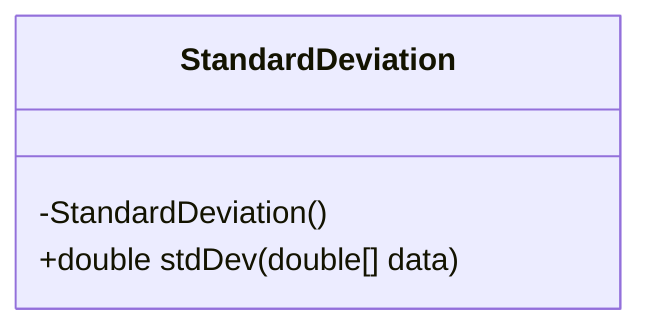
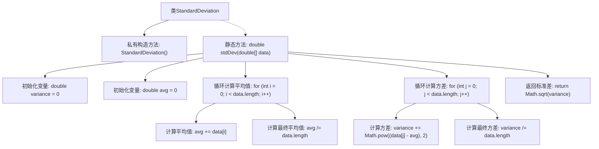

# 基础信息

|      |      |
|------|------|
| 名称 | StandardDeviation |
| 编码语言 | .java |
| 代码路径 | Java/src/main/java/com/thealgorithms/maths/StandardDeviation.java |
| 包名 | com.thealgorithms.maths |
| 依赖项 | [] |
| 概述说明 | 计算数组标准差的静态方法。 |

# 说明

该静态方法用于计算数组的标准差。标准差是衡量数据分散程度的指标，反映了数据点与平均值之间的偏离程度。该方法通过以下步骤实现：首先计算数组的平均值，然后计算每个数据点与平均值的差的平方，接着求这些平方差的平均值，最后取平均值的平方根得到标准差。该方法适用于任何数值数组，能够准确反映数据的波动情况。

# 类列表 Class Summary

| 名称   | 类型  | 说明 |
|-------|------|-------------|
| StandardDeviation | class | 计算数组标准差的静态方法。 |

## 类 StandardDeviation

|      |      |
|------|------|
| 访问范围 | public final |
| 类型 | class |
| 名称 | StandardDeviation |
| 说明 | 计算数组标准差的静态方法。 |

### UML类图

这段代码定义了一个名为 `StandardDeviation` 的类，该类包含一个私有构造函数和一个公共静态方法 `stdDev`。`stdDev` 方法接收一个 `double` 类型的数组作为参数，计算并返回该数组的标准差。标准差的计算过程包括两个主要步骤：首先计算数组的平均值，然后基于平均值计算方差，最后返回方差的平方根作为标准差。由于构造函数是私有的，该类不能被实例化，只能通过静态方法 `stdDev` 来使用其功能。

### 内部方法调用关系图

这段代码定义了一个名为 `StandardDeviation` 的类，其中包含一个私有构造方法和一个静态方法 `stdDev`。`stdDev` 方法用于计算给定数组的标准差。首先，它计算数组的平均值，然后计算方差，最后返回方差的平方根，即标准差。流程图展示了方法的执行步骤，包括初始化变量、循环计算平均值和方差，以及最终返回标准差的过程。

### 字段列表 Field List

| 名称  | 类型  | 说明 |
|-------|-------|------|

### 方法列表 Method List

| 名称  | 类型  | 说明 |
|-------|-------|------|
| stdDev | double | 计算数组数据的标准差，先求平均值，再算方差，最后开平方返回标准差。 |

