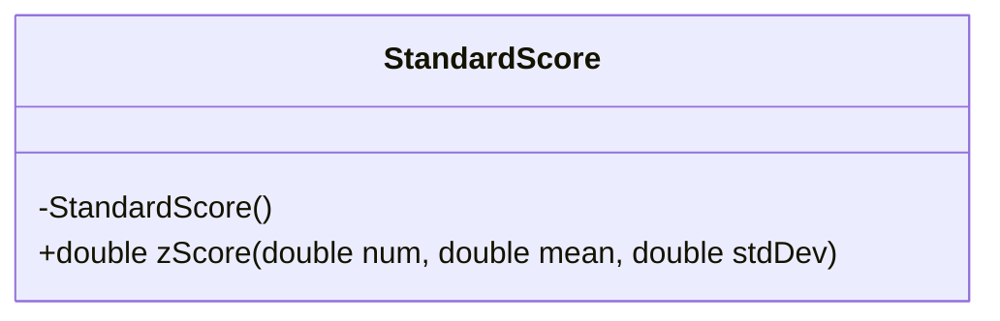
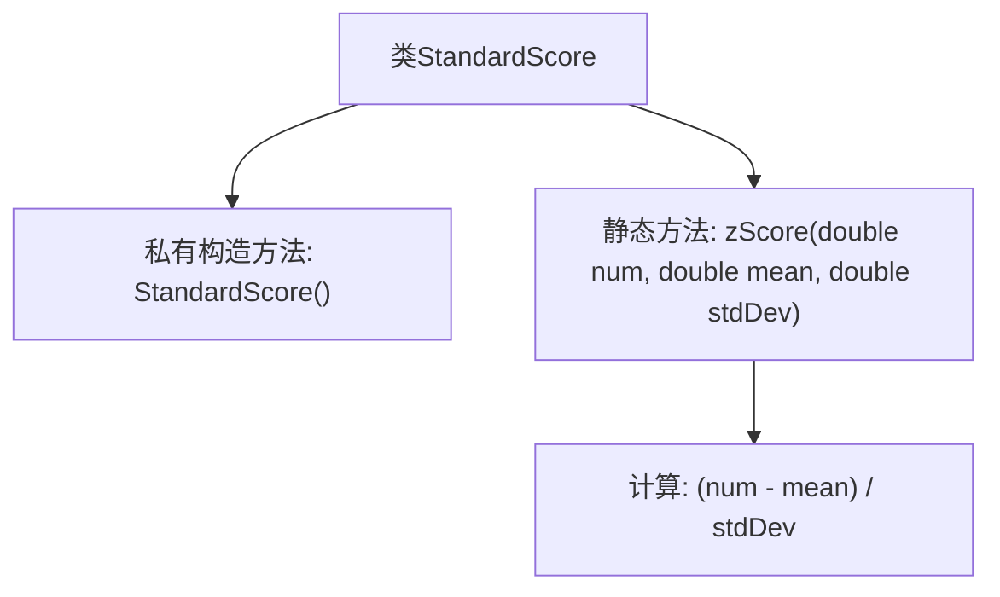

# 基础信息

|      |      |
|------|------|
| 名称 | StandardScore |
| 编码语言 | .java |
| 代码路径 | Java/src/main/java/com/thealgorithms/maths/StandardScore.java |
| 包名 | com.thealgorithms.maths |
| 依赖项 | [] |
| 概述说明 | StandardScore类提供静态方法计算Z分数。 |

# 说明

StandardScore类是一个专门用于计算Z分数的工具类。它提供了静态方法，允许用户在不实例化类的情况下直接调用这些方法进行计算。Z分数是一种标准化的统计度量，用于表示数据点与数据集平均值之间的差异，以标准差为单位。通过使用StandardScore类，用户可以方便地计算和比较不同数据集中的数据点，从而进行更精确的统计分析。

# 类列表 Class Summary

| 名称   | 类型  | 说明 |
|-------|------|-------------|
| StandardScore | class | StandardScore类提供计算Z分数的静态方法。 |

## 类 StandardScore

|      |      |
|------|------|
| 访问范围 | public final |
| 类型 | class |
| 名称 | StandardScore |
| 说明 | StandardScore类提供计算Z分数的静态方法。 |

### UML类图

这段代码定义了一个名为 `StandardScore` 的不可继承的类（`final` 修饰），其中包含一个私有的构造函数，防止外部实例化。类中提供了一个静态方法 `zScore`，用于计算给定数值 `num` 相对于均值 `mean` 和标准差 `stdDev` 的 Z 分数。Z 分数是统计学中常用的标准化方法，用于衡量数据点与均值的偏离程度。该类的设计是工具类，通常用于提供静态方法而不需要实例化对象。

### 内部方法调用关系图

这段代码定义了一个名为 `StandardScore` 的最终类，其中包含一个私有构造方法和一个静态方法 `zScore`。`zScore` 方法用于计算给定数值 `num` 相对于均值 `mean` 和标准差 `stdDev` 的 Z 分数。Z 分数的计算公式为 `(num - mean) / stdDev`，该方法直接返回计算结果。由于构造方法是私有的，该类不能被实例化，只能通过静态方法 `zScore` 来调用其功能。

### 字段列表 Field List

| 名称  | 类型  | 说明 |
|-------|-------|------|

### 方法列表 Method List

| 名称  | 类型  | 说明 |
|-------|-------|------|
| zScore | double | 计算给定数值与均值的标准差分数。 |

